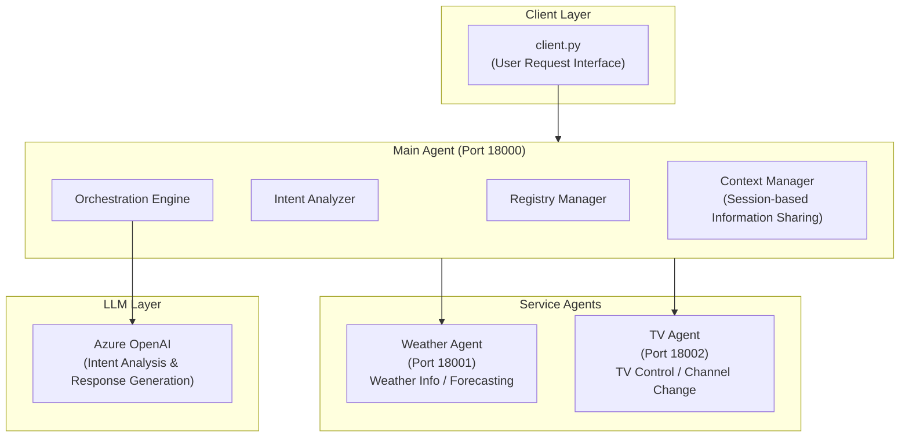

# A2A Multi-Agent System

🌐 **Language**: [한국어](./README.md) | [English](./README_EN.md)

> A2A Protocol-based Multi-Agent Orchestration System


---

## Overview

**A2A Multi-Agent System** is a multi-agent system utilizing the A2A (Agent-to-Agent) protocol. A central orchestration agent manages and coordinates multiple service agents through an HTTP-based registry.

It handles complex user requests through collaboration between multiple agents, supporting dynamic extensibility and context management.

---

## Key Features

### Agent Card-Based Intelligence
- Dynamic LLM prompt generation using registered agent metadata
- Real-time capability recognition without code modifications
- Automatic routing based on agent capabilities

### Context Management
- Multi-domain request handling through session-based information sharing
- Support for both sequential and parallel execution patterns
- Automatic context transfer between agents

### Self-Invocation Prevention
- Mechanism to prevent infinite loops during complex request processing
- Agent chain tracking and management

### Dynamic Extensibility
- Automatic integration of new agents through registry system
- Feature expansion without modifying existing components

---

## System Architecture



---

## Agent Configuration

| Agent | Port | Role |
|-------|------|------|
| **Main Agent** | 18000 | Orchestration, registry management, intent analysis |
| **Weather Agent** | 18001 | Weather information and forecasting |
| **TV Agent** | 18002 | TV control and channel switching |

---

## Tech Stack

| Category | Technology |
|----------|------------|
| **Language** | Python 3.11+ |
| **Web Framework** | FastAPI |
| **LLM** | Azure OpenAI |
| **Protocol** | A2A SDK |
| **Package Manager** | uv |
| **Communication** | HTTP/REST |

---

## Workflow Examples

### Simple Query
```
User: "How's the weather in Seoul today?"
```
→ Main Agent analyzes intent and routes to Weather Agent
→ Weather Agent returns Seoul weather information

### Complex Request (Multi-Agent Collaboration)
```
User: "Change to a channel that matches today's weather"
```
1. Main Agent recognizes complex request
2. Weather Agent → Query current weather conditions
3. Context Manager → Extract and share weather data
4. TV Agent → Recommend and change to weather-appropriate channel

---

## Project Structure

```
a2a-sample/
├── main.py                 # Main agent entry point
├── client.py               # Client interface
├── agents/
│   ├── main_agent.py       # Orchestration agent
│   ├── weather_agent.py    # Weather service agent
│   └── tv_agent.py         # TV control agent
├── prompts/
│   └── templates/          # LLM prompt templates
├── utils/
│   ├── intent_analyzer.py  # Intent analysis utility
│   └── context_manager.py  # Context management utility
└── api/
    ├── registry.py         # Registry API
    └── message.py          # Message handling API
```

---

## Challenges and Solutions

### 1. Context Sharing Between Agents
**Challenge**: Needed to efficiently share information between multiple agents when processing complex requests.

**Solution**: Implemented a session-based Context Manager to manage information flow between agents, designed to support both sequential and parallel execution patterns.

### 2. Dynamic Agent Discovery and Routing
**Challenge**: New agents needed to be automatically recognized and utilized without code modifications.

**Solution**: Built a registry system using Agent Card metadata, allowing the LLM to dynamically understand registered agent capabilities and route appropriately.

### 3. Infinite Loop Prevention
**Challenge**: There was potential for infinite loops due to self-invocation in complex multi-agent chains.

**Solution**: Implemented a mechanism to track agent call chains and detect and block self-references.

---

## Role & Contributions

- A2A protocol-based multi-agent system architecture design
- Main Agent orchestration engine development
- Context Manager session management system implementation
- Agent registry and dynamic routing system development
- Azure OpenAI integration intent analysis module implementation

---

## System Requirements

| Item | Requirement |
|------|-------------|
| **Python** | 3.11 or later |
| **Package Manager** | uv |
| **LLM** | Azure OpenAI API access |

---

## Quick Start

```bash
# Clone repository
git clone https://github.com/leonardo204/a2a_sample.git
cd a2a-sample

# Install dependencies
uv sync

# Configure environment variables (set Azure OpenAI credentials in .env file)

# Run agents
python main.py

# Run client
uv run client.py
```

---

## Related Links

- **GitHub**: [leonardo204/a2a_sample](https://github.com/leonardo204/a2a_sample)

---

*This project is a multi-agent orchestration system implementation using the A2A protocol.*
