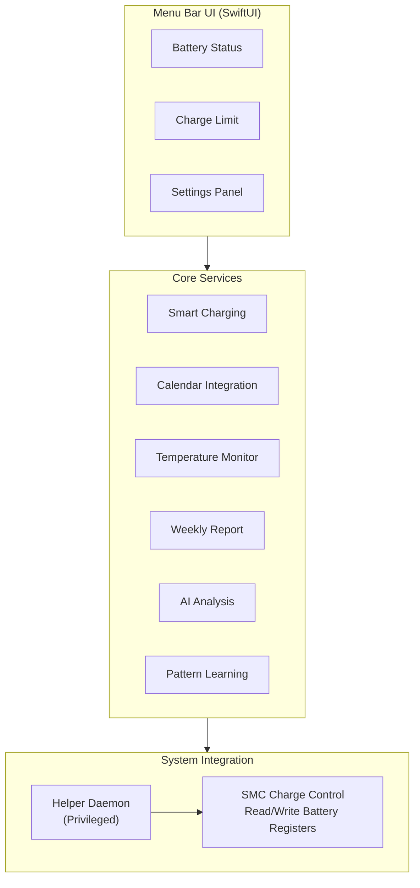

# BatteryAgent

🌐 **Language**: [한국어](./README.md) | [English](./README_EN.md)

> Smart battery management app that controls charging limits from the macOS menu bar

---

## Overview

**BatteryAgent** is a battery charge limit management app that runs from the macOS menu bar. It controls battery charging limits in the 20-100% range via SMC, and provides comprehensive features to maximize battery lifespan including smart charging that learns usage patterns over 14 days, calendar integration, temperature-based protection, weekly reports, and Claude AI analysis.

---

## Key Features

### Battery Charge Limit Control
- Set charging limits in the 20-100% range
- Direct charge control via SMC (System Management Controller)
- Privilege-separated architecture using Helper Daemon

### Smart Charging
- Learns usage patterns over 14 days to determine optimal charging timing
- Automatic charge management tailored to user's daily patterns

### Calendar Integration
- Schedule-based charging scheduling
- Automatic full-charge preparation before outings/meetings

### Temperature-Based Protection
- Real-time battery temperature monitoring
- Automatic charging suspension when threshold temperature is exceeded

### Weekly Reports
- Weekly battery usage analysis
- Charging pattern and battery health tracking

### AI Analysis (Claude)
- Battery usage pattern analysis powered by Claude AI
- Personalized battery management recommendations

---

## Tech Stack

| Category | Technology |
|----------|------------|
| **Language** | Swift 6 |
| **Platform** | macOS 14+ (Sonoma) |
| **App Type** | Menu Bar App (No Dock icon) |
| **System Integration** | SMC (System Management Controller) |
| **Background Service** | Helper Daemon (Privilege Separation) |
| **AI** | Claude (Anthropic) |
| **Calendar** | EventKit |

---

## Architecture

---

## Challenges and Solutions

### 1. SMC Battery Charge Control
**Challenge**: Directly controlling the battery charge limit on macOS requires access to the SMC (System Management Controller), which is a low-level system operation requiring root privileges.

**Solution**: Designed a privilege-separated architecture using a Helper Daemon, where the main app runs with user privileges and only SMC access operations are handled through the Privileged Helper.

### 2. Smart Charging Pattern Learning
**Challenge**: Needed to implement an algorithm that learns user charging patterns to predict optimal charging times, while collecting sufficient data during the 14-day learning period and adapting quickly.

**Solution**: Implemented an adaptive learning algorithm that statistically analyzes usage patterns by time period and applies weighted moving averages to give higher weight to recent patterns.

### 3. Temperature-Based Safety Control
**Challenge**: Required real-time battery temperature monitoring with minimal system resource usage and immediate charging suspension when thresholds are exceeded.

**Solution**: Designed a system with efficient polling strategies and threshold-based event handling that responds to battery temperature increases in graduated steps.

---

## Role & Contributions

- Designed and implemented macOS menu bar app architecture
- Developed SMC-based battery charge control system
- Implemented Helper Daemon privilege separation architecture
- Developed smart charging pattern learning algorithm
- Built calendar integration and temperature-based protection system
- Integrated Claude AI analysis features
- Developed weekly report generation system

---

## Links

- **GitHub**: [leonardo204/BetteryAgent](https://github.com/leonardo204/BetteryAgent)
- **Contact**: zerolive7@gmail.com

---

*This project is a smart battery management tool designed to maximize battery lifespan for macOS users.*
