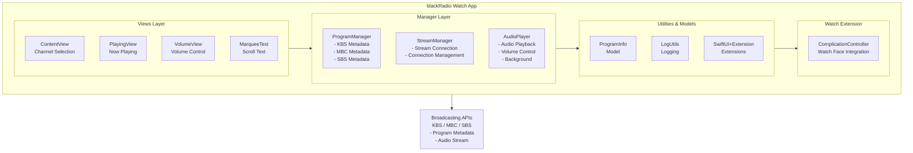

# blackRadio

🌐 **Language**: [한국어](./README.md) | [English](./README_EN.md)

> watchOS Korean Radio Streaming App

---

## Overview

**blackRadio** is a watchOS native app that allows you to listen to major Korean radio broadcasts on Apple Watch. It supports major radio channels from KBS, MBC, and SBS, displaying currently broadcasting program information and thumbnails in real-time.

Listen to radio anytime, anywhere with just your Apple Watch and AirPods without an iPhone, and quickly access the app through watch face complications.

---

## Key Features

### Radio Channel Support
- **KBS**: KBS 1Radio, Happy FM, Classic FM, Cool FM
- **MBC**: FM4U, Standard FM
- **SBS**: Power FM, Love FM

### Real-time Program Information
- **Current Broadcast Display**: Real-time currently broadcasting program information
- **Thumbnail Images**: Display program images alongside information
- **Auto Update**: Automatic information refresh when programs change

### watchOS Optimized UI
- **Intuitive Channel Selection**: Scrollable channel button list
- **Marquee Text**: Long program titles displayed with scroll animation
- **Volume Control**: Digital Crown integrated volume adjustment
- **Complications**: Launch app directly from watch face

### Audio Streaming
- **Background Playback**: Playback continues even when app is closed
- **Stream Management**: Maintains stable streaming connection

---

## Tech Stack

| Category | Technology |
|----------|------------|
| **Language** | Swift 5.9 (100%) |
| **UI Framework** | SwiftUI |
| **Platform** | watchOS |
| **Audio** | AVFoundation |
| **Architecture** | MVVM |
| **API Integration** | URLSession, JSON/JSONP Parsing |

---

## Architecture

---

## Key Components

### ProgramManager
Calls APIs for each broadcasting station to retrieve metadata (title, thumbnail) of currently broadcasting programs.
- KBS/MBC: JSONP format parsing
- SBS: JSON format parsing
- Time-based program matching

### AudioPlayer
Handles audio streaming, providing playback functionality optimized for the watchOS environment.
- AVFoundation-based audio playback
- Background playback support
- Stream connection status management

### MarqueeText
Custom scrolling text component for displaying long program titles on watchOS small screen.

---

## Challenges and Solutions

### 1. watchOS Audio Streaming
**Challenge**: Stable audio streaming was needed in watchOS's limited resource environment.

**Solution**: Utilized AVFoundation's streaming capabilities and implemented logic to automatically reconnect when disconnection occurs by monitoring connection status.

### 2. Broadcasting Station API Integration
**Challenge**: KBS, MBC, and SBS each used different API formats (JSON, JSONP), requiring unified processing.

**Solution**: Separated parsing logic by broadcasting station in ProgramManager and standardized data through a common interface (ProgramInfo).

### 3. Small Screen UI Optimization
**Challenge**: Needed to effectively display program information on Apple Watch's small screen.

**Solution**: Developed MarqueeText component to allow viewing full content of long text through scroll animation.

---

## Role & Contributions

- Overall watchOS app architecture design and implementation
- SwiftUI-based watchOS UI development
- Audio streaming engine implementation
- Broadcasting station API integration and metadata parsing
- Watch face complication development
- MarqueeText custom component development

---

## System Requirements

| Item | Requirement |
|------|-------------|
| **watchOS** | watchOS 9.0 or later |
| **Build Environment** | Xcode 15.0+ |
| **Language** | Swift 5.9 |

---

## Related Links

- **GitHub**: [leonardo204/blackRadio_watchOS](https://github.com/leonardo204/blackRadio_watchOS)

---

*This project is a personal project for listening to Korean radio on Apple Watch.*
