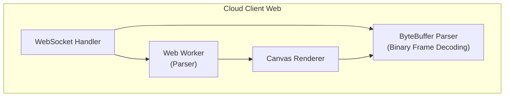

# Cloud Client Web

🌐 **Language**: [한국어](./README.md) | [English](./README_EN.md)

> Cloud Image Streaming Web Test Client

---

## Overview

**Cloud Client Web** is a web-based client for testing cloud UI image streaming services.

It receives real-time image frames from the server via WebSocket and renders them on Canvas to verify streaming status.

---

## Key Features

### WebSocket Streaming
- **Real-time Connection**: WebSocket connection to image server
- **Binary Reception**: ArrayBuffer-based image data reception
- **Connection Status Display**: Real-time connection/disconnection status

### Frame Parsing
- **Web Worker**: Worker-based parsing to prevent main thread blocking
- **Binary Parsing**: Custom protocol image frame parsing
- **Multiple Image Processing**: Multiple image frames in single message

### Image Rendering
- **Canvas Rendering**: HTML5 Canvas-based image display
- **Cell-based Updates**: Selective update of changed regions only
- **Multiple Format Support**: WebP, PNG, JPEG support

---

## Architecture

---

## Tech Stack

| Category | Technology |
|----------|------------|
| **Language** | JavaScript (ES6+) |
| **Markup** | HTML5 |
| **Communication** | WebSocket |
| **Rendering** | Canvas API |
| **Concurrency** | Web Workers |

---

## Role & Contributions

- WebSocket-based streaming client development
- Binary frame parser implementation
- Web Worker-based async parsing implementation
- Canvas rendering module development

---

*This project was used for testing and debugging during cloud UI service development.*
