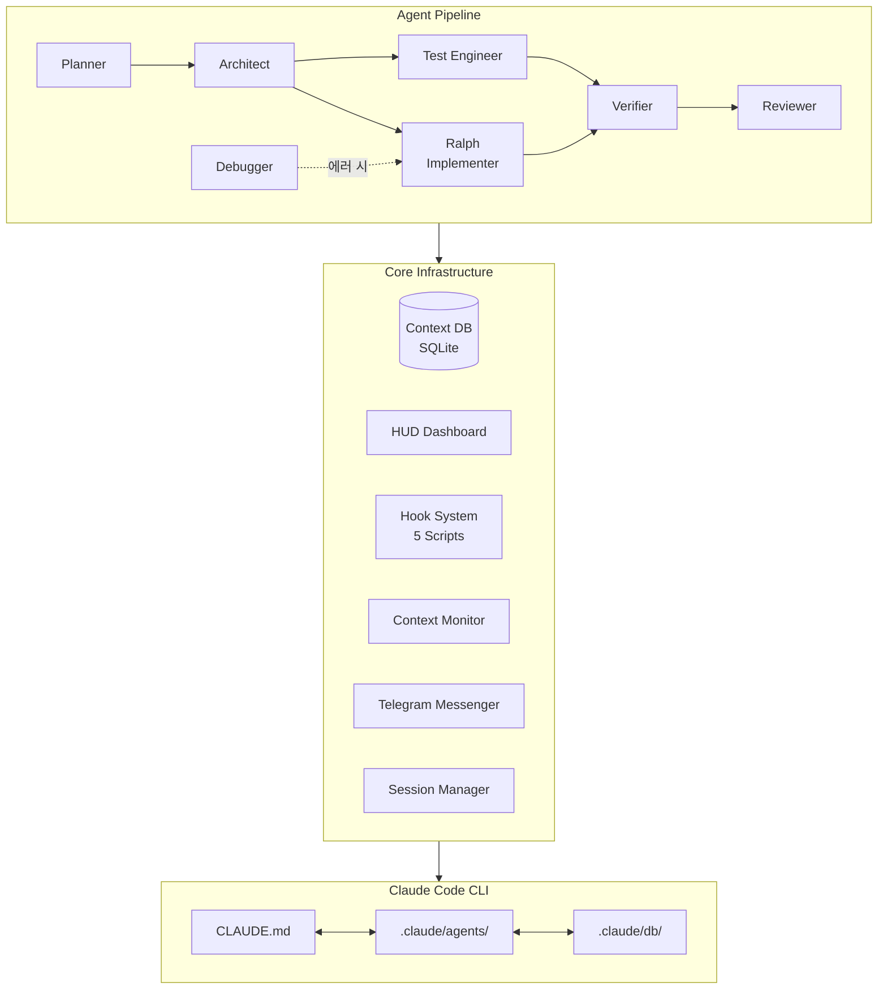

# dotclaude

🌐 **Language**: [한국어](./README.md) | [English](./README_EN.md)

> Claude Code를 더 똑똑하게 — Claude Code Agent Harness

---

## 개요

**dotclaude**는 Claude Code 기반 에이전트 하네스입니다. 7개의 전문 에이전트 파이프라인, SQLite 기반 세션 간 컨텍스트 보존, 실시간 HUD 대시보드, Telegram 알림 등을 통해 Claude Code를 보다 체계적이고 지능적으로 활용할 수 있도록 지원합니다. 단일 명령어(`/dotclaude-init`)로 모든 환경을 즉시 구성할 수 있습니다.

---

## 주요 기능

### 7개 전문 에이전트 시스템
- **Planner**: 태스크 분석 및 실행 계획 수립
- **Architect**: 시스템 아키텍처 설계 및 구조 결정
- **Ralph (Implementer)**: 실제 코드 구현 담당
- **Verifier**: 구현 결과 검증 및 품질 확인
- **Reviewer**: 코드 리뷰 및 개선 제안
- **Debugger**: 오류 분석 및 문제 해결
- **Test Engineer**: 테스트 작성 및 테스트 커버리지 관리

### 에이전트 위임 파이프라인
- Planner → Architect → Ralph + Test Engineer → Verifier → Reviewer 자동 파이프라인
- 복잡도에 따른 자동 트리거 (2파일 이상 변경, 아키텍처 변경 등)
- 메인 컨텍스트는 판단과 위임에 집중, 실행은 전문 에이전트에 위임

### SQLite 기반 컨텍스트 보존
- 세션 간 작업 상태, 핵심 발견, 설계 결정을 영구 저장
- Context DB를 통한 지식 누적 및 재활용
- Compaction(컨텍스트 압축) 대응 자동 복구

### 실시간 HUD 대시보드
- Rate Limit 사용량 실시간 모니터링
- 현재 작업 상태 및 진행률 표시
- 에러 컨텍스트 자동 추적

### 자동 Hooks 시스템
- 5개 자동 실행 스크립트 (PreToolUse, PostToolUse, Notification 등)
- 작업 파일 자동 추적, 에러 컨텍스트 자동 저장
- 세션 요약 자동 생성

### Telegram 알림
- 장시간 작업 완료 시 Telegram 메시지 자동 발송
- 에러 발생 시 즉시 알림
- 원격 모니터링 지원

### 원커맨드 초기화
- `/dotclaude-init` 명령으로 전체 환경 즉시 구성
- `.claude/` 폴더 구조, DB, 에이전트, Hooks 자동 생성
- 기존 프로젝트 업데이트: `/dotclaude-update`

---

## 기술 스택

| 분류 | 기술 |
|------|------|
| **Language** | TypeScript, JavaScript |
| **Runtime** | Node.js 22+ |
| **Database** | SQLite |
| **Platform** | Claude Code CLI |
| **Notification** | Telegram Bot API |
| **Architecture** | Multi-Agent Pipeline, Hook System |

---

## 아키텍처

---

## 개발 과정에서의 도전과 해결

### 1. 세션 간 컨텍스트 유실
**도전**: Claude Code는 세션이 끝나면 이전 작업의 맥락을 잃어버리고, 컨텍스트 압축(Compaction) 시에도 핵심 정보가 소실되는 문제가 있었습니다.

**해결**: SQLite 기반 Context DB를 설계하여 작업 상태, 핵심 발견, 설계 결정을 영구 저장하고, Compaction 감지 시 자동으로 핵심 컨텍스트를 복원하는 Context Monitor를 구현했습니다.

### 2. 복잡한 태스크의 체계적 처리
**도전**: 다수의 파일을 수정하는 대규모 작업에서 에이전트가 체계 없이 진행하여 품질이 저하되는 문제가 있었습니다.

**해결**: 7개 전문 에이전트로 역할을 분리하고, Planner → Architect → Ralph → Verifier → Reviewer 순서의 자동 파이프라인을 구축하여 각 단계별 책임과 품질 관리를 보장했습니다.

### 3. Rate Limit 관리 및 모니터링
**도전**: Claude Code의 API Rate Limit을 초과하면 작업이 중단되며, 현재 사용량을 파악하기 어려웠습니다.

**해결**: 실시간 HUD 대시보드를 구현하여 Rate Limit 사용량을 시각적으로 모니터링하고, Telegram 알림을 통해 장시간 작업의 상태를 원격으로 확인할 수 있도록 했습니다.

---

## 역할 및 기여

- 멀티 에이전트 파이프라인 아키텍처 설계 및 구현
- SQLite 기반 컨텍스트 보존 시스템 개발
- 실시간 HUD 대시보드 및 Context Monitor 구현
- 5개 자동 실행 Hooks 시스템 개발
- Telegram 알림 통합
- 원커맨드 초기화 시스템 (`/dotclaude-init`, `/dotclaude-update`) 구현

---

## 관련 링크

- **GitHub**: [leonardo204/dotclaude](https://github.com/leonardo204/dotclaude)
- **Contact**: zerolive7@gmail.com

---

*이 프로젝트는 Claude Code 기반 에이전트 하네스로, 보다 체계적이고 지능적인 AI 개발 환경을 제공합니다.*
