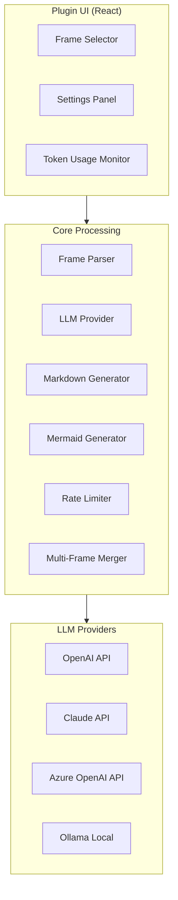

# Figma to Markdown

🌐 **Language**: [한국어](./README.md) | [English](./README_EN.md)

> AI-powered Figma plugin that converts design frames into Confluence-compatible Markdown documentation

---

## Overview

**Figma to Markdown** is a Figma plugin that leverages AI to automatically convert Figma design frames into Confluence-compatible Markdown documentation. By automating design specification documentation, it significantly improves collaboration efficiency between developers and designers.

---

## Key Features

### AI-Powered Document Conversion
- Support for multiple LLM providers (OpenAI, Claude, Azure OpenAI, Ollama)
- Intelligent analysis of Figma frame structures to generate Markdown

### Multi-Frame Processing
- Sequential processing of multiple frames into a unified document
- Option for independent document generation per frame

### Automatic Mermaid Diagram Generation
- Automatic flowchart generation by analyzing design flows
- Support for process diagrams and sequence diagrams

### Multilingual Support
- 6 languages supported: English, Japanese, Chinese, Spanish, French, German
- Selectable document output language

### Rate Limiting Management
- Automatic API limit detection and retry logic
- Stable bulk processing support

### Token Usage Tracking
- Real-time token usage monitoring per frame
- Overall cost management features

---

## Tech Stack

| Category | Technology |
|----------|------------|
| **Language** | TypeScript (83.7%), JavaScript (16.3%) |
| **UI Framework** | React |
| **Platform** | Figma Plugin API |
| **AI Providers** | OpenAI, Claude (Anthropic), Azure OpenAI, Ollama |
| **Output Format** | Markdown, Mermaid |
| **License** | MIT |

---

## Architecture

---

## Usage

### Plugin Installation
1. Navigate to the Community tab in Figma
2. Search for "Figma to Markdown"
3. Install the plugin

### Basic Usage
1. Select frames to convert in Figma
2. Run the plugin (Plugins > Figma to Markdown)
3. Configure LLM provider and API key
4. Select output language
5. Click "Generate" button
6. Copy or export the generated Markdown

### LLM Configuration
- **OpenAI**: Enter API key
- **Claude**: Enter Anthropic API key
- **Azure OpenAI**: Enter endpoint and key
- **Ollama**: Enter local server URL (free)

---

## Challenges and Solutions

### 1. Figma Frame Structure Analysis
**Challenge**: Needed to accurately parse Figma's complex layer structure and component instances into a documentable format.

**Solution**: Implemented recursive traversal of Figma Plugin API's node tree to extract hierarchical structure, with custom processing logic for each component type.

### 2. Multi-LLM Provider Integration
**Challenge**: Had to handle various API formats and response structures from OpenAI, Claude, Azure, and Ollama through a unified interface.

**Solution**: Applied the Provider pattern to abstract each LLM's characteristics and designed a common interface for consistent API calls.

### 3. Rate Limiting and Bulk Processing
**Challenge**: Encountered API rate limit issues when continuously processing multiple frames.

**Solution**: Implemented exponential backoff retry logic and a request queuing system to enable stable bulk processing.

---

## Role & Contributions

- Designed and implemented Figma plugin architecture
- Developed multi-LLM provider integration interface
- Built React-based plugin UI
- Developed automatic Mermaid diagram generation logic
- Implemented multilingual support system

---

## Links

- **GitHub**: [leonardo204/figma-to-markdown](https://github.com/leonardo204/figma-to-markdown)
- **Contact**: zerolive7@gmail.com

---

*This project is an automation tool for improving design-development collaboration efficiency.*
