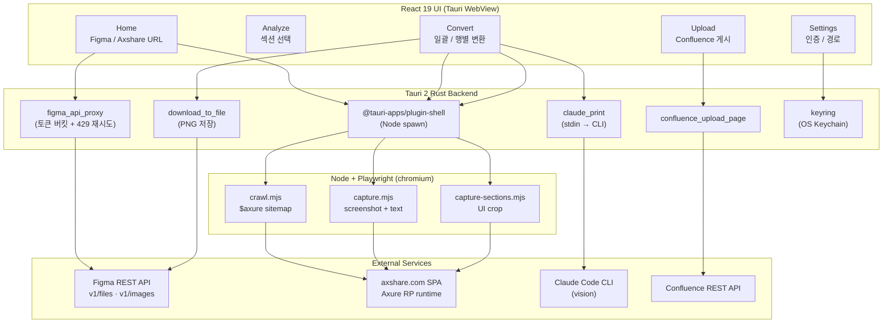
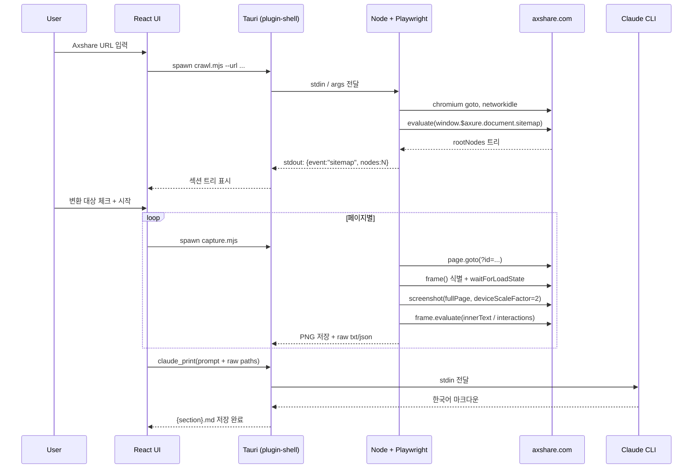

# FlipMD (FlipbookMaker)

🌐 **Language**: [한국어](./README.md) | [English](./README_EN.md)

> **Figma**와 **Axshare(Axure Share)** 두 종류의 UI 플립북을 한국어 마크다운(텍스트 + Mermaid)으로 변환해 Confluence에 업로드하는 macOS 데스크톱 앱

---

## 개요

**FlipMD**(이전 이름: FlipbookMaker)는 두 종류의 UI 플립북을 입력으로 받아 **각 섹션별 한국어 마크다운 문서**를 자동 생성하고, 이를 Confluence에 직접 업로드하는 macOS 전용 데스크톱 앱입니다.

- **Figma** — REST API로 노드 트리/PNG를 가져와 Claude vision이 의미 그룹 단위로 분석
- **Axshare (Axure Share)** — Axure RP가 만든 정적 SPA를 **Playwright(chromium)**로 띄워 사이트맵 + 페이지 콘텐츠 + 인터랙션을 추출

같은 카테고리의 여러 프레임/페이지는 1:1이 아닌 **의미 그룹 단위**로 통합된 한국어 문서로 작성되며, Mermaid 다이어그램은 Confluence 호환 규칙으로 출력해 페이지에 그대로 삽입할 수 있도록 설계했습니다.

---

## 두 입력 소스

### 1. Figma — Vision 기반 변환

- `/v1/files/.../nodes` 메타 트리 + `/v1/images` PNG 배치 렌더링
- Claude Code CLI(vision)로 PNG와 노드 메타를 함께 분석
- 토큰 버킷(메타 12/min, 이미지 5/min) + 10ids 청크 분할 + 429 자동 재시도
- Anthropic API 이미지 합산 ~20MB 한도에 맞춰 `scale=1` 고정

### 2. Axshare — Playwright 기반 SPA 크롤링

Axure RP가 호스팅하는 axshare.com SPA는 단순 HTTP fetch로 사이트맵/콘텐츠를 얻을 수 없어 **Playwright로 실제 브라우저를 띄워서 JS 실행 후 추출**하는 방식이 필수입니다.

| Phase | 스크립트 | 역할 |
|-------|----------|------|
| 1. Discovery | `scripts/crawl.mjs` | `window.$axure.document.sitemap.rootNodes`를 `evaluate`로 직렬화하여 `sitemap.json` 생성 |
| 2. Extraction | `scripts/capture.mjs` | 페이지별 풀페이지 스크린샷(PNG, 레티나 2x) + `innerText` + 인터랙션 메타데이터(JSON) 추출 |
| 3. Section Crop | `scripts/capture-sections.mjs` | 섹션별 UI-only 영역만 크롭 (사이드바/Description 제외) |
| 4. Authoring | Claude Code CLI | raw 텍스트 + 인터랙션 + 캡처를 입력으로 페이지별 한국어 마크다운 생성 |

핵심 처리:
- **iframe 콘텐츠**: Axure 페이지는 `#base` iframe 안에 렌더링 → `page.frames()`로 콘텐츠 프레임 식별 + `networkidle` 대기
- **슬러그 규칙**: 한글·공백·`>`·특수문자를 안전한 파일명으로 변환 (한글 보존)
- **인터랙션 추출**: `a`/`[onclick]`/`[data-label]` 요소를 좌표·라벨·href와 함께 JSON 덤프
- **인증 보호 프로토타입 대응**: `page.fill('input[type=password]', ...)` 단계 옵션화

---

## 5단계 워크플로우 UI

1. **설정** (`Cmd+,`): Claude Code 경로, Figma PAT, Confluence 정보
2. **홈**: Figma URL / Axshare URL 입력 + 출력 폴더 지정 (입력 유형 자동 감지)
3. **분석**: 사이트맵/섹션 목록에서 변환 대상 체크 (시각 순서 자동 정렬)
4. **변환**: 일괄 변환 + 행별 [변환]/[재시도]/[재변환], 실패 사유 펼치기, 단계별 진행률
5. **업로드**: Confluence 부모 페이지 ID/URL 지정 → 일괄 업로드 + 이미지 첨부

한국어 출력 규칙:
- 소제목/표 헤더 한국어 번역, 원문 인용은 보존 + `*(번역)*` 부기
- Mermaid 다이어그램 Confluence 호환 출력
- Hallucination 차단: 입력에 없는 내용 추론 금지, 출처 인용 강제, 빈약 입력은 정직하게 짧게

---

## 기술 스택

| 계층 | 기술 |
|------|------|
| **프론트엔드** | React 19, TypeScript 5, Vite, React Router 7 |
| **데스크톱 셸** | Tauri 2 (Rust 백엔드, plugin: updater / shell / dialog / fs / opener / process) |
| **변환 엔진** | Claude Code CLI (vision) — `claude --print` stdin |
| **SPA 크롤링** | Playwright (chromium headless), Node.js ≥ 18 |
| **외부 API** | Figma REST API, Confluence REST API, Anthropic API |
| **MCP** | `@modelcontextprotocol/sdk` (mcp-atlassian 등 확장 연동 지점) |
| **자격증명 보관** | OS Keychain (Rust `keyring` 크레이트) |
| **배포** | Tauri auto-update via GitHub Releases |
| **플랫폼** | macOS Monterey (12.0)+ Apple Silicon |

### Tauri 백엔드 커맨드

- `claude_print` — stdin 기반 Claude CLI 호출 (argv overflow 회피)
- `figma_api_proxy` — Figma REST API 프록시 + 토큰 버킷 + 429 재시도
- `download_to_file` — Figma S3 PNG 다운로드
- `confluence_upload_page` — Confluence REST API 페이지 생성 + 이미지 첨부
- Playwright 스크립트는 `@tauri-apps/plugin-shell`로 Node 프로세스를 spawn하여 stdout JSON-line 이벤트를 UI에 스트리밍

---

## 아키텍처

### Axshare 변환 시퀀스

---

## 개발 과정에서의 도전과 해결

### 1. Axshare SPA 크롤링 — `$axure` 객체 + iframe 처리

**도전**: axshare는 Axure RP가 만든 정적 HTML/JS 묶음을 호스팅하는 SPA로, 단순 HTTP fetch로는 사이트맵도 페이지 콘텐츠도 얻을 수 없었습니다. 사이트맵은 `window.$axure.document.sitemap.rootNodes` 객체에 JS 변수로만 노출되며, 실제 페이지 콘텐츠는 `#base` iframe 안에 렌더링되어 메인 프레임에서 직접 접근할 수 없었습니다.

**해결**: Playwright(chromium headless)로 브라우저를 띄워 `networkidle`까지 대기한 뒤 `page.evaluate`로 `$axure` 트리를 직렬화 가능한 형태로 변환해 추출했습니다. 페이지 콘텐츠는 `page.frames()`에서 axshare 도메인의 콘텐츠 프레임을 식별하고 `waitForLoadState('networkidle')` + 1.5s 애니메이션 여유를 두어 빈 캡처가 발생하지 않도록 처리했습니다.

### 2. Release `.app`에서 Playwright 의존성

**도전**: Tauri로 빌드한 release `.app`은 자체 `node_modules`가 없어 Playwright를 번들할 수 없었습니다. 사용자 환경에 따라 Playwright 위치가 다양해(글로벌 npm, nvm, 프로젝트 로컬) 단순 `import 'playwright'`로는 일관되게 로드할 수 없었습니다.

**해결**: 환경변수 `PLAYWRIGHT_MODULE_PATH`를 도입해 사용자/Tauri 측에서 Playwright 설치 경로를 지정할 수 있게 만들고, 스크립트 시작 시 `node=...`, `cwd=...`, `PLAYWRIGHT_MODULE_PATH=...`를 stderr에 기록해 spawn 실패를 추적 가능하게 했습니다. ESM에서 디렉토리 import가 unsupported이므로 `${baseSpec}/index.mjs`로 명시 경로를 구성합니다.

### 3. Claude CLI argv 오버플로우

**도전**: 변환 프롬프트에 다수의 이미지 경로 + 메타데이터를 포함하면 명령행 인자 길이 한계를 초과해 Claude CLI 실행이 실패했습니다.

**해결**: `claude_print` Tauri 커맨드를 stdin 기반으로 설계해 prompt 본문과 이미지 경로 목록을 표준 입력으로 전달하고, CLI는 Read 도구로 이미지를 직접 열도록 지시해 argv 길이를 최소화했습니다.

### 4. Figma API Rate Limit 회피

**도전**: 큰 디자인 파일에서 메타 트리 + 이미지 렌더 요청이 빠르게 누적되면 Figma API의 분당 호출 한도(메타 12/min, 이미지 5/min)에 걸려 `429`가 발생했습니다.

**해결**: Tauri 백엔드에 토큰 버킷을 두 종류 요청별로 두고, 이미지 요청은 10ids 청크로 분할했습니다. `figma_api_proxy`가 429에 자동 지수 백오프 재시도를 적용해 사용자가 의식하지 않아도 안전하게 처리됩니다.

### 5. 의미 그룹 단위 통합 변환 + Hallucination 차단

**도전**: 프레임/페이지를 1:1로 마크다운에 매핑하면 같은 시나리오가 분절되어 가독성이 떨어졌고, 단순 병합은 컨텍스트가 길어져 Claude의 환각 위험이 커졌습니다.

**해결**: 카테고리 단위로 묶어 시각 순서로 정렬한 다음 한 번의 vision 호출로 함께 전달해 화면 간 흐름을 이해시키고, 프롬프트에 "입력에 없는 내용 추론 금지", "출처 인용", "빈약 입력은 짧게" 규칙을 강제했습니다.

### 6. 대형 섹션 timeout & 진행률 노출

**도전**: 36개 이상 프레임이 있는 섹션은 vision 분석이 길어져 기본 timeout 안에 끝나지 않았고, 사용자는 "멈췄나?"를 알 수 없었습니다.

**해결**: 섹션 크기에 따라 timeout을 최대 17분까지 동적으로 확장하고, Node 스크립트는 stdout에 JSON-line 이벤트(`{event, type, m, n}`)를 흘려 UI가 "노드 트리 수집 → 이미지 다운로드 m/n → Claude 분석" 단계를 실시간 표시하도록 했습니다.

---

## 역할 및 기여

- 전체 앱 설계 및 구현 (단독 개발)
- React 19 + Tauri 2 5단계 워크플로우 UI 설계
- Tauri Rust 커맨드(claude_print / figma_api_proxy / confluence_upload_page) 구현
- **Playwright 기반 Axshare SPA 크롤링 파이프라인** (crawl / capture / capture-sections) 설계 및 구현
- `$axure.document.sitemap` 추출 + iframe 프레임 식별 + 인터랙션/슬러그 처리
- Figma API 토큰 버킷 + 청크 분할 + 429 재시도 로직 설계
- Claude vision 프롬프트 설계 (의미 그룹 단위 한국어 출력 + Hallucination 차단 규칙)
- Confluence REST API 페이지 생성 및 이미지 첨부 파이프라인 구성
- Tauri auto-update + OS Keychain 자격증명 보관 (Rust `keyring`)
- Release `.app`의 Playwright 글로벌 의존 설계 (`PLAYWRIGHT_MODULE_PATH` + 진단 로그)

---

## 관련 링크

- **GitHub**: [leonardo204/flipbookMaker](https://github.com/leonardo204/flipbookMaker)
- **License**: MIT
- **Contact**: zerolive7@gmail.com

---

*이 프로젝트는 반복적인 UI 시나리오 문서 작성 업무를 자동화하기 위해 만든 macOS 전용 사내 데스크톱 도구입니다.*
