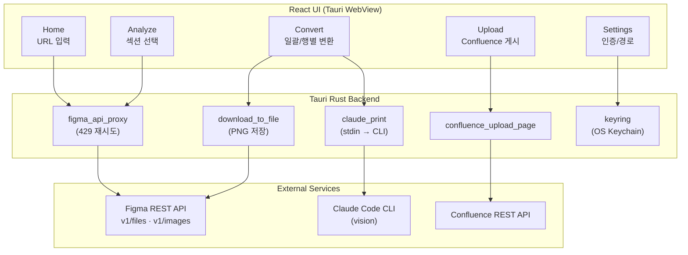
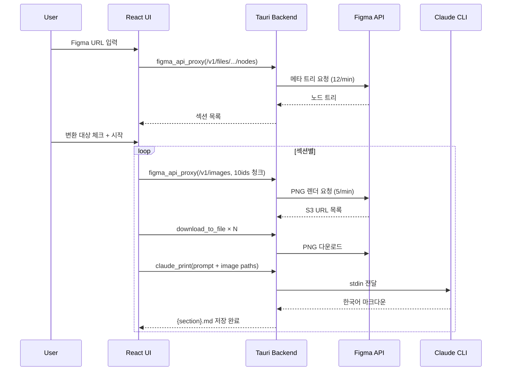

# FlipMD (FlipbookMaker)

🌐 **Language**: [한국어](./README.md) | [English](./README_EN.md)

> Figma/Axshare UI 플립북을 한국어 마크다운(텍스트 + Mermaid)으로 변환해 Confluence에 업로드하는 macOS 데스크톱 앱

---

## 개요

**FlipMD**(이전 이름: FlipbookMaker)는 Figma 플립북(UI 시나리오 문서)을 분석해 **각 섹션별로 한국어 마크다운 문서**를 자동 생성하고, 이를 Confluence에 직접 업로드하는 macOS 전용 데스크톱 앱입니다. Figma 프레임을 PNG로 렌더링한 뒤 Claude Code CLI(vision)로 이미지와 메타데이터를 함께 분석하며, 같은 카테고리의 여러 프레임은 1:1이 아닌 **의미 그룹 단위**로 통합된 한국어 문서로 작성됩니다. Mermaid 다이어그램은 Confluence 호환 규칙으로 출력하여 그대로 페이지 본문에 삽입할 수 있도록 설계했습니다.

---

## 주요 기능

### Vision 기반 변환 파이프라인

- **Figma REST API 연동**: `/v1/files/.../nodes`로 메타 트리를 수집하고 `/v1/images`로 PNG 배치 렌더링
- **Claude vision 분석**: Figma 메타와 PNG를 함께 Claude Code CLI에 전달하여 의미 그룹 단위 한국어 마크다운 생성
- **Hallucination 차단**: 입력에 없는 내용 추론 금지, 출처 인용 강제, 빈약한 입력은 정직하게 짧게 출력

### Rate Limit 안전성

- **토큰 버킷**: 메타 12/min, 이미지 5/min으로 Figma API 한도 준수
- **청크 분할**: 이미지 요청은 10ids 단위로 분할 + 자동 재시도
- **이미지 합산 한도**: Anthropic API의 ~20MB 한도에 맞춰 `scale=1` 고정

### 워크플로우 UI (5단계)

1. **설정**: Claude Code 경로, Figma PAT, Confluence 정보 (`Cmd+,`)
2. **홈**: Figma 디자인 URL + 출력 폴더 지정
3. **분석**: 섹션 목록에서 변환 대상 체크 (시각 순서 자동 정렬)
4. **변환**: 일괄 변환 + 행별 [변환]/[재시도]/[재변환], 실패 사유 펼치기
5. **업로드**: Confluence 부모 페이지 ID/URL 지정 → 일괄 업로드 + 이미지 첨부

### 한국어 출력 규칙

- 소제목/표 헤더 한국어 번역
- 원문 인용은 보존 + `*(번역)*` 부기
- Mermaid 다이어그램 Confluence 호환 출력

---

## 기술 스택

| 계층 | 기술 |
|------|------|
| **프론트엔드** | React 18, TypeScript, Vite, React Router |
| **데스크톱 셸** | Tauri 2 (Rust 백엔드) |
| **변환 엔진** | Claude Code CLI (vision) |
| **외부 API** | Figma REST API, Confluence REST API, Anthropic API |
| **자격증명 보관** | OS Keychain (Rust `keyring` 크레이트) |
| **플랫폼** | macOS Monterey(12.0)+ Apple Silicon |

### Tauri 백엔드 커맨드

- `claude_print` — stdin 기반 Claude CLI 호출 (argv overflow 회피)
- `figma_api_proxy` — Figma REST API 프록시 + 429 재시도
- `download_to_file` — Figma S3 PNG 다운로드
- `confluence_upload_page` — Confluence REST API 페이지 생성 + 이미지 첨부

---

## 아키텍처

### 변환 파이프라인 상세

---

## 개발 과정에서의 도전과 해결

### 1. Claude CLI argv 오버플로우

**도전**: 변환 프롬프트에 다수의 이미지 경로 + 메타데이터를 포함하면 명령행 인자 길이 한계를 초과해 Claude CLI 실행이 실패하는 문제가 있었습니다.

**해결**: `claude_print` Tauri 커맨드를 stdin 기반으로 설계하여 prompt 본문과 이미지 경로 목록을 표준 입력으로 전달했습니다. CLI는 Read 도구로 이미지 파일을 직접 열도록 지시하여 argv 길이를 최소화했습니다.

### 2. Figma API Rate Limit 회피

**도전**: 큰 디자인 파일에서 메타 트리 + 이미지 렌더 요청이 빠르게 누적되면 Figma API의 분당 호출 한도(메타 12/min, 이미지 5/min)에 걸려 `429 Too Many Requests`가 발생했습니다.

**해결**: Tauri 백엔드에 토큰 버킷을 두어 두 종류 요청에 별도 한도를 적용하고, 이미지 요청은 10ids 청크로 분할했습니다. `figma_api_proxy`가 429 응답에 자동 재시도(지수 백오프)를 적용해 사용자가 의식하지 않아도 안전하게 처리되도록 만들었습니다.

### 3. 의미 그룹 단위 통합 변환

**도전**: 프레임을 1:1로 마크다운 페이지로 변환하면 같은 시나리오에 속한 화면들이 분절되어 가독성이 떨어졌습니다. 단순 병합은 컨텍스트가 길어져 Claude의 환각 가능성이 커졌습니다.

**해결**: 카테고리 단위로 프레임을 묶고, 시각 순서로 정렬한 다음 한 번의 vision 호출에 함께 전달하여 Claude가 화면 간의 흐름을 인식하도록 했습니다. 프롬프트에는 "입력에 없는 내용은 추론 금지", "출처를 인용하라", "빈약한 입력은 짧게 답하라" 규칙을 강제하여 환각을 차단했습니다.

### 4. 대형 섹션 timeout 관리

**도전**: 36개 이상의 프레임을 가진 섹션은 vision 분석이 길어져 기본 timeout 안에 끝나지 않는 경우가 있었습니다.

**해결**: 섹션 크기에 따라 timeout을 최대 17분까지 동적으로 확장하고, 변환 단계(노드 수집 → 이미지 다운로드 m/n → Claude 분석)별 진행 상태를 UI에 실시간 노출했습니다.

---

## 역할 및 기여

- 전체 앱 설계 및 구현 (단독 개발)
- React + Tauri 5단계 워크플로우 UI 설계
- Tauri Rust 커맨드(claude_print / figma_api_proxy / confluence_upload_page) 구현
- Figma API 토큰 버킷 + 청크 분할 + 429 재시도 로직 설계
- Claude vision 프롬프트 설계 (의미 그룹 단위 한국어 출력 + Hallucination 차단 규칙)
- Confluence REST API 페이지 생성 및 이미지 첨부 파이프라인 구성
- OS Keychain 기반 인증 정보 보관 (Rust `keyring`)

---

## 관련 링크

- **GitHub**: [leonardo204/flipbookMaker](https://github.com/leonardo204/flipbookMaker)
- **License**: MIT
- **Contact**: zerolive7@gmail.com

---

*이 프로젝트는 반복적인 UI 시나리오 문서 작성 업무를 자동화하기 위해 만든 macOS 전용 사내 데스크톱 도구입니다.*
