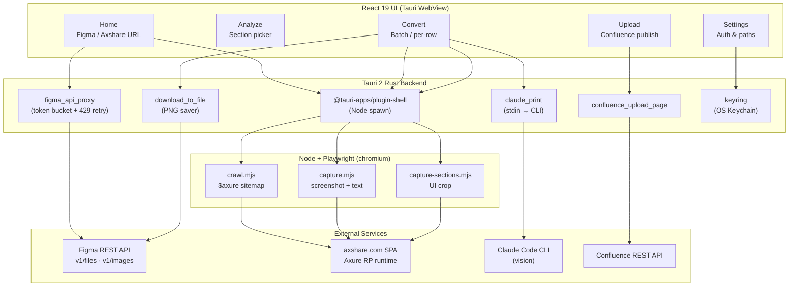
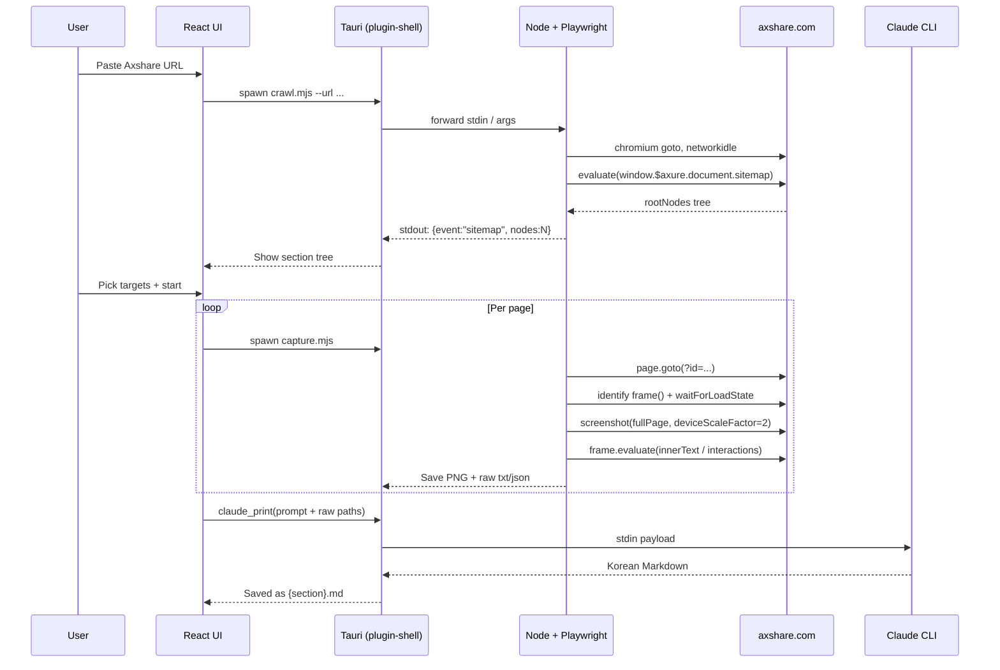

# FlipMD (FlipbookMaker)

🌐 **Language**: [한국어](./README.md) | [English](./README_EN.md)

> A macOS desktop app that converts both **Figma** and **Axshare (Axure Share)** UI flipbooks into Korean Markdown (text + Mermaid) and uploads them to Confluence

---

## Overview

**FlipMD** (formerly FlipbookMaker) is a macOS-only desktop app that takes two kinds of UI flipbooks as input, automatically generates **Korean Markdown documents per section**, and uploads them directly to Confluence.

- **Figma** — Fetch node trees and PNGs via REST API; Claude vision analyzes them at the semantic group level
- **Axshare (Axure Share)** — Drive a real **Playwright (chromium)** browser against the static SPA produced by Axure RP to extract the sitemap, page content, and interactions

Multiple frames/pages within the same category are merged into a single Korean document at the **semantic group level** rather than 1:1, and Mermaid diagrams are emitted under Confluence-compatible rules so they can be inserted into pages as-is.

---

## Two Input Sources

### 1. Figma — Vision-based Conversion

- `/v1/files/.../nodes` meta tree + `/v1/images` PNG batch render
- Claude Code CLI (vision) analyzes PNGs alongside node metadata
- Token bucket (meta 12/min, images 5/min) + 10-ID chunking + 429 auto-retry
- Fixed at `scale=1` to stay under Anthropic's ~20 MB per-request image cap

### 2. Axshare — Playwright-based SPA Crawling

The axshare.com SPA is a static HTML/JS bundle generated by Axure RP. A plain HTTP fetch yields neither the sitemap nor page content, so it's mandatory to **drive a real browser via Playwright** and extract data after JS execution.

| Phase | Script | Role |
|-------|--------|------|
| 1. Discovery | `scripts/crawl.mjs` | Serialize `window.$axure.document.sitemap.rootNodes` via `evaluate` into `sitemap.json` |
| 2. Extraction | `scripts/capture.mjs` | Per-page full-page screenshot (PNG, retina 2x) + `innerText` + interaction metadata (JSON) |
| 3. Section Crop | `scripts/capture-sections.mjs` | Crop UI-only regions per section (excluding sidebar/Description) |
| 4. Authoring | Claude Code CLI | Generate Korean Markdown per page from raw text + interactions + captures |

Key handling:
- **iframe content**: Axure pages render inside a `#base` iframe → identify the content frame via `page.frames()` and wait on `networkidle`
- **Slug rules**: Convert Korean / whitespace / `>` / special characters into safe filenames while preserving Hangul
- **Interaction extraction**: Dump `a` / `[onclick]` / `[data-label]` elements with coordinates, labels, and href to JSON
- **Password-protected prototypes**: Optional `page.fill('input[type=password]', ...)` step

---

## Five-Step Workflow UI

1. **Settings** (`Cmd+,`): Claude Code path, Figma PAT, Confluence credentials
2. **Home**: Paste a Figma URL or Axshare URL + select output folder (input type auto-detected)
3. **Analyze**: Pick conversion targets from the sitemap/section tree (auto-sorted by visual order)
4. **Convert**: Batch run + per-row [Convert] / [Retry] / [Re-convert]; expandable failure details; per-stage progress
5. **Upload**: Specify Confluence parent page ID/URL → batch upload + image attachment

Korean output rules:
- Translated sub-headings and table headers; original quotes preserved with `*(translated)*` annotation
- Mermaid diagrams emitted in Confluence-compatible form
- Hallucination guardrails: forbid inference beyond the input, enforce source citations, keep sparse inputs honestly short

---

## Tech Stack

| Layer | Technology |
|-------|------------|
| **Frontend** | React 19, TypeScript 5, Vite, React Router 7 |
| **Desktop Shell** | Tauri 2 (Rust backend, plugins: updater / shell / dialog / fs / opener / process) |
| **Conversion Engine** | Claude Code CLI (vision) — `claude --print` via stdin |
| **SPA Crawling** | Playwright (chromium headless), Node.js ≥ 18 |
| **External APIs** | Figma REST API, Confluence REST API, Anthropic API |
| **MCP** | `@modelcontextprotocol/sdk` (extension point for mcp-atlassian etc.) |
| **Credential Storage** | OS Keychain (Rust `keyring` crate) |
| **Distribution** | Tauri auto-update via GitHub Releases |
| **Platform** | macOS Monterey (12.0)+ Apple Silicon |

### Tauri Backend Commands

- `claude_print` — Invoke the Claude CLI via stdin (avoids argv overflow)
- `figma_api_proxy` — Figma REST API proxy + token bucket + 429 retry
- `download_to_file` — Download Figma S3 PNGs
- `confluence_upload_page` — Create Confluence pages and attach images via REST API
- Playwright scripts are spawned as Node processes via `@tauri-apps/plugin-shell`, streaming JSON-line events on stdout into the UI

---

## Architecture

### Axshare Conversion Sequence

---

## Challenges & Solutions

### 1. Crawling the Axshare SPA — `$axure` Object + iframe Handling

**Challenge**: axshare hosts a static HTML/JS SPA generated by Axure RP. A plain HTTP fetch yields neither the sitemap nor page content. The sitemap is exposed only as a JS variable at `window.$axure.document.sitemap.rootNodes`, and actual page content renders inside a `#base` iframe inaccessible from the main frame.

**Solution**: Drive Playwright (chromium headless) to load the page until `networkidle`, then run `page.evaluate` to serialize the `$axure` tree into a JSON-friendly form. For page content, locate the axshare-domain content frame from `page.frames()` and wait on `waitForLoadState('networkidle')` plus a 1.5 s animation buffer to avoid blank captures.

### 2. Playwright Dependency in the Release `.app`

**Challenge**: A Tauri-built release `.app` has no `node_modules` of its own and cannot bundle Playwright. Users have Playwright in different places (global npm, nvm, project-local), so a plain `import 'playwright'` could not resolve consistently.

**Solution**: Introduced a `PLAYWRIGHT_MODULE_PATH` env var so the user (or Tauri) can pin the Playwright install location, and emit `node=...`, `cwd=...`, `PLAYWRIGHT_MODULE_PATH=...` to stderr at startup to make spawn failures traceable. ESM does not support directory imports, so the resolver constructs `${baseSpec}/index.mjs` explicitly.

### 3. Claude CLI argv Overflow

**Challenge**: Including many image paths + metadata in the conversion prompt exceeded the command-line argument length limit and broke Claude CLI invocation.

**Solution**: Designed the `claude_print` Tauri command to be stdin-based, streaming the prompt body and image path list through standard input. The CLI is instructed to open images via its Read tool, keeping argv length minimal.

### 4. Avoiding Figma API Rate Limits

**Challenge**: For large design files, meta-tree and image-render requests pile up quickly and trigger Figma's per-minute caps (meta 12/min, images 5/min), producing `429`.

**Solution**: Implemented per-request-type token buckets in the Tauri backend and chunked image requests into groups of 10 IDs. `figma_api_proxy` applies automatic exponential backoff on 429 so the user never has to think about it.

### 5. Semantic-Group Conversion + Hallucination Guardrails

**Challenge**: A 1:1 mapping from frame/page to Markdown fragmented related screens within the same scenario, hurting readability. Naive merging, however, lengthened context and increased Claude's hallucination risk.

**Solution**: Group frames/pages by category, sort them in visual order, and pass them to a single vision call so Claude can reason about cross-screen flow. Prompts enforce strict rules — "do not infer beyond input", "cite sources", "answer briefly when input is sparse" — to suppress hallucinations.

### 6. Large Sections — Timeout & Progress Visibility

**Challenge**: Sections with 36+ frames sometimes exceeded the default vision timeout, and the user had no way to tell whether the run had stalled.

**Solution**: Dynamically extend timeouts up to 17 minutes based on section size, while the Node scripts emit JSON-line events (`{event, type, m, n}`) on stdout so the UI can show "node tree → image download m/n → Claude analysis" progress live.

---

## Role & Contributions

- Full app design and implementation (solo project)
- 5-step React 19 + Tauri 2 workflow UI design
- Tauri Rust commands (claude_print / figma_api_proxy / confluence_upload_page)
- **Playwright-based Axshare SPA crawling pipeline** (crawl / capture / capture-sections) — design and implementation
- `$axure.document.sitemap` extraction + iframe frame identification + interaction/slug processing
- Figma API token bucket + chunking + 429 retry logic
- Claude vision prompt design (semantic-group Korean output + hallucination guardrails)
- Confluence REST API page creation + image attachment pipeline
- Tauri auto-update + OS Keychain credential storage (Rust `keyring`)
- Designed the release `.app`'s reliance on a globally installed Playwright (`PLAYWRIGHT_MODULE_PATH` + diagnostic logging)

---

## Links

- **GitHub**: [leonardo204/flipbookMaker](https://github.com/leonardo204/flipbookMaker)
- **License**: MIT
- **Contact**: zerolive7@gmail.com

---

*This project is a macOS-only in-house desktop tool built to automate the repetitive task of authoring UI scenario documents.*
