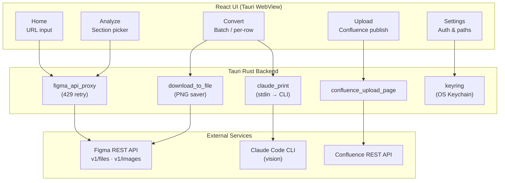
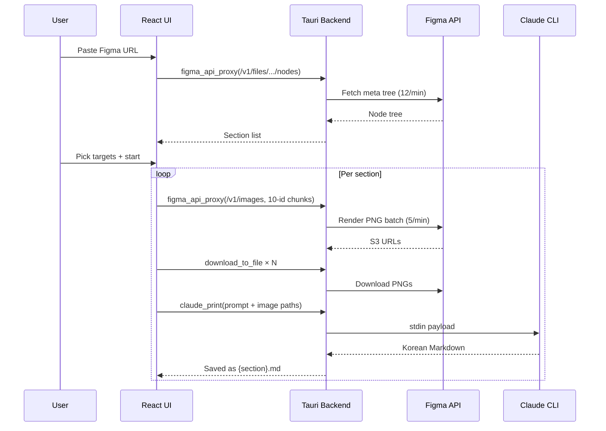

# FlipMD (FlipbookMaker)

🌐 **Language**: [한국어](./README.md) | [English](./README_EN.md)

> A macOS desktop app that converts Figma/Axshare UI flipbooks into Korean Markdown (text + Mermaid) and uploads them to Confluence

---

## Overview

**FlipMD** (formerly FlipbookMaker) is a macOS-only desktop app that analyzes Figma flipbooks (UI scenario documents) and automatically generates **Korean Markdown documents per section**, then uploads them directly to Confluence. It renders Figma frames as PNGs and feeds them along with node metadata to the Claude Code CLI (vision); multiple frames in the same category are merged into a single Korean document at the **semantic group level** rather than 1:1 per frame. Mermaid diagrams are emitted under Confluence-compatible rules so they can be inserted into pages as-is.

---

## Key Features

### Vision-based Conversion Pipeline

- **Figma REST API integration**: Collect node trees via `/v1/files/.../nodes` and batch-render PNGs via `/v1/images`
- **Claude vision analysis**: Pass Figma metadata + PNGs to the Claude Code CLI to produce Korean Markdown at the semantic group level
- **Hallucination guardrails**: Forbid inference beyond the input, enforce source citations, and keep sparse inputs honestly short

### Rate-Limit Safety

- **Token bucket**: Meta 12/min, images 5/min — respects Figma API limits
- **Chunked requests**: Image requests are split into chunks of 10 IDs with automatic retry
- **Image size cap**: Fixed at `scale=1` to stay under Anthropic's ~20 MB per-request image limit

### Five-Step Workflow UI

1. **Settings**: Claude Code path, Figma PAT, Confluence credentials (`Cmd+,`)
2. **Home**: Paste Figma design URL + select output folder
3. **Analyze**: Pick sections to convert (auto-sorted by visual order)
4. **Convert**: Batch run + per-row [Convert] / [Retry] / [Re-convert]; expandable failure details
5. **Upload**: Specify Confluence parent page ID/URL → batch upload + image attachment

### Korean Output Conventions

- Translated sub-headings and table headers
- Original quotes preserved with `*(translated)*` annotation
- Mermaid diagrams emitted in Confluence-compatible form

---

## Tech Stack

| Layer | Technology |
|-------|------------|
| **Frontend** | React 18, TypeScript, Vite, React Router |
| **Desktop Shell** | Tauri 2 (Rust backend) |
| **Conversion Engine** | Claude Code CLI (vision) |
| **External APIs** | Figma REST API, Confluence REST API, Anthropic API |
| **Credential Storage** | OS Keychain (Rust `keyring` crate) |
| **Platform** | macOS Monterey (12.0)+ Apple Silicon |

### Tauri Backend Commands

- `claude_print` — Invoke the Claude CLI via stdin (avoids argv overflow)
- `figma_api_proxy` — Figma REST API proxy with 429 retry logic
- `download_to_file` — Download Figma S3 PNGs
- `confluence_upload_page` — Create Confluence pages and attach images via REST API

---

## Architecture

### Conversion Pipeline (Detailed)

---

## Challenges & Solutions

### 1. Claude CLI argv Overflow

**Challenge**: Including many image paths and metadata in the conversion prompt exceeded the command-line argument length limit and broke the Claude CLI invocation.

**Solution**: Designed the `claude_print` Tauri command to be stdin-based, streaming the prompt body and image path list through standard input. The CLI is instructed to open the images via its Read tool, keeping argv length minimal.

### 2. Avoiding Figma API Rate Limits

**Challenge**: For large design files, meta-tree and image-render requests pile up quickly and trigger Figma's per-minute caps (meta 12/min, images 5/min), producing `429 Too Many Requests`.

**Solution**: Implemented a token bucket on the Tauri backend with separate quotas for the two request types and chunked image requests into groups of 10 IDs. `figma_api_proxy` applies automatic exponential backoff on 429 responses so the user never has to think about it.

### 3. Semantic-Group-Level Conversion

**Challenge**: Mapping frames 1:1 to Markdown pages fragmented related screens within the same scenario, hurting readability. Naive merging, however, lengthened context and increased Claude's hallucination risk.

**Solution**: Group frames by category, sort them in visual order, and pass them to a single vision call so Claude can reason about cross-frame flow. Prompts enforce strict rules — "do not infer beyond input", "cite sources", "answer briefly when input is sparse" — to suppress hallucinations.

### 4. Timeout Management for Large Sections

**Challenge**: Sections with 36+ frames sometimes exceeded the default vision-analysis timeout.

**Solution**: Dynamically extend timeouts up to 17 minutes based on section size, while exposing per-stage progress (node collection → image download m/n → Claude analysis) live in the UI.

---

## Role & Contributions

- Full app design and implementation (solo project)
- 5-step React + Tauri workflow UI design
- Tauri Rust commands (claude_print / figma_api_proxy / confluence_upload_page)
- Figma API token bucket + chunking + 429 retry logic
- Claude vision prompt design (semantic-group Korean output + hallucination guardrails)
- Confluence REST API page creation + image attachment pipeline
- OS Keychain-based credential storage via Rust `keyring`

---

## Links

- **GitHub**: [leonardo204/flipbookMaker](https://github.com/leonardo204/flipbookMaker)
- **License**: MIT
- **Contact**: zerolive7@gmail.com

---

*This project is a macOS-only in-house desktop tool built to automate the repetitive task of authoring UI scenario documents.*
