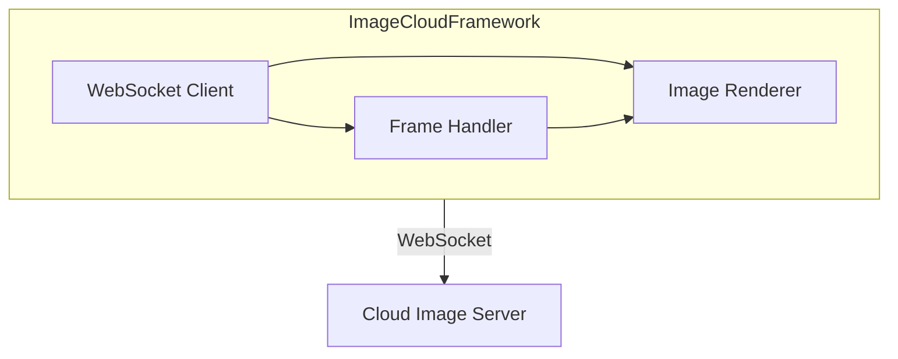

# ImageCloudFramework

🌐 **Language**: [한국어](./README.md) | [English](./README_EN.md)

> Swift Framework for iOS Cloud Image Streaming

---

## Overview

**ImageCloudFramework** is a Swift framework for handling cloud-based image streaming on iOS devices.

It supports real-time image frame reception and rendering via WebSocket, developed for integration with cloud UI services.

---

## Key Features

### Image Streaming
- **WebSocket Communication**: Real-time image frame reception
- **Frame Decoding**: Binary data parsing and image conversion
- **Buffer Management**: Efficient frame buffering

### Utilities
- **CloudLogUtil**: Debug logging utility
- **Frame Processing**: Image frame parsing and composition

---

## Architecture

---

## Tech Stack

| Category | Technology |
|----------|------------|
| **Platform** | iOS 13+ |
| **Language** | Swift 5 |
| **Communication** | WebSocket |
| **Build** | Xcode, Swift Package |

---

## Role & Contributions

- iOS framework architecture design
- WebSocket-based image streaming module development
- Frame parsing and rendering logic implementation

---

*This project was developed for the IBC 2022 Cloud UI demo.*
