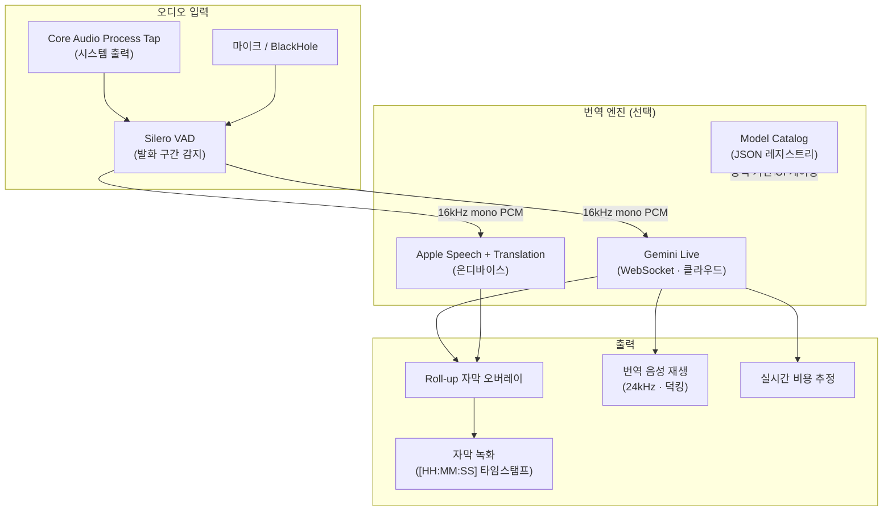

# liveTranscript

🌐 **Language**: [한국어](./README.md) | [English](./README_EN.md)

> 시스템에서 흘러나오는 소리를 실시간으로 번역해 영화 자막처럼 화면에 표시하는 macOS 메뉴바 앱

---

## 개요

**liveTranscript**는 시스템 출력 오디오(영상, 회의, 스트리밍 등)를 실시간으로 캡처해 원하는 언어로 번역하고, 영화 자막처럼 화면에 roll-up 오버레이로 표시하는 macOS 메뉴바 앱입니다. 클라우드(Gemini Live)와 온디바이스(Apple Speech + Translation) 두 가지 번역 엔진을 선택할 수 있어, 비용과 프라이버시 요구에 맞춰 유연하게 사용할 수 있습니다.

---

## 주요 기능

### 시스템 오디오 캡처
- Core Audio Process Tap(macOS 14.4+)으로 시스템 출력 오디오를 화면 녹화 권한 없이 직접 캡처
- 마이크, BlackHole 루프백 장치 입력 지원
- Silero VAD(음성 활동 감지)로 발화 구간만 전송해 API 비용 절감

### 선택 가능한 번역 엔진
- **클라우드**: Gemini Live Translate (WebSocket 스트리밍, API 키 필요)
- **온디바이스**: Apple Speech + Translation (macOS 26+, 키 불필요·완전 무료)
- JSON 모델 카탈로그로 엔진 능력에 따라 UI를 자동 게이팅

### 영화 자막식 자막 렌더링
- roll-up 방식으로 번역문을 누적 표시, 원문 동시 표시 옵션
- 폰트·크기(16–72pt)·색상·외곽선·글로우·배경 박스 실시간 조정
- delta(누적)·segment 두 입력 모델을 단일 표시로 통일

### 번역 음성 재생 & 녹화
- 번역된 음성(24kHz) 출력, 원문 오디오 자동 덕킹, 출력 장치 선택
- 원문+번역문을 `[HH:MM:SS]` 타임스탬프와 함께 파일로 기록 (이어쓰기/새로쓰기)

### 실시간 비용 추정
- Gemini 사용 시 세션별 입력/출력/총 비용(USD) 표시 및 누적 저장
- 온디바이스 엔진은 무료

---

## 기술 스택

| 분류 | 기술 |
|------|------|
| **Language** | Swift 6.0 |
| **Platform** | macOS 26 (Tahoe)+ |
| **App Type** | 메뉴바 앱 |
| **Audio Capture** | Core Audio Process Tap, BlackHole |
| **VAD** | Silero VAD |
| **Cloud Engine** | Gemini Live Translate (WebSocket) |
| **On-Device Engine** | Apple Speech + Translation |
| **Update** | Sparkle |
| **Build** | XcodeGen, Make |

---

## 아키텍처

---

## 개발 과정에서의 도전과 해결

### 1. 화면 녹화 권한 없는 시스템 오디오 캡처
**도전**: 시스템에서 재생되는 소리를 캡처하려면 일반적으로 화면 녹화 권한이 필요하거나 별도 루프백 장치 설치가 강제됩니다.

**해결**: macOS 14.4+의 Core Audio Process Tap을 사용해 화면 녹화 권한 없이 시스템 출력 오디오를 직접 탭하고, 필요 시 BlackHole 루프백도 선택할 수 있도록 입력 경로를 추상화했습니다.

### 2. 두 가지 번역 엔진의 통합
**도전**: 클라우드(Gemini)는 delta 누적 스트림을, 온디바이스(Apple)는 segment 단위 결과를 반환해 자막 표시 모델이 서로 달랐습니다.

**해결**: JSON 모델 카탈로그로 엔진 능력을 정의하고, delta·segment 두 입력을 단일 roll-up 표시 모델로 통일하는 렌더링 레이어를 설계했습니다. 엔진 능력에 따라 관련 UI가 자동으로 켜지고 꺼지도록 게이팅했습니다.

### 3. API 비용 최적화
**도전**: 클라우드 번역은 오디오 전송량에 비례해 비용이 발생하므로, 무음 구간까지 전송하면 비용이 급증합니다.

**해결**: Silero VAD로 실제 발화 구간만 감지해 전송하고, 세션별 입력/출력 토큰 비용을 실시간 추정·누적 표시해 사용자가 비용을 즉시 파악할 수 있게 했습니다.

---

## 역할 및 기여

- macOS 메뉴바 앱 아키텍처 설계 및 구현
- Core Audio Process Tap 기반 시스템 오디오 캡처 파이프라인 개발
- Silero VAD 연동 및 발화 구간 기반 비용 최적화
- Gemini Live(WebSocket)·Apple Speech+Translation 이중 엔진 통합
- delta·segment 통일 roll-up 자막 렌더링 레이어 설계
- 번역 음성 재생·자막 녹화·실시간 비용 추정 기능 구현
- Sparkle 기반 자동 업데이트 배포

---

## 관련 링크

- **GitHub**: [leonardo204/liveTranscript](https://github.com/leonardo204/liveTranscript)
- **Contact**: zerolive7@gmail.com

---

*이 프로젝트는 언어 장벽 없이 영상·회의·스트리밍의 소리를 실시간으로 이해할 수 있도록 돕는 macOS 실시간 번역 자막 도구입니다.*
