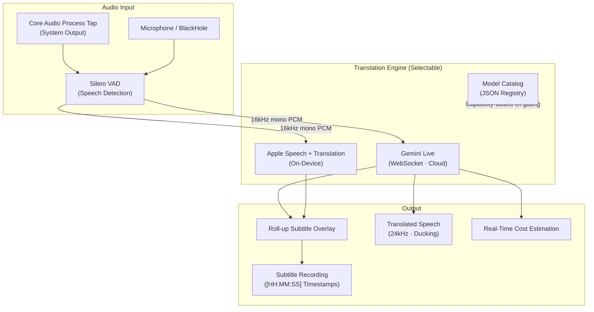

# liveTranscript

🌐 **Language**: [한국어](./README.md) | [English](./README_EN.md)

> A macOS menu bar app that translates system audio in real time and displays it on screen like movie subtitles

---

## Overview

**liveTranscript** is a macOS menu bar app that captures system output audio (videos, meetings, streams, etc.) in real time, translates it into your target language, and renders it as a roll-up overlay on screen like movie subtitles. You can choose between a cloud engine (Gemini Live) and an on-device engine (Apple Speech + Translation), balancing cost and privacy to fit your needs.

---

## Key Features

### System Audio Capture
- Directly taps system output audio via Core Audio Process Tap (macOS 14.4+) — **no screen recording permission required**
- Supports microphone and BlackHole loopback device input
- Silero VAD (Voice Activity Detection) sends only speech segments to cut API costs

### Selectable Translation Engines
- **Cloud**: Gemini Live Translate (WebSocket streaming, API key required)
- **On-Device**: Apple Speech + Translation (macOS 26+, no key, fully free)
- JSON model catalog automatically gates UI based on each engine's capabilities

### Movie-Style Subtitle Rendering
- Roll-up display accumulates translations, with an optional source-text view
- Real-time control of font, size (16–72pt), color, outline, glow, and background box
- Unifies delta (accumulative) and segment input models into a single display

### Translated Speech Playback & Recording
- Translated speech (24kHz) output, automatic source-audio ducking, output device selection
- Records source + translation to file with `[HH:MM:SS]` timestamps (append/overwrite)

### Real-Time Cost Estimation
- Shows and accumulates per-session input/output/total cost (USD) when using Gemini
- On-device engine is free

---

## Tech Stack

| Category | Technology |
|----------|------------|
| **Language** | Swift 6.0 |
| **Platform** | macOS 26 (Tahoe)+ |
| **App Type** | Menu Bar App |
| **Audio Capture** | Core Audio Process Tap, BlackHole |
| **VAD** | Silero VAD |
| **Cloud Engine** | Gemini Live Translate (WebSocket) |
| **On-Device Engine** | Apple Speech + Translation |
| **Update** | Sparkle |
| **Build** | XcodeGen, Make |

---

## Architecture

---

## Challenges and Solutions

### 1. System Audio Capture Without Screen Recording Permission
**Challenge**: Capturing system playback audio typically requires screen recording permission or forces installation of a separate loopback device.

**Solution**: Used the Core Audio Process Tap (macOS 14.4+) to tap system output audio directly without screen recording permission, while abstracting the input path so BlackHole loopback can be selected when needed.

### 2. Integrating Two Translation Engines
**Challenge**: The cloud engine (Gemini) returns a delta accumulative stream while the on-device engine (Apple) returns segment-based results, giving them different subtitle display models.

**Solution**: Defined engine capabilities in a JSON model catalog and designed a rendering layer that unifies both delta and segment inputs into a single roll-up display, gating the relevant UI on and off based on each engine's capabilities.

### 3. API Cost Optimization
**Challenge**: Cloud translation costs scale with the amount of audio sent, so transmitting silent segments causes costs to spike.

**Solution**: Used Silero VAD to detect and send only actual speech segments, and estimated/accumulated per-session input/output token costs in real time so users always know their spend.

---

## Role & Contributions

- Designed and implemented macOS menu bar app architecture
- Developed Core Audio Process Tap-based system audio capture pipeline
- Integrated Silero VAD for speech-based cost optimization
- Unified dual engines: Gemini Live (WebSocket) and Apple Speech + Translation
- Designed roll-up subtitle rendering layer unifying delta and segment models
- Implemented translated speech playback, subtitle recording, and real-time cost estimation
- Deployed automatic updates via Sparkle

---

## Links

- **GitHub**: [leonardo204/liveTranscript](https://github.com/leonardo204/liveTranscript)
- **Contact**: zerolive7@gmail.com

---

*A macOS real-time translation subtitle tool that helps you understand audio from videos, meetings, and streams without a language barrier.*
