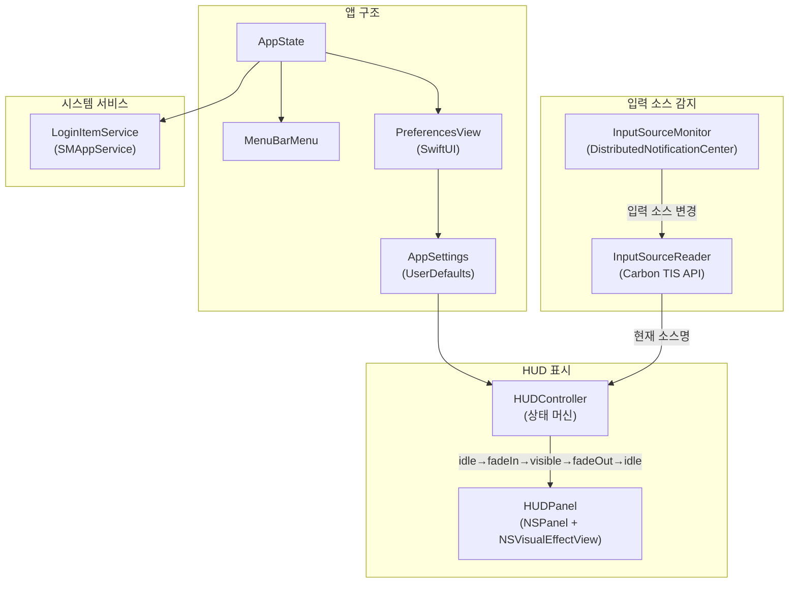

# LnHud

🌐 **Language**: [한국어](./README.md) | [English](./README_EN.md)

> 키보드 입력 소스 전환 시 화면 중앙에 HUD 오버레이를 표시하는 macOS 메뉴바 유틸리티

---

## 개요

**LnHud**는 키보드 입력 소스를 전환할 때 현재 언어(한국어, English, 日本語 등)를 화면 중앙에 큼직하게 보여주는 macOS 메뉴바 앱입니다. 어떤 언어로 타이핑 중인지 한눈에 확인할 수 있어, 입력 소스 혼동 없이 빠르게 작업할 수 있습니다.

---

## 주요 기능

### 즉시 HUD 표시
- 키보드 레이아웃 전환 시 현재 입력 소스명을 대형 오버레이로 표시
- 모든 키보드 레이아웃 및 입력 방식 호환

### 커스터마이징
- HUD 표시 시간, 폰트 크기, 모서리 둥글기, 투명도 조절
- 9방향 그리드 위치 선택 + X/Y 오프셋 미세 조정
- 배경 색상: 시스템 바이브런시, 8가지 프리셋, 커스텀 컬러 피커
- 입력 소스별 개별 색상 지정 또는 전체 동기화

### 멀티 모니터 지원
- HUD 표시 위치 선택: 내장 디스플레이, 메인 화면, 마우스 커서 위치 화면

### 메뉴바 앱
- Dock 아이콘 없이 메뉴바에서 조용히 실행
- 메뉴바 아이콘 숨기기 옵션
- 로그인 시 자동 실행

### 프라이버시
- 네트워크 접속 없음, 데이터 수집 없음, 완전 오프라인 동작
- App Sandbox 적용

---

## 기술 스택

| 분류 | 기술 |
|------|------|
| **Language** | Swift |
| **Platform** | macOS 13+ (Ventura) |
| **App Type** | 메뉴바 앱 (Dock 아이콘 없음) |
| **UI** | AppKit (NSPanel, NSVisualEffectView) + SwiftUI (설정 화면) |
| **Input Source** | Carbon TIS API |
| **Notification** | DistributedNotificationCenter |
| **Login Item** | SMAppService |

---

## 아키텍처

---

## 개발 과정에서의 도전과 해결

### 1. 입력 소스 변경 감지
**도전**: macOS에서 키보드 입력 소스 전환을 실시간으로 감지해야 하며, 모든 종류의 입력 방식(영문, 한국어, 일본어 등)을 지원해야 했습니다.

**해결**: `DistributedNotificationCenter`를 통해 시스템 레벨의 입력 소스 변경 이벤트를 수신하고, Carbon TIS API로 현재 소스명을 읽어오는 구조를 구현했습니다.

### 2. HUD 상태 머신
**도전**: HUD의 페이드인/표시/페이드아웃 전환을 자연스럽고 일관되게 처리해야 하며, 빠른 연속 전환에도 안정적으로 동작해야 했습니다.

**해결**: idle → fadeIn → visible → fadeOut → idle 상태 머신을 설계하여 각 전환을 명확하게 관리하고, 표시 중 새로운 입력 소스 변경 시 상태를 리셋하는 로직을 구현했습니다.

### 3. 순수 AppKit 렌더링
**도전**: HUD 오버레이를 모든 윈도우 위에 부드럽게 표시하면서 시스템 리소스를 최소화해야 했습니다.

**해결**: Auto Layout 없이 `NSPanel` + `NSVisualEffectView` + `NSTextField`로 경량 HUD를 구현하여, 최소한의 오버헤드로 시각적 효과를 달성했습니다.

---

## 역할 및 기여

- macOS 메뉴바 앱 아키텍처 설계 및 구현
- Carbon TIS API 기반 입력 소스 감지 시스템 개발
- HUD 상태 머신 및 애니메이션 시스템 구현
- 멀티 모니터 대응 HUD 위치 제어 로직 개발
- 입력 소스별 개별 색상 설정 기능 구현
- App Sandbox 적용 및 Mac App Store 배포

---

## 관련 링크

- **GitHub**: [leonardo204/lnhud](https://github.com/leonardo204/lnhud)
- **App Store**: [LnHud](https://apps.apple.com/kr/app/lnhud/id6762333462?mt=12)
- **Contact**: zerolive7@gmail.com

---

*이 프로젝트는 macOS 사용자가 입력 소스 전환 시 현재 언어를 즉시 확인할 수 있도록 도와주는 경량 유틸리티입니다.*
