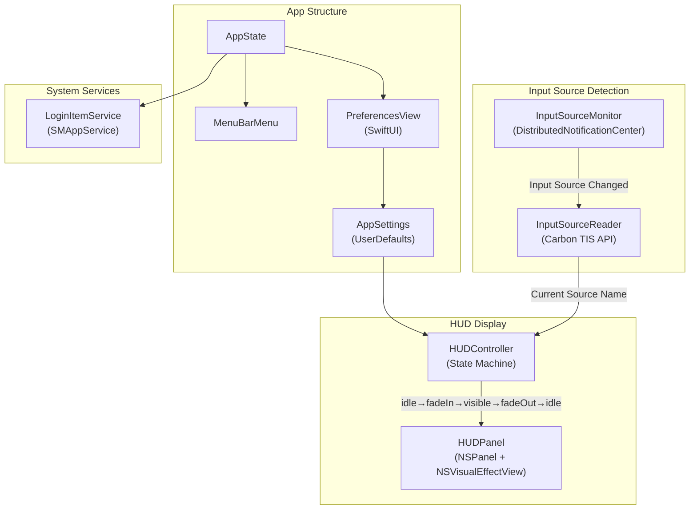

# LnHud

🌐 **Language**: [한국어](./README.md) | [English](./README_EN.md)

> A lightweight macOS menu bar utility that displays a HUD overlay when switching keyboard input sources

---

## Overview

**LnHud** is a macOS menu bar app that displays the current language (한국어, English, 日本語, etc.) as a large overlay in the center of the screen whenever you switch keyboard input sources. It eliminates confusion about which language you're typing in, letting you work without second-guessing your input source.

---

## Key Features

### Instant HUD Display
- Shows current input source name as a large overlay when switching keyboard layouts
- Compatible with all keyboard layouts and input methods

### Full Customization
- Adjustable HUD duration, font size, corner radius, and opacity
- 9-grid position selection with X/Y offset fine-tuning
- Background color: system vibrancy, 8 presets, or custom color picker
- Per-language color assignment or global sync

### Multi-Monitor Support
- Choose HUD display location: built-in display, main screen, or mouse cursor screen

### Menu Bar App
- Runs quietly in the menu bar with no Dock icon
- Option to hide menu bar icon
- Launch at Login support

### Privacy First
- No network access, no analytics, no data collection — fully offline
- App Sandbox enabled

---

## Tech Stack

| Category | Technology |
|----------|------------|
| **Language** | Swift |
| **Platform** | macOS 13+ (Ventura) |
| **App Type** | Menu Bar App (No Dock icon) |
| **UI** | AppKit (NSPanel, NSVisualEffectView) + SwiftUI (Preferences) |
| **Input Source** | Carbon TIS API |
| **Notification** | DistributedNotificationCenter |
| **Login Item** | SMAppService |

---

## Architecture

---

## Challenges and Solutions

### 1. Input Source Change Detection
**Challenge**: Needed to detect keyboard input source switches in real-time on macOS while supporting all input methods (English, Korean, Japanese, etc.).

**Solution**: Implemented a system-level event listener using `DistributedNotificationCenter` to receive input source change events, combined with Carbon TIS API to read the current source name.

### 2. HUD State Machine
**Challenge**: Required smooth and consistent fade-in/display/fade-out transitions, with stable behavior even during rapid consecutive switches.

**Solution**: Designed an idle → fadeIn → visible → fadeOut → idle state machine to clearly manage each transition, with reset logic for new input source changes during active display.

### 3. Pure AppKit Rendering
**Challenge**: Needed to display the HUD overlay above all windows with smooth visuals while minimizing system resource usage.

**Solution**: Built a lightweight HUD using `NSPanel` + `NSVisualEffectView` + `NSTextField` without Auto Layout, achieving visual effects with minimal overhead.

---

## Role & Contributions

- Designed and implemented macOS menu bar app architecture
- Developed Carbon TIS API-based input source detection system
- Implemented HUD state machine and animation system
- Built multi-monitor HUD positioning logic
- Developed per-input-source color configuration
- App Sandbox compliance and Mac App Store deployment

---

## Links

- **GitHub**: [leonardo204/lnhud](https://github.com/leonardo204/lnhud)
- **App Store**: [LnHud](https://apps.apple.com/kr/app/lnhud/id6762333462?mt=12)
- **Contact**: zerolive7@gmail.com

---

*A lightweight utility that helps macOS users instantly identify their current input language when switching keyboard sources.*
