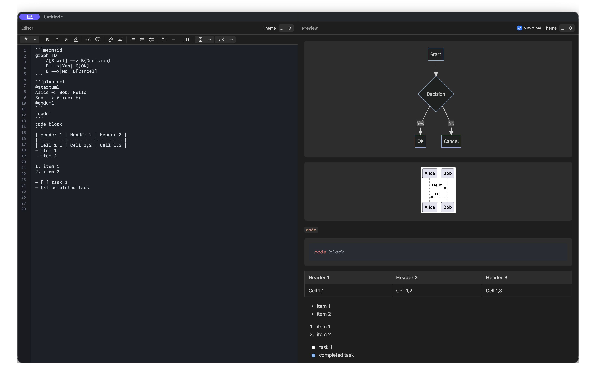

# MarkdownEditor

🌐 **Language**: [한국어](./README.md) | [English](./README_EN.md)

> Real-time Preview Markdown Editor for macOS


---

## Overview

**MarkdownEditor** is a native macOS markdown editor that displays editor and preview side by side with instant reflection of edits. It renders Mermaid diagrams and PlantUML sequence diagrams in real-time, and provides synchronized scrolling between editor and preview.

Designed for developers and technical writers, this app significantly enhances productivity in markdown document creation.

---

## Key Features

### Real-time Preview
- Side-by-side editor and preview display
- Instant reflection of edits
- Markdown syntax highlighting

### Diagram Support
- **Mermaid**: Flowcharts, sequence diagrams, Gantt charts, etc.
- **PlantUML**: Sequence diagrams, class diagrams, etc.
- Real-time diagram rendering

### Synchronized Scrolling
- Automatic scroll position synchronization between editor and preview
- Accurate position matching even in long documents

### Theme Settings
- Independent light/dark theme selection for editor and preview
- Flexible theme combinations for your work environment

### Markdown Toolbar
- **Text Formatting**: Bold, italic, strikethrough
- **Headings**: H1 ~ H6 levels
- **Links/Images**: Quick insert buttons
- **Code Blocks**: Inline code and code fences

### File Management
- Open multiple files via drag and drop
- Auto-detection of already opened files with navigation
- Tab-based multi-document editing

---

## Screenshots

### Main Editor Screen
*Main screen with editor and real-time preview side by side*



### App Icon


---

## Tech Stack

| Category | Technology |
|----------|------------|
| **Language** | Swift 5.9 (88%) |
| **UI Framework** | SwiftUI + AppKit |
| **Diagram Rendering** | Mermaid, PlantUML |
| **Markdown Parsing** | Native Swift Parser |
| **Build Tool** | Xcode 15.0+ |
| **Minimum OS** | macOS 13.0 (Ventura) |
| **Architecture** | Apple Silicon + Intel Support |

---

## Architecture

```
┌─────────────────────────────────────────────────────────────────┐
│                      MarkdownEditor App                          │
│                                                                  │
│  ┌────────────────────────────────────────────────────────────┐ │
│  │                    Document Window                          │ │
│  │  ┌─────────────────────┬─────────────────────────────────┐ │ │
│  │  │    Editor Pane      │        Preview Pane             │ │ │
│  │  │  ┌───────────────┐  │  ┌───────────────────────────┐  │ │ │
│  │  │  │ # Heading     │  │  │  Heading                  │  │ │ │
│  │  │  │               │  │  │  ─────────                │  │ │ │
│  │  │  │ ```mermaid    │◄─┼─►│  ┌─────┐    ┌─────┐      │  │ │ │
│  │  │  │ graph LR      │  │  │  │  A  │───►│  B  │      │  │ │ │
│  │  │  │ A --> B       │  │  │  └─────┘    └─────┘      │  │ │ │
│  │  │  │ ```           │  │  │                           │  │ │ │
│  │  │  └───────────────┘  │  └───────────────────────────┘  │ │ │
│  │  │                     │         Synchronized Scroll      │ │ │
│  │  └─────────────────────┴─────────────────────────────────┘ │ │
│  │                                                             │ │
│  │  ┌─────────────────────────────────────────────────────┐   │ │
│  │  │  Toolbar: [B] [I] [H1] [H2] [Link] [Image] [Code]   │   │ │
│  │  └─────────────────────────────────────────────────────┘   │ │
│  └────────────────────────────────────────────────────────────┘ │
│                                                                  │
│  ┌────────────────────────────────────────────────────────────┐ │
│  │                    Core Components                          │ │
│  │  ┌──────────────┐ ┌──────────────┐ ┌────────────────────┐  │ │
│  │  │  Markdown    │ │   Mermaid    │ │   Scroll Sync      │  │ │
│  │  │   Parser     │ │   Renderer   │ │     Manager        │  │ │
│  │  └──────────────┘ └──────────────┘ └────────────────────┘  │ │
│  │  ┌──────────────┐ ┌──────────────┐ ┌────────────────────┐  │ │
│  │  │   Theme      │ │   File       │ │   Document         │  │ │
│  │  │   Manager    │ │   Handler    │ │     Manager        │  │ │
│  │  └──────────────┘ └──────────────┘ └────────────────────┘  │ │
│  └────────────────────────────────────────────────────────────┘ │
└─────────────────────────────────────────────────────────────────┘
```

---

## Installation

### DMG Installation (Recommended)
1. Download the latest DMG from [Releases](https://github.com/leonardo204/MarkdownEditor/releases)
2. Open the DMG file
3. Drag MarkdownEditor to the Applications folder
4. Gatekeeper approval required on first launch

### Set as Default App

**In Finder:**
1. Right-click on a `.md` file
2. Select "Get Info"
3. Choose MarkdownEditor in the "Open With" section
4. Click "Change All"

**In Terminal:**
```bash
# Install duti (Homebrew required)
brew install duti

# Set as default app
duti -s com.yourcompany.MarkdownEditor .md all
```

### Build from Source
```bash
# Clone repository
git clone https://github.com/leonardo204/MarkdownEditor.git
cd MarkdownEditor

# Build in Xcode
xcodebuild -scheme MarkdownEditor -configuration Release

# Or open directly in Xcode
open MarkdownEditor.xcodeproj
```

---

## Challenges and Solutions

### 1. Editor-Preview Scroll Synchronization
**Challenge**: Accurate position matching between markdown source and rendered HTML was required. Simple ratio calculations were insufficient due to different view heights and unpredictable rendering results like diagrams.

**Solution**: Implemented precise position calculation algorithm through line-by-line markdown parsing and HTML element mapping. Prevented infinite loops with scroll event debouncing.

### 2. Real-time Mermaid Diagram Rendering
**Challenge**: Integrating the Mermaid library into a native macOS app and updating diagrams in real-time during editing was required.

**Solution**: Loaded Mermaid.js using WKWebView and passed diagram code from Swift through JavaScript bridge for rendering. Applied debouncing to prevent excessive rendering during typing.

### 3. Multi-Theme System
**Challenge**: Editor and preview needed independent themes while providing a consistent user experience.

**Solution**: Separated theme manager so each component applies themes independently, persisting settings through UserDefaults.

---

## Role & Contributions

- macOS native markdown editor architecture design
- SwiftUI + AppKit hybrid editor UI implementation
- Mermaid/PlantUML diagram rendering system development
- Editor-preview scroll synchronization algorithm implementation
- Theme system and user settings management development

---

## System Requirements

| Item | Requirement |
|------|-------------|
| **OS** | macOS 13.0 (Ventura) or later |
| **Processor** | Apple Silicon (M1/M2/M3) or Intel |
| **Build Environment** | Xcode 15.0+, macOS 14.0+ |

---

## Related Links

- **GitHub**: [leonardo204/MarkdownEditor](https://github.com/leonardo204/MarkdownEditor)

---

*This project is a productivity tool for developers and technical writers.*
