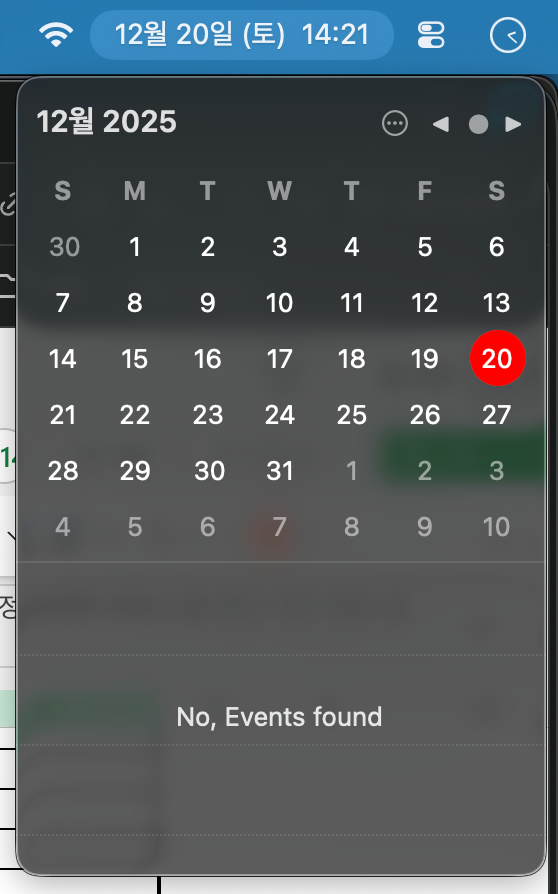
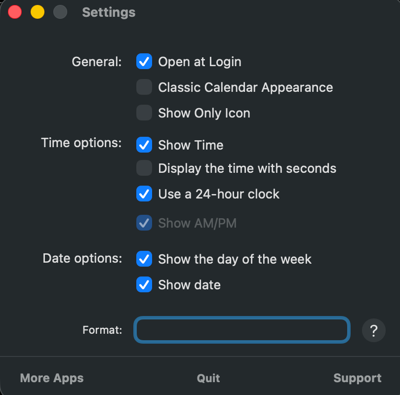

# MiniCalendar

🌐 **Language**: [한국어](./README.md) | [English](./README_EN.md)

> macOS Menu Bar Date/Time and Calendar App


---

## Overview

**MiniCalendar** is an app that displays date and time in customizable formats in the macOS menu bar and provides a clean mini calendar on click. As an alternative to the default system clock, it offers more customization options and intuitive calendar navigation.

Developed to enhance macOS user productivity, this app leverages SwiftUI and AppKit to provide a native macOS experience.

---

## Key Features

### Menu Bar Date/Time Display
- Customizable date and time formats
- 12-hour/24-hour format selection
- Seconds display option
- AM/PM display settings

### Mini Calendar Popup
- Clean calendar view with a single click
- Month navigation via mouse wheel/trackpad scroll
- Year navigation with `<<` / `>>` buttons
- Current date highlighting

### Various Customizations
- Flexible date format settings (e.g., "Dec 20 (Fri)", "2025-12-20")
- Weekday display options
- Week start day selection (Sunday/Monday)
- Launch at login setting

---

## Screenshots

### Menu Bar & Calendar Popup
*Check date/time and display calendar from menu bar*


### Menu Bar Display
*Display date and time in custom format*



### Preferences
*Various customization options*



---

## Tech Stack

| Category | Technology |
|----------|------------|
| **Language** | Swift 5.9 |
| **UI Framework** | SwiftUI + AppKit |
| **Build Tool** | XcodeGen |
| **Minimum OS** | macOS 13.0 (Ventura) |
| **Architecture** | Apple Silicon + Intel Support |

---

## Architecture

```
┌─────────────────────────────────────────────────────┐
│                 MiniCalendar App                     │
│                                                      │
│  ┌──────────────────────────────────────────────┐   │
│  │              Menu Bar Item                    │   │
│  │  ┌────────────────────────────────────────┐  │   │
│  │  │  Date/Time Display (Customizable)      │  │   │
│  │  │  "Dec 23 (Mon) 11:24"                  │  │   │
│  │  └────────────────────────────────────────┘  │   │
│  └──────────────────────────────────────────────┘   │
│                        │ Click                       │
│                        ▼                             │
│  ┌──────────────────────────────────────────────┐   │
│  │           Calendar Popover (SwiftUI)          │   │
│  │  ┌────────────────────────────────────────┐  │   │
│  │  │  << December 2025 >>                   │  │   │
│  │  │  ┌──┬──┬──┬──┬──┬──┬──┐               │  │   │
│  │  │  │Su│Mo│Tu│We│Th│Fr│Sa│               │  │   │
│  │  │  ├──┼──┼──┼──┼──┼──┼──┤               │  │   │
│  │  │  │  │  │  │  │  │  │  │               │  │   │
│  │  │  │  │  │  │23│  │  │  │  ← Today      │  │   │
│  │  │  └──┴──┴──┴──┴──┴──┴──┘               │  │   │
│  │  └────────────────────────────────────────┘  │   │
│  └──────────────────────────────────────────────┘   │
│                                                      │
│  ┌──────────────────────────────────────────────┐   │
│  │          Preferences Window                   │   │
│  │  - Time Format (12h/24h)                      │   │
│  │  - Date Format Pattern                        │   │
│  │  - Week Start Day                             │   │
│  │  - Launch at Login                            │   │
│  └──────────────────────────────────────────────┘   │
└─────────────────────────────────────────────────────┘
```

---

## Date Format Support

Supported symbols for custom date formats:

| Symbol | Description | Example |
|--------|-------------|---------|
| `yyyy` | 4-digit year | 2025 |
| `yy` | 2-digit year | 25 |
| `M` | Month (1-12) | 12 |
| `MM` | Month (01-12) | 12 |
| `d` | Day (1-31) | 23 |
| `dd` | Day (01-31) | 23 |
| `E` | Weekday abbreviated | Mon |
| `EEEE` | Weekday full | Monday |

**Format Examples:**
- `MMM d (E)` → "Dec 23 (Mon)"
- `yyyy-MM-dd` → "2025-12-23"
- `EEEE, MMMM d, yyyy` → "Monday, December 23, 2025"

---

## Installation

### DMG Installation (Recommended)
1. Download the latest DMG from [Releases](https://github.com/leonardo204/MiniCalendar/releases)
2. Open the DMG file
3. Drag MiniCalendar to the Applications folder

### Build from Source
```bash
# Clone repository
git clone https://github.com/leonardo204/MiniCalendar.git
cd MiniCalendar

# Generate Xcode project
xcodegen generate

# Build in Xcode
open MiniCalendar.xcodeproj
```

---

## Challenges and Solutions

### 1. Menu Bar Item Customization
**Challenge**: Displaying custom text and interactive popover in the macOS menu bar was required.

**Solution**: Implemented menu bar item using NSStatusItem and NSPopover, wrapping SwiftUI views with NSHostingController for a modern UI.

### 2. Date Format Flexibility
**Challenge**: A flexible date format system was needed to meet diverse user needs.

**Solution**: Allowed users to directly input DateFormatter format strings for maximum flexibility.

### 3. Launch at Login
**Challenge**: Implementing launch at login feature in compliance with macOS security policies.

**Solution**: Utilized SMAppService from the ServiceManagement framework to safely manage login items.

---

## Role & Contributions

- macOS native app architecture design
- SwiftUI + AppKit hybrid UI implementation
- Menu bar item and popover system development
- User settings storage and management system implementation
- XcodeGen-based project configuration

---

## Related Links

- **GitHub**: [leonardo204/MiniCalendar](https://github.com/leonardo204/MiniCalendar)
- **License**: MIT

---

*This project is an open-source project developed to enhance the macOS user experience.*
