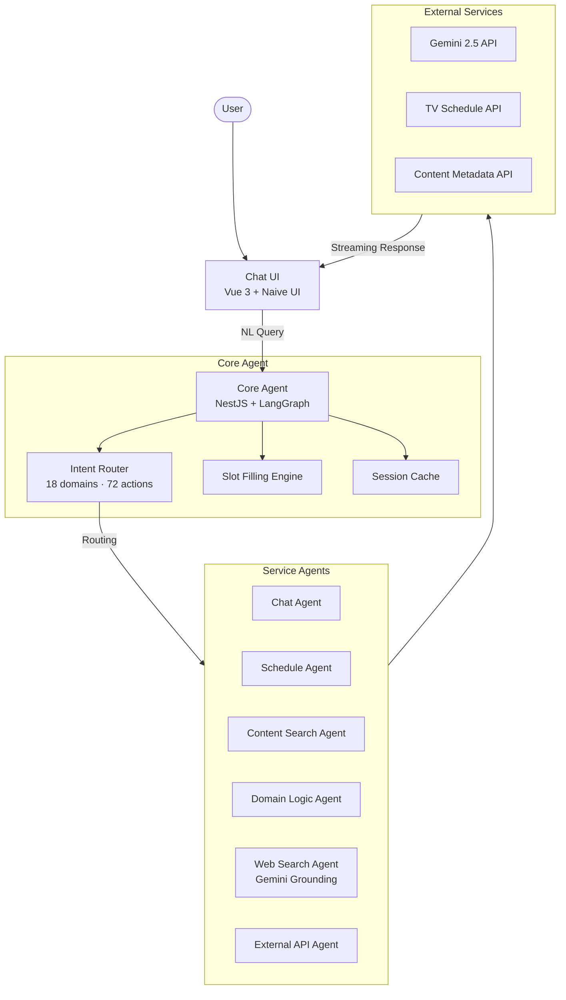

# MyTammi

🌐 **Language**: [한국어](./README.md) | [English](./README_EN.md)

> Vietnamese TV Media AI Assistant — Intelligent Conversational System with Multi-Agent Architecture

---

## Overview

**MyTammi** is an AI assistant for Vietnamese TV media services, built on a Multi-Agent architecture that classifies user natural language queries across 18 domains (72 actions) and routes them to 8 specialized service agents. Leveraging LangChain/LangGraph for agent orchestration and Google Gemini 2.5 Flash/Pro for natural language processing, it provides conversational access to a wide range of media services including TV schedule lookup, content search, and user support.

---

## Key Features

### Multi-Agent Orchestration
- 8 specialized service agents (ChatAgent, ScheduleAgent, etc.)
- Core Agent automatically routes to appropriate service agents based on intent classification results
- LangGraph-based agent state management and workflow control

### Intent Classification System
- Precise intent classification across 18 domains and 72 actions
- Automatic collection of missing information through Slot Filling
- Session cache-based conversation context retention

### AI-Powered Natural Language Processing
- Google Gemini 2.5 Flash (fast responses) / Pro (complex reasoning) model utilization
- Real-time web search integration via Gemini Google Search Grounding
- Vietnamese/English multilingual natural language understanding

### Real-Time Chat Interface
- Responsive chat UI built with Vue 3 + Naive UI
- Streaming response support for real-time typing effects
- Session-based conversation history management

### External Service Integration
- TV schedule API, content metadata API, and other external system connections
- Built-in Gemini Google Search Grounding web search
- Domain-specific dedicated business logic processing

---

## Tech Stack

| Category | Technology |
|----------|------------|
| **Language** | TypeScript 100% |
| **Backend** | NestJS |
| **Frontend** | Vue 3 + Naive UI |
| **AI/LLM** | Google Gemini 2.5 Flash/Pro |
| **Agent Framework** | LangChain, LangGraph |
| **Web Search** | Gemini Google Search Grounding (built-in) |
| **Monorepo** | Turborepo + pnpm workspaces |
| **Build** | Vite (Frontend), tsc (Backend) |

---

## Architecture

---

## Challenges and Solutions

### 1. Large-Scale Intent Classification System Design
**Challenge**: Needed to accurately classify intents across a large taxonomy of 18 domains and 72 actions, while accounting for the linguistic characteristics of Vietnamese.

**Solution**: Designed a hierarchical intent classification structure that first determines the domain, then resolves the specific action in a two-stage classification approach. Leveraged Gemini's structured output capability to improve classification accuracy, and implemented slot filling to conversationally collect missing information.

### 2. Multi-Agent Orchestration
**Challenge**: State sharing across 8 service agents, error handling, and conversation context maintenance presented complex problems.

**Solution**: Used LangGraph to model agent workflows as a graph-based system, with centralized conversation state management through session cache. Implemented fallback logic and retry mechanisms for each agent's failure scenarios to ensure system stability.

### 3. Real-Time Web Search Integration
**Challenge**: Needed to trigger web searches at appropriate moments when agents required up-to-date information, and naturally integrate search results into the conversation context.

**Solution**: Implemented Gemini Google Search Grounding to embed web search at the LLM level. The model autonomously determines when search is needed and incorporates results into its responses, enabling delivery of current information without separate search orchestration.

### 4. Frontend/Backend Integration in Monorepo Environment
**Challenge**: Efficiently managing shared types, build order, and development environment for frontend (Vue 3) and backend (NestJS) within a Turborepo + pnpm workspaces-based monorepo.

**Solution**: Separated shared packages (shared types, utilities) into dedicated workspaces and configured Turborepo's task pipeline to automatically manage build dependencies. Supported concurrent execution (dev mode) in the development environment, enabling both frontend and backend to run with a single command.

---

## Role & Contributions

- Designed Multi-Agent architecture and implemented LangGraph-based workflows
- Developed intent classification system across 18 domains / 72 actions
- Implemented NestJS backend services and 8 specialized service agents
- Built real-time chat interface with Vue 3 + Naive UI
- Integrated Gemini Google Search Grounding and web search functionality
- Configured monorepo with Turborepo + pnpm workspaces

---

## Links

- **Repository**: Private (Bitbucket) — Company project with proprietary source code
- **Contact**: zerolive7@gmail.com

---

*This project is an AI-powered intelligent conversational assistant for Vietnamese TV media services.*
