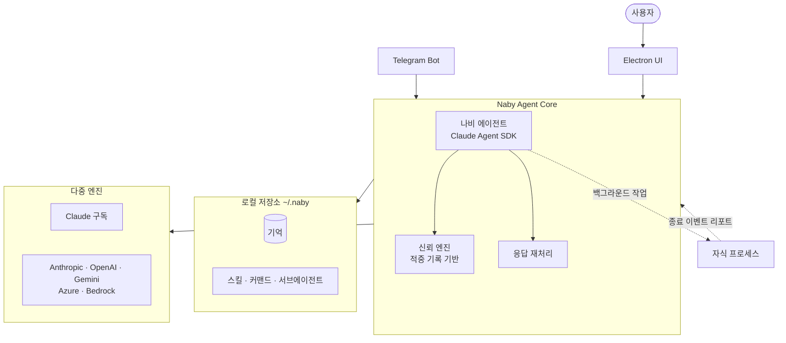

# naby

🌐 **Language**: [한국어](./README.md) | [English](./README_EN.md)

> 나비 — 신뢰를 학습해 위임 범위를 넓혀가는 로컬-퍼스트 개인 AI 에이전트

---

## 개요

**naby**는 사용자의 판단 기준을 학습하고, 검증된 신뢰도에 따라 위임 권한을 점진적으로 넓혀가는 **로컬-퍼스트 개인 에이전트 데스크톱 앱**입니다. 학습된 기억·스킬·커맨드·에이전트 프로필은 모두 사용자 컴퓨터에 남으며, 특정 AI 벤더에 종속되지 않습니다. 사내 AI Native 환경의 개인 에이전트 클라이언트로 사용됩니다.

핵심은 **나비(Naby)**라는 내장 에이전트입니다. 대화를 통해 사용자의 의사결정 기준을 배우고, 자신의 추천을 먼저 기록한 뒤 사용자의 실제 선택과 비교합니다. 통계적으로 우연이라 보기 어려운 적중률에 도달했을 때만 실행 권한을 넓히고, 예측이 어긋나면 사유와 함께 권한을 낮춥니다.

---

## 주요 기능

### 신뢰 단계 기반 자율성 (🥚 → 🐛 → 🛡 → 🦋)

| 단계 | 권한 | 자동 실행 |
|------|------|-----------|
| 🥚 알 | 읽기·조사·초안 작성 | 1스텝 |
| 🐛 애벌레 | 알과 동일 (학습량 차이) | 1스텝 |
| 🛡 번데기 | 되돌릴 수 있는 변경 (파일 쓰기·편집) | 3스텝 |
| 🦋 나비 | 비가역 작업, 다단계 위임 | 사용자 설정 |

신뢰 등급은 대화 빈도가 아니라 **적중 기록**으로만 계산됩니다. 자기 평가나 추측으로 오르지 않습니다.

### 대화형 기억 학습
- 대화 중 기억할 만한 사실을 제안하고, 사용자가 승인한 것만 이후 대화에 주입
- 세션 회고로 사용자의 교정 지점을 찾아 성능 지표에 반영
- 세션을 넘나드는 반복 확인으로 신뢰도 상승
- 새 사실이 기존 기억과 충돌하면 감사 이력을 남기고 교체
- 마무리 어투·문서 형식·결론 우선 여부 등 작업 유형별 스타일 학습

기억의 소유자는 사용자입니다. 열람·검색·수정·삭제가 모두 가능하며, 자동 삭제는 없습니다.

### 응답 재처리
출력 전에, 사용자가 쓰지 않는 표현·어투가 있으면 의미를 보존한 채 문체를 다시 씁니다. 코드·커맨드·경로·숫자·식별자는 보호됩니다. 반복되는 이탈은 사전 프롬프트 주입으로 재작성 호출을 줄입니다.

### 백그라운드 작업 리포트
naby가 자식 프로세스를 소유하고 종료 이벤트를 받아, 해당 세션에 리포트 턴을 엽니다.
- 세션 메시지 + 안 읽음 배지 (기본)
- OS 알림 (앱이 포커스를 벗어났거나 다른 세션을 보는 중)
- 텔레그램 에스컬레이션 (설정 시)

### 다중 엔진 지원

| 엔진 | 방식 |
|------|------|
| Claude (구독) | 로컬 Claude Code 로그인 · 다계정 수동 전환 |
| Anthropic · OpenAI · Google Gemini · Azure OpenAI · Amazon Bedrock | API 키 |
| ChatGPT (구독) | OAuth (개발 모드) |

### 텔레그램 원격 운영
텔레그램 봇으로 세션에 연결해 메시지를 턴으로 처리합니다. 승인 질문을 텔레그램으로 보내고, 버튼 응답으로 작업을 이어가며 완료 시 결과를 돌려받습니다.

### 하네스 소유
스킬·커맨드·서브에이전트(하네스)는 `~/.naby`에 저장됩니다. 외부 자산(예: Claude Code 내보내기)은 naby 소유 사본으로 복사되어 벤더 디렉토리와 연결이 끊깁니다. 사용자가 설치한 스킬은 기본 활성, 가져온 항목은 비활성 상태로 도착합니다.

### 그 외
- **세션 이어가기**: 컨텍스트가 차면 맥락을 요약하고 세션 환경(프로젝트 링크·기억·플랜 모드·텔레그램 연동)을 상속
- **예약 작업**: 지정 시각·주기·cron 표현식으로 naby가 스스로 턴을 시작
- **에이전트 내보내기**: 학습된 에이전트를 파일로 내보내 다른 기기에서 가져오기 (신뢰 등급은 이전되지 않고 기록으로 재계산)

---

## 기술 스택

| 분류 | 기술 |
|------|------|
| **Platform** | Electron 43 (macOS · Windows · Linux) |
| **Language** | TypeScript 5.9 (ES Modules) |
| **Agent Core** | Anthropic Claude Agent SDK |
| **AI SDK** | Vercel AI SDK — Anthropic · OpenAI · Google · Azure · Bedrock · MCP |
| **Validation** | zod |
| **Build** | esbuild · tsx · electron-builder · electron-updater |
| **Integration** | Telegram Bot, MCP |

---

## 아키텍처

---

## 개발 과정에서의 도전과 해결

### 1. 자율성과 통제의 균형
**도전**: 개인 에이전트가 너무 소극적이면 쓸모가 없고, 너무 적극적이면 위험합니다. 어디까지 자동으로 실행하게 할지 기준이 필요했습니다.

**해결**: 🥚알→🐛애벌레→🛡번데기→🦋나비 4단계 신뢰 모델을 설계했습니다. 에이전트가 자신의 추천을 먼저 기록하고 사용자의 실제 선택과 대조해, 통계적으로 유의한 적중률에 도달할 때만 승급하고 어긋나면 사유와 함께 강등하도록 했습니다.

### 2. 데이터 주권과 벤더 독립
**도전**: 개인의 판단 패턴·기억이라는 민감한 데이터를 특정 AI 벤더에 맡기지 않으면서, 여러 엔진을 자유롭게 갈아탈 수 있어야 했습니다.

**해결**: 모든 학습 데이터를 사용자 컴퓨터(`~/.naby`)에 로컬-퍼스트로 저장하고, Vercel AI SDK로 Anthropic·OpenAI·Gemini·Azure·Bedrock을 추상화했습니다. 하네스도 naby 소유 사본으로 복사해 벤더 디렉토리와 연결을 끊었습니다.

### 3. 사용자 문체와의 이질감
**도전**: 에이전트 응답이 사용자가 쓰지 않는 표현·어투를 쓰면 위임 신뢰가 떨어집니다.

**해결**: 출력 전에 응답을 재처리해 의미는 보존하되 문체를 사용자에 맞게 다시 쓰도록 했습니다. 코드·경로·숫자·식별자는 보호하고, 반복되는 이탈은 사전 프롬프트 주입으로 재작성 호출 자체를 줄였습니다.

---

## 역할 및 기여

- 신뢰 단계(4단계) 기반 자율 위임 모델 설계 및 구현
- 로컬-퍼스트 기억 저장 및 대화형 학습 시스템 개발
- Vercel AI SDK 기반 다중 엔진 추상화 통합
- 응답 재처리(문체 정렬) 파이프라인 구현
- 백그라운드 작업 리포트 및 텔레그램 원격 운영 통합
- Electron 크로스플랫폼(macOS·Windows·Linux) 패키징 및 자동 업데이트

---

## 관련 링크

- **GitHub**: [leonardo204/naby](https://github.com/leonardo204/naby)
- **Contact**: zerolive7@gmail.com

---

*naby는 신뢰를 증거로 쌓아가는 로컬-퍼스트 개인 AI 에이전트로, 사용자가 기억과 위임을 온전히 소유하는 환경을 지향합니다.*
