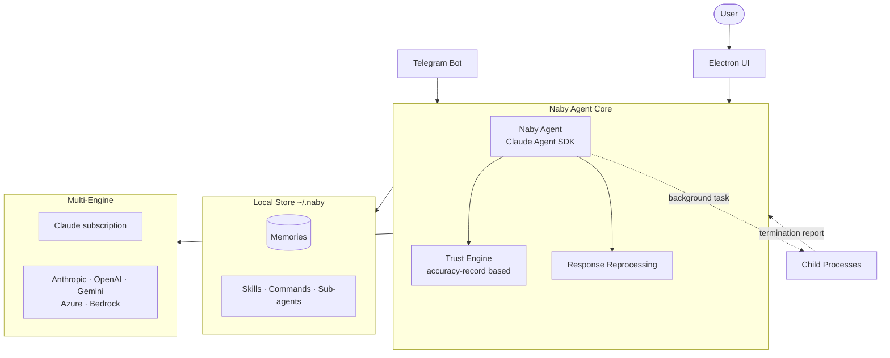

# naby

🌐 **Language**: [한국어](./README.md) | [English](./README_EN.md)

> Naby — a local-first personal AI agent that learns trust and gradually expands its delegation scope

---

## Overview

**naby** is a **local-first personal agent desktop app** that learns the user's judgment patterns and gradually expands its delegation authority based on demonstrated trustworthiness. All learned data—memories, skills, commands, and agent profiles—stays on the user's computer and remains independent of any AI vendor. It serves as the personal agent client for an in-house AI Native environment.

At its core is **Naby**, an embedded agent that learns the user's decision-making criteria through conversation, records its own recommendation first, and then compares it against the user's actual choice. It expands execution permissions only when it reaches an accuracy rate that is statistically hard to attribute to chance, and downgrades authority—with stated reasons—when its predictions diverge.

---

## Key Features

### Trust-Staged Autonomy (🥚 → 🐛 → 🛡 → 🦋)

| Stage | Capabilities | Auto-Execute |
|-------|--------------|--------------|
| 🥚 Egg | Reading, research, draft creation | 1 step |
| 🐛 Caterpillar | Same as egg (different learning volume) | 1 step |
| 🛡 Chrysalis | Reversible changes (file writes, edits) | 3 steps |
| 🦋 Butterfly | Irreversible operations, multi-step delegation | User-configurable |

Trust grades are calculated purely from **accuracy records**, not conversation frequency—never from self-assessment or guesswork.

### Conversational Memory Learning
- Suggests memorable facts during conversation; only user-approved facts inject into future turns
- Session retrospectives find user corrections and reflect them in performance metrics
- Repeated confirmations across sessions raise confidence
- When a new fact conflicts with a stored memory, the old record is replaced with an audit trail preserved
- Learns style preferences (endings, document formats, conclusion-first approach) per task type

The user owns their memory—full view, search, edit, and delete. No automatic deletion occurs.

### Response Reprocessing
Before output, if a response uses language or tone the user doesn't employ, it is rewritten to preserve meaning while adjusting style. Code, commands, paths, numbers, and identifiers are protected. Repeated deviations trigger pre-prompt injection to reduce rewrite calls.

### Background Task Reporting
naby owns child processes and receives termination events, opening a report turn in the relevant session.
- Session message + unread badge (default)
- OS notification (app out of focus or viewing a different session)
- Telegram escalation (if configured)

### Multi-Engine Support

| Engine | Method |
|--------|--------|
| Claude (subscription) | Local Claude Code login · multi-account manual switching |
| Anthropic · OpenAI · Google Gemini · Azure OpenAI · Amazon Bedrock | API keys |
| ChatGPT (subscription) | OAuth (development mode) |

### Remote Operation via Telegram
Connect to a session via a Telegram bot, where messages become turns. Approval questions are sent to Telegram; the user responds via buttons to continue work and receives results on completion.

### Harness Ownership
Skills, commands, and sub-agents (harnesses) are stored in `~/.naby`. External assets (e.g., Claude Code exports) become naby-owned copies with no further vendor-directory connection. User-installed skills are active by default; imported items arrive inactive.

### More
- **Session continuation**: When context fills, summarizes context and inherits the session environment (project links, memories, plan mode, Telegram integration)
- **Scheduled tasks**: Named times, intervals, or cron expressions let naby initiate turns autonomously
- **Agent export**: Exports a trained agent to a file for import on another device (trust grades recalculate from records rather than being transferred)

---

## Tech Stack

| Category | Technology |
|----------|------------|
| **Platform** | Electron 43 (macOS · Windows · Linux) |
| **Language** | TypeScript 5.9 (ES Modules) |
| **Agent Core** | Anthropic Claude Agent SDK |
| **AI SDK** | Vercel AI SDK — Anthropic · OpenAI · Google · Azure · Bedrock · MCP |
| **Validation** | zod |
| **Build** | esbuild · tsx · electron-builder · electron-updater |
| **Integration** | Telegram Bot, MCP |

---

## Architecture

---

## Challenges and Solutions

### 1. Balancing Autonomy and Control
**Challenge**: A personal agent that is too passive is useless, while one that is too aggressive is dangerous. A clear criterion for how far to auto-execute was needed.

**Solution**: Designed a 4-stage trust model (🥚 Egg → 🐛 Caterpillar → 🛡 Chrysalis → 🦋 Butterfly). The agent records its own recommendation first and compares it against the user's actual choice, advancing only upon reaching a statistically significant accuracy rate and downgrading—with reasons—when predictions diverge.

### 2. Data Sovereignty and Vendor Independence
**Challenge**: Sensitive personal data—judgment patterns and memories—should not be entrusted to any single AI vendor, while still allowing free switching between multiple engines.

**Solution**: Stored all learned data local-first on the user's computer (`~/.naby`) and abstracted Anthropic, OpenAI, Gemini, Azure, and Bedrock behind the Vercel AI SDK. Harnesses are also copied as naby-owned copies, severing their connection to vendor directories.

### 3. Dissonance with the User's Writing Style
**Challenge**: When agent responses use expressions or tone the user doesn't employ, trust in delegation erodes.

**Solution**: Reprocessed responses before output to preserve meaning while rewriting style to match the user. Code, paths, numbers, and identifiers are protected, and repeated deviations trigger pre-prompt injection to reduce rewrite calls altogether.

---

## Role & Contributions

- Designed and implemented the 4-stage trust-based autonomous delegation model
- Developed the local-first memory store and conversational learning system
- Integrated multi-engine abstraction via the Vercel AI SDK
- Implemented the response reprocessing (style-alignment) pipeline
- Integrated background task reporting and Telegram remote operation
- Packaged and auto-updated the Electron cross-platform build (macOS · Windows · Linux)

---

## Links

- **GitHub**: [leonardo204/naby](https://github.com/leonardo204/naby)
- **Contact**: zerolive7@gmail.com

---

*naby is a local-first personal AI agent that builds trust from evidence, aiming for an environment where the user fully owns their memory and delegation.*
