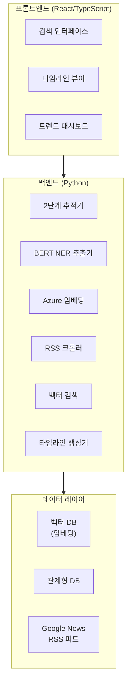

# News Origin

🌐 **Language**: [한국어](./README.md) | [English](./README_EN.md)

> 뉴스의 기원을 추적하고 전파 경로를 시각화하는 풀스택 뉴스 분석 서비스

---

## 개요

**News Origin**은 뉴스 기사의 최초 출처를 추적하고, 다양한 매체를 통해 어떻게 전파되었는지를 시각화하는 풀스택 서비스입니다. 2단계 추적 시스템을 통해 기존 DB/벡터 기반의 즉시 검색과 Google News RSS 크롤링을 활용한 실시간 추적을 모두 지원합니다.

---

## 주요 기능

### 2단계 뉴스 추적 시스템
- **1단계 (즉시 검색)**: 기존 DB 및 벡터 데이터베이스를 활용한 빠른 검색
- **2단계 (실시간 추적)**: Google News RSS 크롤링을 통한 라이브 뉴스 수집 및 추적

### BERT NER 키워드 추출
- BERT 기반 Named Entity Recognition으로 뉴스 핵심 키워드 자동 추출
- 인물, 기관, 장소 등 주요 엔터티 식별

### 시맨틱 검색
- Azure Embeddings를 활용한 의미 기반 뉴스 유사도 검색
- 벡터 유사도를 통한 관련 기사 자동 매칭

### 타임라인 시각화
- 뉴스 전파 경로를 시간순으로 시각화
- 출처별 보도 시점 및 확산 패턴 분석

### 트렌드 분석
- 뉴스 주제별 시간대 트렌드 분석
- 매체별 보도 빈도 및 패턴 파악

### 실시간 검색
- 다양한 뉴스 소스를 횡단하는 실시간 검색
- 검색 결과의 출처 신뢰도 표시

---

## 기술 스택

| 분류 | 기술 |
|------|------|
| **Backend** | Python |
| **Frontend** | TypeScript, React |
| **NLP** | BERT NER (키워드 추출) |
| **Embeddings** | Azure OpenAI Embeddings (시맨틱 검색) |
| **Data Source** | Google News RSS 크롤링 |
| **Database** | 벡터 DB + 관계형 DB |
| **Visualization** | 타임라인, 트렌드 차트 |

---

## 아키텍처

---

## 개발 과정에서의 도전과 해결

### 1. 2단계 추적 시스템 설계
**도전**: 기존 데이터에서의 즉시 검색과 실시간 크롤링을 통한 라이브 추적을 하나의 통합된 인터페이스로 제공해야 했습니다.

**해결**: 1단계에서 DB/벡터 검색으로 빠른 결과를 먼저 반환하고, 2단계에서 Google News RSS 크롤링을 비동기로 실행하여 실시간 결과를 점진적으로 업데이트하는 아키텍처를 설계했습니다.

### 2. BERT NER 정확도 향상
**도전**: 한국어 뉴스 기사에서 인물, 기관, 장소 등의 Named Entity를 정확하게 추출하는 것이 어려웠습니다.

**해결**: 한국어에 특화된 BERT 모델을 활용하고, 뉴스 도메인에 맞는 후처리 로직을 추가하여 추출 정확도를 높였습니다.

### 3. 시맨틱 검색 성능 최적화
**도전**: 대량의 뉴스 기사 임베딩에서 실시간으로 유사도 검색을 수행할 때 응답 속도가 저하되는 문제가 있었습니다.

**해결**: Azure Embeddings와 벡터 DB의 인덱싱 최적화를 통해 검색 속도를 개선하고, 캐싱 전략을 적용하여 반복 쿼리의 응답 시간을 단축했습니다.

---

## 역할 및 기여

- 풀스택 서비스 아키텍처 설계 및 구현
- 2단계 뉴스 추적 시스템 개발
- BERT NER 기반 키워드 추출 파이프라인 구축
- Azure Embeddings 연동 및 시맨틱 검색 구현
- React 기반 타임라인 시각화 및 트렌드 대시보드 개발
- Google News RSS 크롤링 시스템 구현

---

## 관련 링크

- **GitHub**: [leonardo204/news-origin](https://github.com/leonardo204/news-origin)
- **Contact**: zerolive7@gmail.com

---

*이 프로젝트는 뉴스의 원본 출처를 추적하고 전파 과정을 분석하는 풀스택 서비스입니다.*
