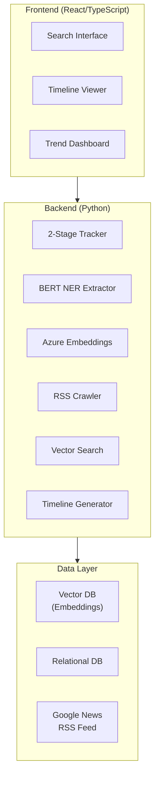

# News Origin

🌐 **Language**: [한국어](./README.md) | [English](./README_EN.md)

> Full-stack news analysis service that tracks news origins and visualizes propagation paths

---

## Overview

**News Origin** is a full-stack service that tracks the original source of news articles and visualizes how they propagate across various media outlets. Through a 2-stage tracking system, it supports both instant search via existing DB/vector databases and live tracking through Google News RSS crawling.

---

## Key Features

### 2-Stage News Tracking System
- **Stage 1 (Instant Search)**: Fast search leveraging existing DB and vector databases
- **Stage 2 (Live Tracking)**: Real-time news collection and tracking via Google News RSS crawling

### BERT NER Keyword Extraction
- Automatic extraction of key news keywords using BERT-based Named Entity Recognition
- Identification of major entities including people, organizations, and locations

### Semantic Search
- Meaning-based news similarity search using Azure Embeddings
- Automatic related article matching through vector similarity

### Timeline Visualization
- Chronological visualization of news propagation paths
- Analysis of reporting timestamps and spread patterns by source

### Trend Analysis
- Time-based trend analysis by news topic
- Reporting frequency and pattern identification by media outlet

### Real-Time Search
- Real-time search across multiple news sources
- Source reliability indicators for search results

---

## Tech Stack

| Category | Technology |
|----------|------------|
| **Backend** | Python |
| **Frontend** | TypeScript, React |
| **NLP** | BERT NER (Keyword Extraction) |
| **Embeddings** | Azure OpenAI Embeddings (Semantic Search) |
| **Data Source** | Google News RSS Crawling |
| **Database** | Vector DB + Relational DB |
| **Visualization** | Timeline, Trend Charts |

---

## Architecture

---

## Challenges and Solutions

### 1. 2-Stage Tracking System Design
**Challenge**: Needed to provide instant search from existing data and live tracking via real-time crawling through a single unified interface.

**Solution**: Designed an architecture where Stage 1 returns fast results via DB/vector search first, then Stage 2 asynchronously executes Google News RSS crawling to progressively update results in real-time.

### 2. BERT NER Accuracy Improvement
**Challenge**: Accurately extracting Named Entities such as people, organizations, and locations from Korean news articles was difficult.

**Solution**: Utilized a Korean-specialized BERT model and added domain-specific post-processing logic for news content to improve extraction accuracy.

### 3. Semantic Search Performance Optimization
**Challenge**: Response time degraded when performing real-time similarity searches across a large volume of news article embeddings.

**Solution**: Improved search speed through Azure Embeddings and vector DB indexing optimization, and applied caching strategies to reduce response times for repeated queries.

---

## Role & Contributions

- Designed and implemented full-stack service architecture
- Developed 2-stage news tracking system
- Built BERT NER-based keyword extraction pipeline
- Implemented Azure Embeddings integration and semantic search
- Developed React-based timeline visualization and trend dashboard
- Implemented Google News RSS crawling system

---

## Links

- **GitHub**: [leonardo204/news-origin](https://github.com/leonardo204/news-origin)
- **Contact**: zerolive7@gmail.com

---

*This project is a full-stack service for tracking news origins and analyzing propagation patterns.*
