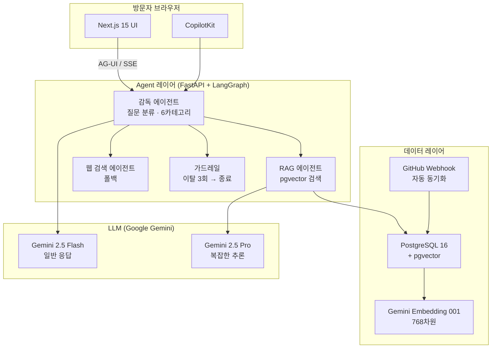

# PortfolioLive

🌐 **Language**: [한국어](./README.md) | [English](./README_EN.md)

> AI 대화형 포트폴리오 — 방문자가 자연어로 경력/기술을 질문할 수 있는 Agentic AI 채팅 기반 포트폴리오 사이트

---

## 개요

**PortfolioLive**는 방문자가 AI 채팅을 통해 경력, 기술 스택, 프로젝트 등을 자연어로 질문할 수 있는 인터랙티브 포트폴리오 사이트입니다. LangGraph 기반의 Agentic AI가 질문을 분류하고 pgvector RAG로 관련 정보를 검색하여 정확한 답변을 제공합니다. GitHub Webhook을 통해 프로젝트가 자동으로 동기화되며, 관리자 대시보드로 콘텐츠를 관리할 수 있습니다.

---

## 주요 기능

### Agentic AI Chat

- **감독 에이전트**: 질문을 6가지 카테고리(경력, 기술, 프로젝트, 연락처, 일반, 기타)로 자동 분류
- **pgvector RAG**: Gemini Embedding 001 (768차원) 기반 코사인 유사도 검색으로 관련 경력/프로젝트 정보 검색
- **멀티턴 대화**: 이전 대화 컨텍스트를 유지하며 연속적인 질문 처리
- **웹 검색 폴백**: RAG 결과가 부족할 때 웹 검색으로 정보 보완
- **가드레일**: 주제 이탈 3회 초과 시 세션 자동 종료
- **AG-UI 프로토콜**: SSE(Server-Sent Events) 스트리밍으로 실시간 응답 표시

### 포트폴리오 쇼케이스

- **GitHub 자동 동기화**: Webhook 연동으로 저장소 변경 시 포트폴리오 자동 업데이트
- **카테고리 필터링**: 프로젝트를 기술 스택, 연도, 카테고리별로 필터링
- **README 렌더링**: 각 프로젝트의 README 마크다운을 웹에서 바로 렌더링
- **기술 스택 태그**: 프로젝트별 기술 태그 자동 추출 및 표시

### 관리자 대시보드

- **콘텐츠 관리**: 경력, 프로젝트, 프로필 정보 CRUD 관리
- **채팅 로그 분석**: 방문자 질문 패턴 및 대화 이력 조회
- **방문 통계**: 페이지별 방문자 수, 채팅 사용량 등 통계 제공
- **GitHub Sync**: 수동 동기화 트리거 및 동기화 상태 모니터링

---

## 기술 스택

| 계층 | 기술 |
|------|------|
| **Frontend** | Next.js 15, Tailwind CSS, CopilotKit |
| **Agent Framework** | LangGraph, FastAPI |
| **LLM** | Gemini 2.5 Flash (일반 응답), Gemini 2.5 Pro (복잡한 추론) |
| **Embedding** | Gemini Embedding 001 (768차원) |
| **RAG** | pgvector 코사인 유사도 검색 |
| **Database** | PostgreSQL 16 + pgvector |
| **Protocol** | AG-UI Protocol, SSE 스트리밍 |
| **인프라** | Docker Compose, Cloudflare |

---

## 아키텍처

---

## 개발 과정에서의 도전과 해결

### 1. AG-UI 프로토콜 기반 실시간 스트리밍

**도전**: CopilotKit과 LangGraph 에이전트를 연결하여 스트리밍 응답을 구현해야 했습니다. 일반적인 REST API 방식으로는 LangGraph의 노드별 중간 결과를 실시간으로 전달할 수 없었습니다.

**해결**: AG-UI 프로토콜의 SSE(Server-Sent Events) 스트리밍을 적용하여 에이전트의 각 단계(질문 분류 → RAG 검색 → 응답 생성)가 완료될 때마다 클라이언트에 실시간으로 전달되도록 구현했습니다.

### 2. pgvector RAG 검색 품질 향상

**도전**: 경력 및 프로젝트 정보를 단순 키워드 검색으로 찾으면 관련성이 낮은 결과가 반환되는 문제가 있었습니다. 특히 "AI 관련 경험이 있나요?"처럼 추상적인 질문에 대한 검색 품질이 낮았습니다.

**해결**: Gemini Embedding 001로 모든 경력/프로젝트 정보를 768차원 벡터로 임베딩하고 pgvector의 코사인 유사도 검색을 적용했습니다. 청크 전략을 프로젝트 단위로 최적화하여 관련성 높은 결과를 반환하도록 개선했습니다.

### 3. 가드레일 및 세션 관리

**도전**: 방문자가 포트폴리오와 무관한 질문을 반복하거나 악의적인 프롬프트 인젝션을 시도하는 경우를 처리해야 했습니다.

**해결**: 감독 에이전트가 질문의 주제 관련성을 판단하고, 이탈 횟수를 세션 상태로 추적합니다. 3회 초과 시 안내 메시지와 함께 세션을 종료하는 가드레일 로직을 LangGraph 노드로 구현했습니다.

---

## 역할 및 기여

- 전체 시스템 아키텍처 설계 및 구현 (단독 개발)
- LangGraph 기반 Agentic AI 파이프라인 설계 (감독 에이전트 + RAG + 웹 검색)
- AG-UI 프로토콜 SSE 스트리밍 연동
- pgvector 기반 RAG 시스템 구축 및 임베딩 파이프라인 개발
- Next.js 15 + CopilotKit 프론트엔드 구현
- GitHub Webhook 자동 동기화 시스템 개발
- Docker Compose 기반 인프라 구성 및 Cloudflare 배포

---

## 관련 링크

- **GitHub**: [leonardo204/PortfolioLive](https://github.com/leonardo204/PortfolioLive)
- **라이브 사이트**: [me.zerolive.co.kr](https://me.zerolive.co.kr)
- **Contact**: zerolive7@gmail.com

---

*이 프로젝트는 AI 채팅을 통해 방문자와 상호작용하는 Agentic AI 기반 포트폴리오 사이트입니다.*
