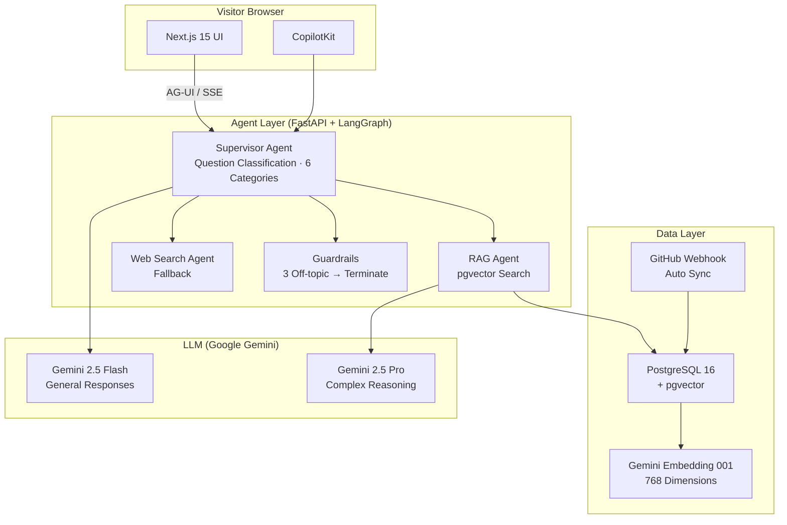

# PortfolioLive

🌐 **Language**: [한국어](./README.md) | [English](./README_EN.md)

> AI-powered interactive portfolio — visitors can ask about career/skills via Agentic AI chat

---

## Overview

**PortfolioLive** is an interactive portfolio site where visitors can ask about career history, technical skills, and projects in natural language through an AI chat interface. A LangGraph-based Agentic AI classifies questions and retrieves relevant information via pgvector RAG to provide accurate answers. Projects are automatically synchronized through GitHub Webhooks, and an admin dashboard enables content management.

- **Live Site**: [me.zerolive.co.kr](https://me.zerolive.co.kr)
- **GitHub**: [leonardo204/PortfolioLive](https://github.com/leonardo204/PortfolioLive)

---

## Key Features

### Agentic AI Chat

- **Supervisor Agent**: Automatically classifies questions into 6 categories (career, skills, projects, contact, general, other)
- **pgvector RAG**: Cosine similarity search using Gemini Embedding 001 (768 dimensions) to retrieve relevant career and project information
- **Multi-turn Conversation**: Maintains previous conversation context for continuous question handling
- **Web Search Fallback**: Supplements information with web search when RAG results are insufficient
- **Guardrails**: Automatic session termination after 3 off-topic questions
- **AG-UI Protocol**: Real-time response display via SSE (Server-Sent Events) streaming

### Portfolio Showcase

- **GitHub Auto Sync**: Automatic portfolio updates when repository changes via Webhook integration
- **Category Filtering**: Filter projects by tech stack, year, and category
- **README Rendering**: Renders each project's README markdown directly in the browser
- **Tech Stack Tags**: Automatic extraction and display of technology tags per project

### Admin Dashboard

- **Content Management**: CRUD management for career, projects, and profile information
- **Chat Log Analysis**: View visitor question patterns and conversation history
- **Visit Statistics**: Page visitor counts, chat usage, and other statistics
- **GitHub Sync**: Manual sync trigger and sync status monitoring

---

## Tech Stack

| Layer | Technology |
|-------|------------|
| **Frontend** | Next.js 15, Tailwind CSS, CopilotKit |
| **Agent Framework** | LangGraph, FastAPI |
| **LLM** | Gemini 2.5 Flash (general responses), Gemini 2.5 Pro (complex reasoning) |
| **Embedding** | Gemini Embedding 001 (768 dimensions) |
| **RAG** | pgvector cosine similarity search |
| **Database** | PostgreSQL 16 + pgvector |
| **Protocol** | AG-UI Protocol, SSE Streaming |
| **Infrastructure** | Docker Compose, Cloudflare |

---

## Architecture

---

## Challenges & Solutions

### 1. Real-time Streaming with AG-UI Protocol

**Challenge**: Needed to connect CopilotKit with the LangGraph agent to implement streaming responses. Standard REST API approaches could not deliver intermediate results from each LangGraph node in real time.

**Solution**: Applied AG-UI protocol's SSE (Server-Sent Events) streaming so that the client receives real-time updates as each agent step completes (question classification → RAG search → response generation).

### 2. Improving pgvector RAG Search Quality

**Challenge**: Searching for career and project information with simple keyword matching returned low-relevance results. Abstract questions like "Do you have AI experience?" yielded poor search quality.

**Solution**: Embedded all career and project information into 768-dimensional vectors using Gemini Embedding 001 and applied pgvector cosine similarity search. Optimized the chunking strategy at the project level to return highly relevant results.

### 3. Guardrails and Session Management

**Challenge**: Needed to handle cases where visitors repeatedly ask off-topic questions or attempt malicious prompt injection.

**Solution**: The supervisor agent assesses the topic relevance of each question and tracks off-topic counts in session state. A guardrail logic implemented as a LangGraph node terminates the session with a guidance message after 3 violations.

---

## Role & Contributions

- Full system architecture design and implementation (solo development)
- LangGraph-based Agentic AI pipeline design (supervisor agent + RAG + web search)
- AG-UI protocol SSE streaming integration
- pgvector RAG system construction and embedding pipeline development
- Next.js 15 + CopilotKit frontend implementation
- GitHub Webhook auto-sync system development
- Docker Compose infrastructure setup and Cloudflare deployment

---

## Links

- **GitHub**: [leonardo204/PortfolioLive](https://github.com/leonardo204/PortfolioLive)
- **Live Site**: [me.zerolive.co.kr](https://me.zerolive.co.kr)
- **Contact**: zerolive7@gmail.com

---

*This project is an Agentic AI-powered portfolio site that interacts with visitors through AI chat.*
