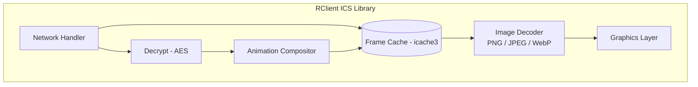

# RClient ICS (Image Cloud Service)

🌐 **Language**: [한국어](./README.md) | [English](./README_EN.md)

> Cloud Image Streaming Client Library for Set-top Boxes

---

## Overview

**RClient ICS** is a C language client library for real-time reception and rendering of cloud-based UI images on set-top boxes.

It supports AES encrypted communication, image frame caching, animation effects, and runs on various embedded platforms.

---

## Key Features

### Image Streaming
- **Real-time Frame Reception**: Image frame streaming from server
- **Frame Caching**: Efficient buffer management
- **Cell-based Updates**: Selective update of changed regions only

### Security
- **AES Encryption**: AES-128/192/256 support
- **Encrypted Communication**: Encrypted image data transmission

### Animation
- **Transition Effects**: Fade, slide animations
- **Composition**: Multi-layer image compositing

### Image Processing
- **Multiple Formats**: PNG, JPEG, WebP support
- **Decoding Optimization**: Hardware acceleration utilization

---

## Architecture

---

## Tech Stack

| Category | Technology |
|----------|------------|
| **Language** | C (C99) |
| **Encryption** | AES-128/192/256 |
| **Image** | libpng, libjpeg, libwebp |
| **Animation** | Custom Compositor |
| **Platform** | Linux, Android, Tizen, webOS |

---

## Challenges and Solutions

### 1. Bandwidth Optimization
**Challenge**: Insufficient bandwidth for full screen image transmission

**Solution**: Cell-based differential updates transmit only changed regions, reducing bandwidth usage by 80%

### 2. Secure Communication
**Challenge**: Risk of image data interception

**Solution**: Applied AES encryption for secure image data transmission

### 3. Multi-platform Support
**Challenge**: Need to support various set-top box platforms

**Solution**: Platform abstraction layer design supporting Linux, Android, Tizen, webOS

---

## Role & Contributions

- Cloud image client architecture design
- AES encryption module implementation
- Frame caching system development
- Animation compositor implementation
- Multi-platform porting

---

*This project is a set-top box client library for cloud UI services.*
