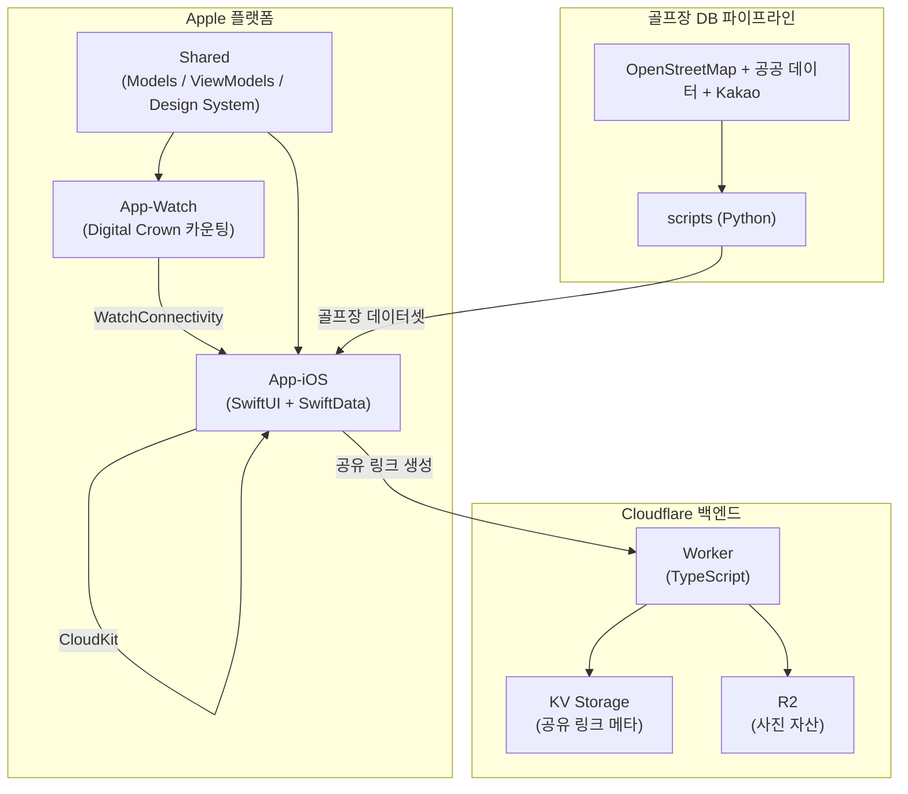

# RoundOn

🌐 **Language**: [한국어](./README.md) | [English](./README_EN.md)

> 탭 한 번으로 기록하는 미니멀 골프 스코어 카운터 — iPhone + Apple Watch

---

## 개요

**RoundOn**은 복잡한 기능을 걷어내고 "탭 한 번 = 한 타"라는 단순함에 집중한 골프 스코어 카운터입니다. 파(par) 대비 실시간 스코어를 보여주며, OB·해저드·컨시드(OK) 페널티 버튼을 제공합니다. Apple Watch의 Digital Crown으로 휴대폰을 꺼내지 않고도 스코어를 기록할 수 있고, GPS로 주변 골프장을 자동 인식하며, 종이 스코어카드를 촬영하면 AI가 코스·플레이어·스코어를 자동으로 채워줍니다. 라운드 결과는 앱이 없는 사람도 볼 수 있는 웹 링크로 공유됩니다.

---

## 주요 기능

### 직관적인 탭 스코어링
- 탭 한 번에 한 타 기록, 파 대비 스코어 실시간 표시
- OB·해저드·컨시드(OK) 페널티 버튼 제공
- 계정·로그인 불필요, 광고 기반 무료 제공

### Apple Watch 연동
- Digital Crown으로 휴대폰 없이 스코어 기록 + 햅틱 피드백
- WatchConnectivity 기반 iOS ↔ Watch 실시간 동기화

### GPS 골프장 자동 인식
- 965개 국내 골프장 데이터베이스에서 GPS로 주변 코스 자동 매칭
- OpenStreetMap(ODbL) + 공공 데이터 + Kakao API 보강 데이터 결합

### AI 스코어카드 분석
- 종이 스코어카드를 촬영하면 코스·플레이어·스코어를 자동 인식·입력

### 결과 공유
- 7일간 유효한 만료형 웹 링크 + 사진 첨부 공유 (`golf.zerolive.co.kr`)
- 수신자는 앱 설치 없이 메신저로 라운드 결과 확인 가능

### 동기화 & 프라이버시
- CloudKit 기반 iCloud 기기 간 동기화
- 골프장 데이터는 OpenStreetMap(ODbL 1.0) 라이선스 준수

---

## 기술 스택

| 분류 | 기술 |
|------|------|
| **Frontend** | SwiftUI (iOS / watchOS), SwiftData, CloudKit, HealthKit |
| **Backend** | Cloudflare Workers (TypeScript), KV Storage, R2 |
| **Data Pipeline** | Python 3, OpenStreetMap (ODbL) + 공공 데이터 + Kakao API |
| **Build Tools** | XcodeGen, xcodebuild, Wrangler |
| **Platform** | iOS 17.0+, watchOS 10.0+ |

---

## 아키텍처

---

## 개발 과정에서의 도전과 해결

### 1. 965개 국내 골프장 자동 매칭
**도전**: 신뢰할 수 있는 통합 골프장 데이터셋이 부재한 상태에서, GPS 위치만으로 주변 코스를 정확히 식별해야 했습니다.

**해결**: OpenStreetMap(ODbL) 데이터를 기반으로 공공 데이터셋과 Kakao API 보강 정보를 결합하는 Python 파이프라인을 구축하여, 965개 골프장 데이터베이스를 생성하고 GPS 기반 자동 매칭을 구현했습니다.

### 2. Apple Watch 단독 스코어링
**도전**: 휴대폰을 꺼내지 않고도 라운드 중 빠르고 정확하게 타수를 기록할 수 있어야 했습니다.

**해결**: Digital Crown 회전을 타수 입력에 매핑하고 햅틱 피드백을 더해, WatchConnectivity로 iOS 앱과 실시간 동기화되는 워치 단독 스코어링 경험을 구현했습니다.

### 3. 앱 없이 공유되는 만료형 결과 링크
**도전**: 라운드 결과를 앱이 없는 동반자에게도 공유하되, 데이터를 영구 노출하지 않아야 했습니다.

**해결**: Cloudflare Workers + KV + R2 조합으로 사진을 포함한 7일 만료형 웹 뷰어 링크를 생성하여, 수신자가 설치 없이 결과를 확인하고 일정 기간 후 자동 만료되도록 구현했습니다.

---

## 역할 및 기여

- iOS / watchOS 앱 아키텍처 설계 및 SwiftUI + SwiftData 구현
- Apple Watch Digital Crown 스코어링 및 WatchConnectivity 동기화 개발
- Cloudflare Workers 기반 만료형 공유 링크 백엔드 구축
- OpenStreetMap·공공 데이터·Kakao API 결합 골프장 DB 파이프라인 개발
- AI 스코어카드 인식 기능 연동
- App Store 배포 및 운영

---

## 관련 링크

- **GitHub**: [leonardo204/round-on](https://github.com/leonardo204/round-on)
- **App Store**: [RoundOn](https://apps.apple.com/us/app/roundon/id6776994717)
- **Contact**: zerolive7@gmail.com

---

*RoundOn은 골프 라운드 중 누구나 부담 없이 탭 한 번으로 스코어를 기록하고, 결과를 손쉽게 공유할 수 있도록 돕는 미니멀 스코어 카운터입니다.*
