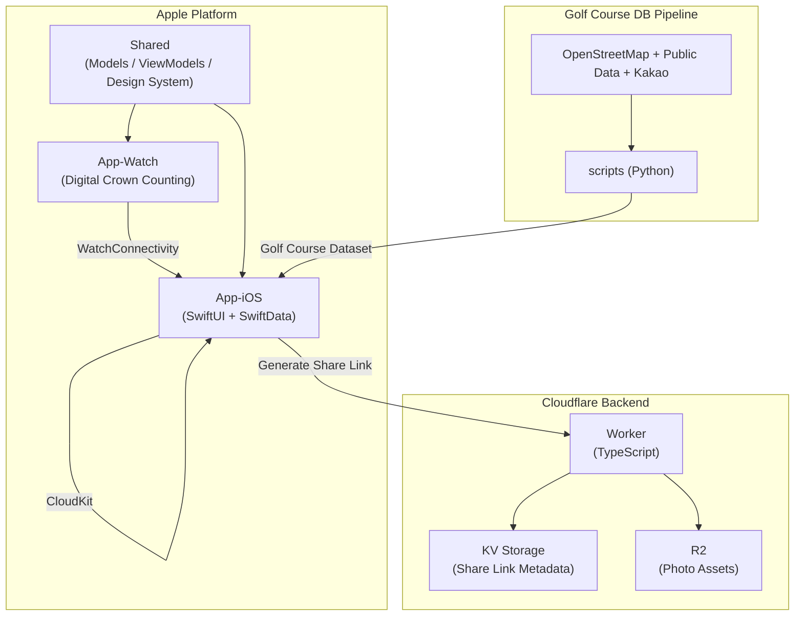

# RoundOn

🌐 **Language**: [한국어](./README.md) | [English](./README_EN.md)

> A minimalist golf score counter — one tap per stroke, for iPhone + Apple Watch

---

## Overview

**RoundOn** is a golf score counter that strips away complexity and focuses on one idea: "one tap = one stroke." It shows your score relative to par in real time and provides penalty buttons for out-of-bounds, hazards, and conceded strokes. With Apple Watch you can record scores using the Digital Crown without taking out your phone, GPS automatically recognizes nearby golf courses, and an AI scorecard scanner auto-fills the course, players, and scores from a photo of a paper scorecard. Round results are shared via web links that recipients can open without installing the app.

---

## Key Features

### Intuitive Tap Scoring
- One tap records one stroke, with real-time score relative to par
- Penalty buttons for out-of-bounds, hazards, and conceded (OK) strokes
- No account or login required; free with ad support

### Apple Watch Integration
- Record scores with the Digital Crown — no phone needed — plus haptic feedback
- Real-time iOS ↔ Watch sync via WatchConnectivity

### GPS Course Recognition
- Automatically matches nearby courses from a 965-course Korean golf database
- Combines OpenStreetMap (ODbL) + public datasets + Kakao API enrichment

### AI Scorecard Analysis
- Photograph a paper scorecard to auto-detect and fill in course, players, and scores

### Result Sharing
- Time-limited (7-day) shareable web links with photo attachments (`golf.zerolive.co.kr`)
- Recipients view round results via messaging apps without installing the app

### Sync & Privacy
- iCloud cross-device sync powered by CloudKit
- Golf course data licensed under OpenStreetMap (ODbL 1.0)

---

## Tech Stack

| Category | Technology |
|----------|------------|
| **Frontend** | SwiftUI (iOS / watchOS), SwiftData, CloudKit, HealthKit |
| **Backend** | Cloudflare Workers (TypeScript), KV Storage, R2 |
| **Data Pipeline** | Python 3, OpenStreetMap (ODbL) + public datasets + Kakao API |
| **Build Tools** | XcodeGen, xcodebuild, Wrangler |
| **Platform** | iOS 17.0+, watchOS 10.0+ |

---

## Architecture

---

## Challenges and Solutions

### 1. Auto-Matching 965 Korean Golf Courses
**Challenge**: With no reliable unified golf course dataset available, the app needed to accurately identify nearby courses from GPS location alone.

**Solution**: Built a Python pipeline that combines OpenStreetMap (ODbL) data with public datasets and Kakao API enrichment to generate a 965-course database, enabling GPS-based automatic matching.

### 2. Standalone Apple Watch Scoring
**Challenge**: Players needed to record strokes quickly and accurately during a round without taking out their phone.

**Solution**: Mapped Digital Crown rotation to stroke input with haptic feedback, delivering a standalone Watch scoring experience that syncs to the iOS app in real time via WatchConnectivity.

### 3. App-Free Expiring Result Links
**Challenge**: Round results needed to be shareable with playing partners who don't have the app, without exposing data permanently.

**Solution**: Used Cloudflare Workers + KV + R2 to generate 7-day expiring web viewer links with photos, letting recipients view results without installation while data auto-expires after the window.

---

## Role & Contributions

- Designed iOS / watchOS app architecture and implemented it with SwiftUI + SwiftData
- Developed Apple Watch Digital Crown scoring and WatchConnectivity sync
- Built the Cloudflare Workers backend for expiring share links
- Developed the golf course DB pipeline combining OpenStreetMap, public data, and Kakao API
- Integrated AI scorecard recognition
- App Store deployment and operations

---

## Links

- **GitHub**: [leonardo204/round-on](https://github.com/leonardo204/round-on)
- **App Store**: [RoundOn](https://apps.apple.com/us/app/roundon/id6776994717)
- **Contact**: zerolive7@gmail.com

---

*RoundOn is a minimalist score counter that helps anyone effortlessly track their golf round with a single tap and share the results with ease.*
