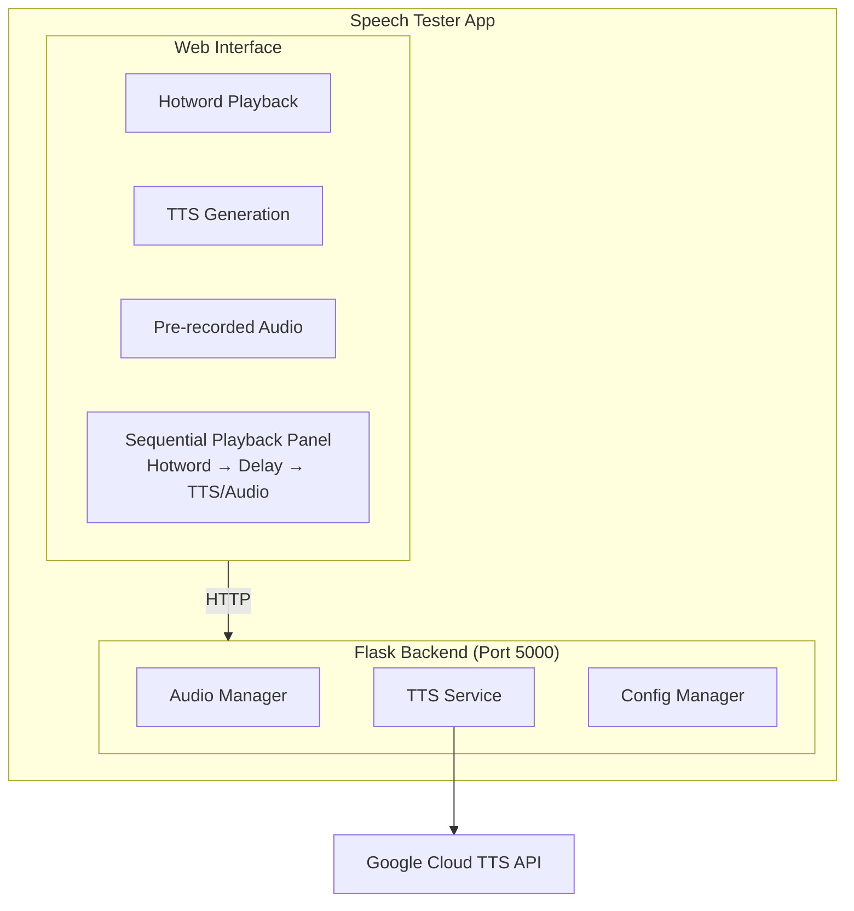

# Speech Tester

🌐 **Language**: [한국어](./README.md) | [English](./README_EN.md)

> VTT Media AI Platform Speech Testing Tool

---

## Overview

**Speech Tester** is a web-based tool for testing voice assistant functionality of VTT Media AI Platform. It supports hotword playback, TTS (Text-to-Speech) generation, pre-recorded audio file playback, and sequential playback scenario testing.

It enables validation of voice assistant workflows through real user interaction simulation (hotword → delay → TTS/audio).

---

## Key Features

### Hotword Playback
- **Wake Word Audio**: Play pre-recorded wake word files like "Tammi ơi"
- **File Management**: Automatic folder-based wake word file scanning

### TTS Generation
- **Multi-language**: English, Vietnamese support
- **Google Cloud TTS**: High-quality speech synthesis
- **Download**: Save generated audio files

### Pre-recorded Audio
- **Category Management**: Organize test files by folder
- **Hierarchical Structure**: Categories like weather/, device_control/
- **Instant Playback**: One-click audio playback

### Sequential Playback
- **Scenario Testing**: Hotword → Delay → TTS/Audio
- **Configurable Delay**: 0-10 second delay settings
- **Progress Display**: Step-by-step progress visualization

---

## Architecture

---

## Tech Stack

| Category | Technology |
|----------|------------|
| **Backend** | Python 3.9+, Flask |
| **Frontend** | Vanilla JavaScript, HTML5, CSS3 |
| **TTS** | Google Cloud Text-to-Speech API |
| **Audio** | WAV (PCM, 24kHz) |

---

## Challenges and Solutions

### 1. Sequential Audio Playback
**Challenge**: Needed to play Hotword → Delay → TTS in exact order.

**Solution**: Implemented Promise-based async playback queue, detecting each step's completion before proceeding to next.

### 2. Category-based File Management
**Challenge**: Needed efficient management of audio files for various test scenarios.

**Solution**: Implemented folder-based auto-scan system where adding category folders automatically reflects in UI.

---

## Role & Contributions

- Flask-based web application design and implementation
- Google Cloud TTS integration service development
- Audio file management system implementation
- Sequential playback scenario test feature development

---

## System Requirements

| Item | Requirement |
|------|-------------|
| **Python** | 3.9 or later |
| **Browser** | Chrome 90+, Firefox 88+, Safari 14+ |
| **Google Cloud** | TTS API enabled |

---

*This project is an internal tool for VTT Media AI Platform speech feature testing.*
