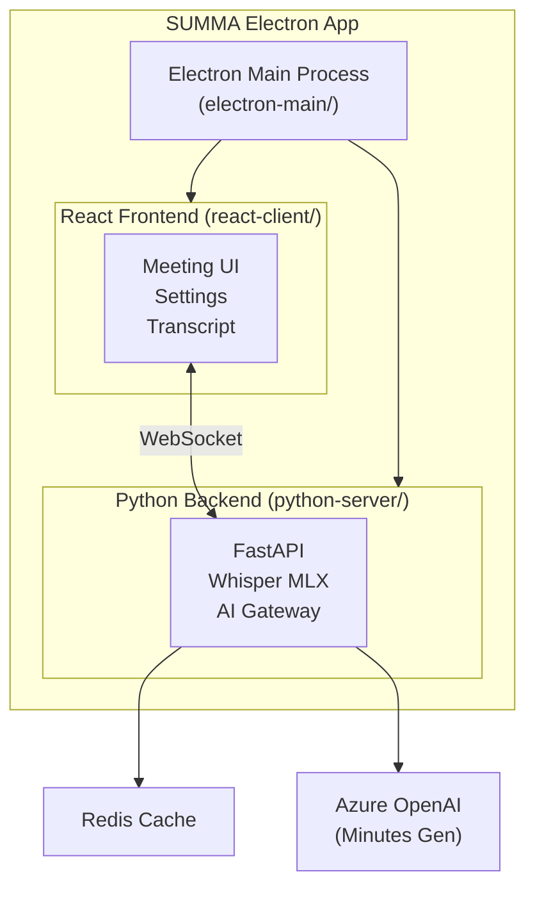

# SUMMA Electron

🌐 **Language**: [한국어](./README.md) | [English](./README_EN.md)

> AI-powered Real-time Speech Recognition and Meeting Minutes Auto-generation Desktop Application

---

## Overview

**SUMMA (Speech Understanding Meeting Assistant)** is an Electron desktop application that provides Whisper-based real-time speech recognition and AI-powered automatic meeting minutes generation.

It offers essential features for meeting support including real-time voice transcription, customizable prompt settings, and performance optimization through Redis cache.

---

## Key Features

### Real-time Speech Recognition
- **Whisper MLX**: Apple Silicon optimized speech recognition
- **Dynamic Model Switching**: Runtime Whisper model selection
- **Audio Input Selection**: Various microphone device support

### Meeting Minutes Generation
- **AI-based Summarization**: Automatic summarization via Azure OpenAI
- **Prompt Customization**: Custom prompts and keywords
- **Real-time Transcription**: Instant speech content display

### Performance Optimization
- **Redis Cache**: Session data caching
- **Memory Optimization**: Efficient resource management
- **Process Separation**: Independent Python server execution

---

## System Architecture

---

## Tech Stack

| Category | Technology |
|----------|------------|
| **Desktop** | Electron |
| **Frontend** | React, Zustand |
| **Backend** | Python, FastAPI |
| **Speech** | Whisper MLX |
| **AI** | Azure OpenAI |
| **Cache** | Redis |
| **Build** | electron-builder |

---

## Challenges and Solutions

### 1. Electron + Python Integration
**Challenge**: Needed stable management of Python backend within Electron app.

**Solution**: Managed Python server as child process from Electron main process, with automatic cleanup on app termination.

### 2. Whisper MLX Integration
**Challenge**: Needed optimal Whisper performance on Apple Silicon.

**Solution**: Used Whisper MLX to leverage Metal GPU acceleration, implementing interface supporting dynamic model switching.

### 3. Real-time Transcription UI
**Challenge**: Needed smooth UI display of real-time speech recognition results.

**Solution**: Implemented real-time updates via WebSocket bidirectional communication, with efficient state management using Zustand.

---

## Role & Contributions

- Electron + React + Python hybrid architecture design
- Whisper MLX-based real-time speech recognition system development
- Azure OpenAI integrated meeting minutes generation implementation
- Prompt customization system development
- macOS build and deployment system setup

---

## System Requirements

| Item | Requirement |
|------|-------------|
| **macOS** | macOS (Apple Silicon recommended) |
| **Python** | System installation required |
| **Redis** | Optional (for caching) |
| **Microphone** | Permission required |

---

*This project is a desktop application for AI-powered automatic meeting minutes generation.*
