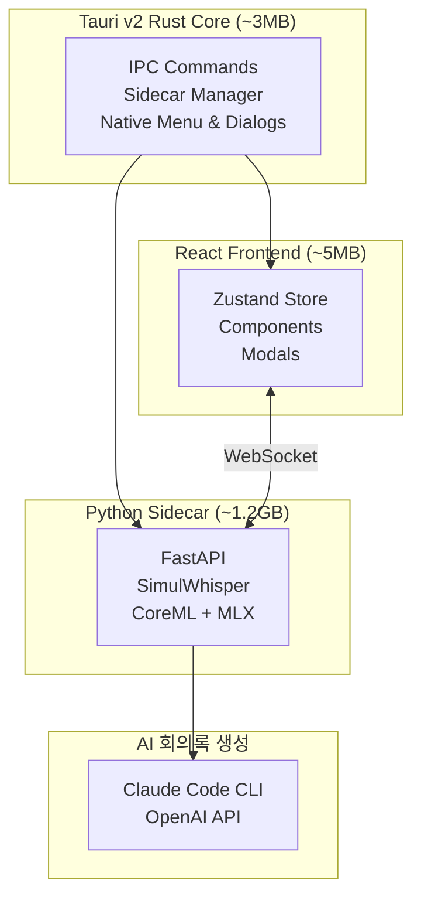

# SUMMA v2 (Tauri)

🌐 **Language**: [한국어](./README.md) | [English](./README_EN.md)

> AI 기반 실시간 스트리밍 전사 및 회의록 자동 생성 데스크톱 애플리케이션


---

## 개요

**SUMMA v2**는 [SUMMA Electron](../summa-electron/)의 후속 버전으로, Tauri v2 기반으로 재설계된 경량 고성능 회의록 애플리케이션입니다.

SimulWhisper + AlignAtt 정책 기반 실시간 스트리밍 전사, CoreML + MLX 하이브리드 아키텍처로 Apple Silicon에서 최대 18배 빠른 인코딩 성능을 제공합니다.

---

## 주요 기능

### 실시간 스트리밍 전사
- **SimulWhisper**: 실시간 스트리밍 음성 인식 (AlignAtt 정책)
- **CoreML Encoder**: Apple Neural Engine 활용 18배 가속
- **MLX Decoder**: 유연한 디코딩 제어 및 할루시네이션 방지

### 경량 VAD 시스템
- **Silero VAD ONNX**: torch 의존성 제거 (3GB → 30MB)
- **VAC Controller**: 지능형 음성 구간 관리

### 할루시네이션 방지
- **Bag of Hallucinations**: 알려진 패턴 데이터베이스
- **N-gram 반복 감지**: 동일 구절 반복 필터링
- **연속 중복 차단**: 직전 결과와 비교

### AI 회의록 생성
- **Claude Code CLI**: 로컬 실행 (API 키 불필요)
- **OpenAI API**: 클라우드 기반 옵션
- **커스텀 프롬프트**: 사용자 정의 회의록 형식

---

## 시스템 아키텍처



---

## Electron vs Tauri 비교

| 항목 | Electron (v1) | Tauri (v2) |
|------|---------------|------------|
| 런타임 | Chromium + Node.js 번들 | 시스템 WebView 사용 |
| 기본 바이너리 크기 | ~150MB | ~3MB |
| 메모리 사용량 | ~300MB+ | ~50MB |
| 백엔드 언어 | JavaScript (Node.js) | Rust |
| 보안 | Node.js 전체 API 노출 | 명시적 권한 시스템 |
| IPC 성능 | JSON 직렬화 | 바이너리 직렬화 |

---

## 기술 스택

| 분류 | 기술 |
|------|------|
| **Desktop** | Tauri v2 (Rust) |
| **Frontend** | React 19, Vite, Zustand |
| **Backend** | Python 3.11+, FastAPI |
| **ASR** | SimulWhisper (CoreML + MLX) |
| **VAD** | Silero VAD (ONNX) |
| **AI** | Claude Code CLI, OpenAI API |
| **Build** | PyInstaller, Tauri Bundler |

---

## 프로젝트 구조

```
summa2-tauri/
├── src/                          # React 프론트엔드
│   ├── components/               # UI 컴포넌트
│   ├── modals/                   # 모달 (설정, 회의록 등)
│   ├── contexts/                 # React Context
│   ├── hooks/                    # Custom Hooks
│   └── stores/                   # Zustand 상태 관리
├── src-tauri/                    # Tauri (Rust)
│   ├── src/
│   │   ├── commands/            # IPC 핸들러
│   │   └── lib.rs               # 앱 진입점
│   ├── binaries/                # 사이드카 바이너리
│   └── tauri.conf.json          # Tauri 설정
├── sidecar/                      # Python 백엔드
│   ├── app.py                   # FastAPI 서버
│   ├── asr/
│   │   ├── simul_processor.py   # SimulStreaming 프로세서
│   │   └── vac_processor.py     # VAC 컨트롤러
│   └── utils/
│       └── silero_vad_onnx.py   # Silero VAD ONNX
└── package.sh                    # 빌드 스크립트
```

---

## 성능 벤치마크 (Apple M1 Pro)

| 메트릭 | 값 |
|--------|-----|
| 실시간 비율 (RTF) | 0.15x (6.7배 실시간) |
| 평균 지연 시간 | ~300ms |
| 메모리 사용량 | ~2GB (Whisper large-v3-turbo) |
| VAD 처리 시간 | <5ms per chunk |
| DMG 크기 | ~1.3GB (CoreML 모델 포함) |

---

## 개발 과정에서의 도전과 해결

### 1. CoreML + MLX 하이브리드 아키텍처
**도전**: Whisper의 Encoder와 Decoder가 서로 다른 최적화 요구사항을 가짐

**해결**: Encoder는 CoreML로 Apple Neural Engine 활용, Decoder는 MLX로 유연한 제어 구현

### 2. 할루시네이션 방지
**도전**: 무음 구간에서 Whisper가 가짜 텍스트 생성

**해결**: Bag of Hallucinations 패턴 데이터베이스, N-gram 반복 감지, 연속 중복 차단 등 다층 필터링 구현

### 3. Python Sidecar 통합
**도전**: Tauri에서 무거운 ML 모델을 포함한 Python 백엔드 관리

**해결**: PyInstaller로 단일 바이너리 패키징, Rust에서 안정적인 spawn/kill 관리, 앱 종료 시 좀비 프로세스 방지

---

## 역할 및 기여

- Tauri v2 + React + Python Sidecar 아키텍처 설계
- SimulWhisper 기반 실시간 스트리밍 전사 시스템 개발
- CoreML + MLX 하이브리드 파이프라인 구축
- Silero VAD ONNX 통합으로 의존성 경량화
- 할루시네이션 감지 및 방지 시스템 구현
- macOS 코드 서명/공증 및 배포 파이프라인 구축

---

## 시스템 요구사항

| 항목 | 요구사항 |
|------|----------|
| **macOS** | macOS 12.0+ (Apple Silicon 필수) |
| **메모리** | 8GB RAM 이상 권장 |
| **저장공간** | ~2GB (앱 + 모델) |
| **마이크** | 권한 허용 필요 |

---

## 참고 자료

- [Lightning-SimulWhisper](https://github.com/altalt-org/Lightning-SimulWhisper) - CoreML + MLX 하이브리드 Whisper
- [SimulWhisper Paper](https://arxiv.org/abs/2307.01721) - 동시 음성 인식
- [Bag of Hallucinations](https://arxiv.org/abs/2501.11378) - 할루시네이션 감지

---

*이 프로젝트는 SUMMA Electron의 후속 버전으로, Tauri 기반 경량 고성능 회의록 자동 생성 애플리케이션입니다.*
