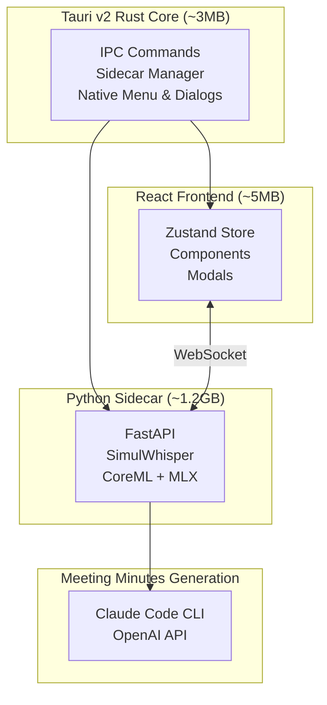

# SUMMA v2 (Tauri)

🌐 **Language**: [한국어](./README.md) | [English](./README_EN.md)

> AI-powered real-time streaming transcription and meeting minutes generation desktop application


---

## Overview

**SUMMA v2** is the successor to [SUMMA Electron](../summa-electron/), redesigned as a lightweight, high-performance meeting notes application based on Tauri v2.

It provides real-time streaming transcription using SimulWhisper + AlignAtt policy, with CoreML + MLX hybrid architecture delivering up to 18x faster encoding on Apple Silicon.

---

## Key Features

### Real-time Streaming Transcription
- **SimulWhisper**: Real-time streaming speech recognition (AlignAtt policy)
- **CoreML Encoder**: 18x acceleration using Apple Neural Engine
- **MLX Decoder**: Flexible decoding control and hallucination prevention

### Lightweight VAD System
- **Silero VAD ONNX**: Removed torch dependency (3GB → 30MB)
- **VAC Controller**: Intelligent voice segment management

### Hallucination Prevention
- **Bag of Hallucinations**: Known pattern database
- **N-gram Repetition Detection**: Filters repeated phrases
- **Consecutive Duplicate Blocking**: Compares with previous results

### AI Meeting Minutes
- **Claude Code CLI**: Local execution (no API key required)
- **OpenAI API**: Cloud-based option
- **Custom Prompts**: User-defined meeting notes format

---

## System Architecture



---

## Electron vs Tauri Comparison

| Aspect | Electron (v1) | Tauri (v2) |
|--------|---------------|------------|
| Runtime | Chromium + Node.js bundled | System WebView |
| Base Binary Size | ~150MB | ~3MB |
| Memory Usage | ~300MB+ | ~50MB |
| Backend Language | JavaScript (Node.js) | Rust |
| Security | Full Node.js API exposed | Explicit permission system |
| IPC Performance | JSON serialization | Binary serialization |

---

## Tech Stack

| Category | Technology |
|----------|------------|
| **Desktop** | Tauri v2 (Rust) |
| **Frontend** | React 19, Vite, Zustand |
| **Backend** | Python 3.11+, FastAPI |
| **ASR** | SimulWhisper (CoreML + MLX) |
| **VAD** | Silero VAD (ONNX) |
| **AI** | Claude Code CLI, OpenAI API |
| **Build** | PyInstaller, Tauri Bundler |

---

## Project Structure

```
summa2-tauri/
├── src/                          # React frontend
│   ├── components/               # UI components
│   ├── modals/                   # Modals (settings, minutes, etc.)
│   ├── contexts/                 # React Context
│   ├── hooks/                    # Custom Hooks
│   └── stores/                   # Zustand state management
├── src-tauri/                    # Tauri (Rust)
│   ├── src/
│   │   ├── commands/            # IPC handlers
│   │   └── lib.rs               # App entry point
│   ├── binaries/                # Sidecar binaries
│   └── tauri.conf.json          # Tauri configuration
├── sidecar/                      # Python backend
│   ├── app.py                   # FastAPI server
│   ├── asr/
│   │   ├── simul_processor.py   # SimulStreaming processor
│   │   └── vac_processor.py     # VAC controller
│   └── utils/
│       └── silero_vad_onnx.py   # Silero VAD ONNX
└── package.sh                    # Build script
```

---

## Performance Benchmarks (Apple M1 Pro)

| Metric | Value |
|--------|-------|
| Real-time Factor (RTF) | 0.15x (6.7x faster than real-time) |
| Average Latency | ~300ms |
| Memory Usage | ~2GB (Whisper large-v3-turbo) |
| VAD Processing Time | <5ms per chunk |
| DMG Size | ~1.3GB (includes CoreML model) |

---

## Challenges and Solutions

### 1. CoreML + MLX Hybrid Architecture
**Challenge**: Whisper's Encoder and Decoder have different optimization requirements

**Solution**: Encoder uses CoreML with Apple Neural Engine, Decoder uses MLX for flexible control

### 2. Hallucination Prevention
**Challenge**: Whisper generates fake text during silent segments

**Solution**: Implemented multi-layer filtering with Bag of Hallucinations pattern database, N-gram repetition detection, and consecutive duplicate blocking

### 3. Python Sidecar Integration
**Challenge**: Managing Python backend with heavy ML models in Tauri

**Solution**: Single binary packaging with PyInstaller, reliable spawn/kill management in Rust, zombie process prevention on app exit

---

## Role and Contributions

- Designed Tauri v2 + React + Python Sidecar architecture
- Developed real-time streaming transcription system based on SimulWhisper
- Built CoreML + MLX hybrid pipeline
- Integrated Silero VAD ONNX for dependency reduction
- Implemented hallucination detection and prevention system
- Built macOS code signing/notarization and deployment pipeline

---

## System Requirements

| Item | Requirement |
|------|-------------|
| **macOS** | macOS 12.0+ (Apple Silicon required) |
| **Memory** | 8GB RAM or more recommended |
| **Storage** | ~2GB (app + models) |
| **Microphone** | Permission required |

---

## References

- [Lightning-SimulWhisper](https://github.com/altalt-org/Lightning-SimulWhisper) - CoreML + MLX hybrid Whisper
- [SimulWhisper Paper](https://arxiv.org/abs/2307.01721) - Simultaneous speech recognition
- [Bag of Hallucinations](https://arxiv.org/abs/2501.11378) - Hallucination detection

---

*This project is the successor to SUMMA Electron, a lightweight high-performance meeting minutes generation application based on Tauri.*
