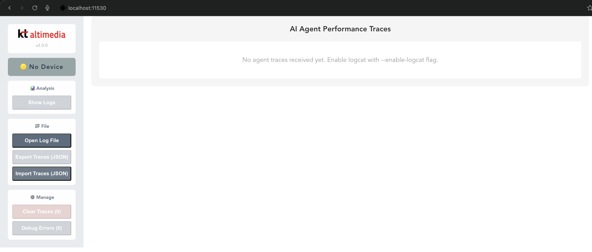
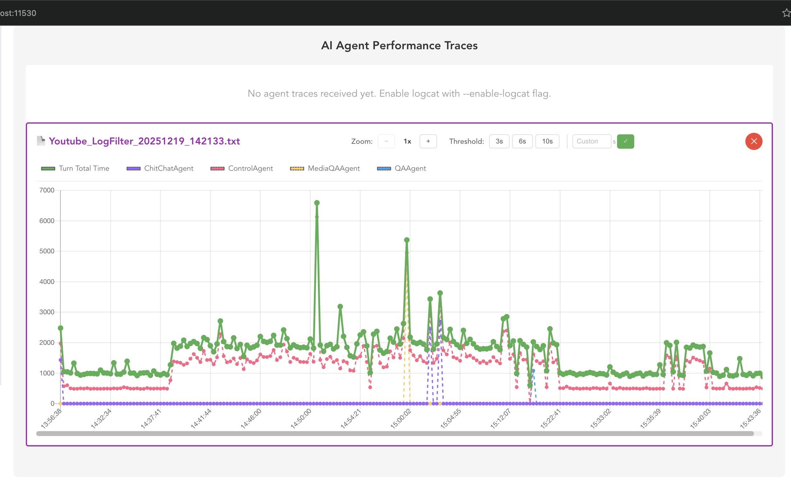
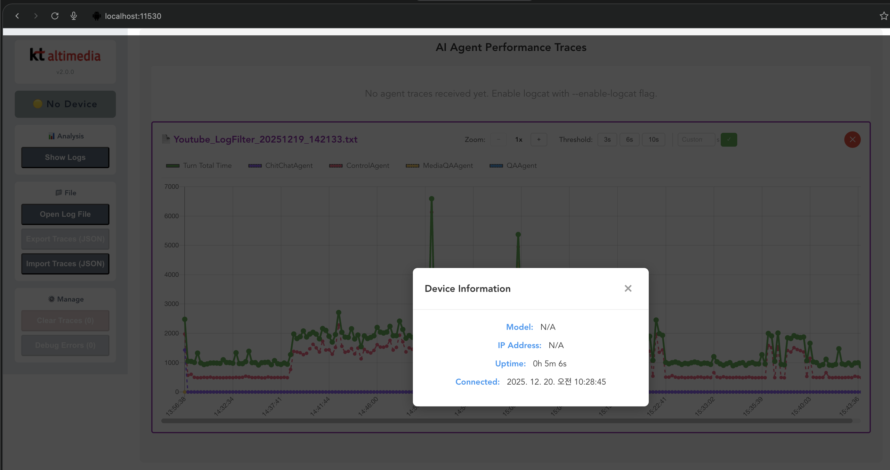
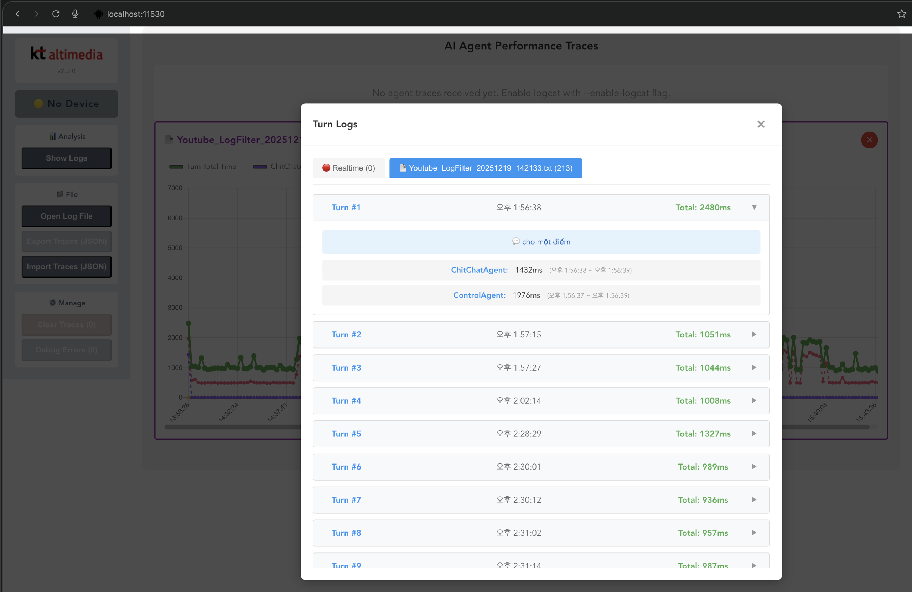
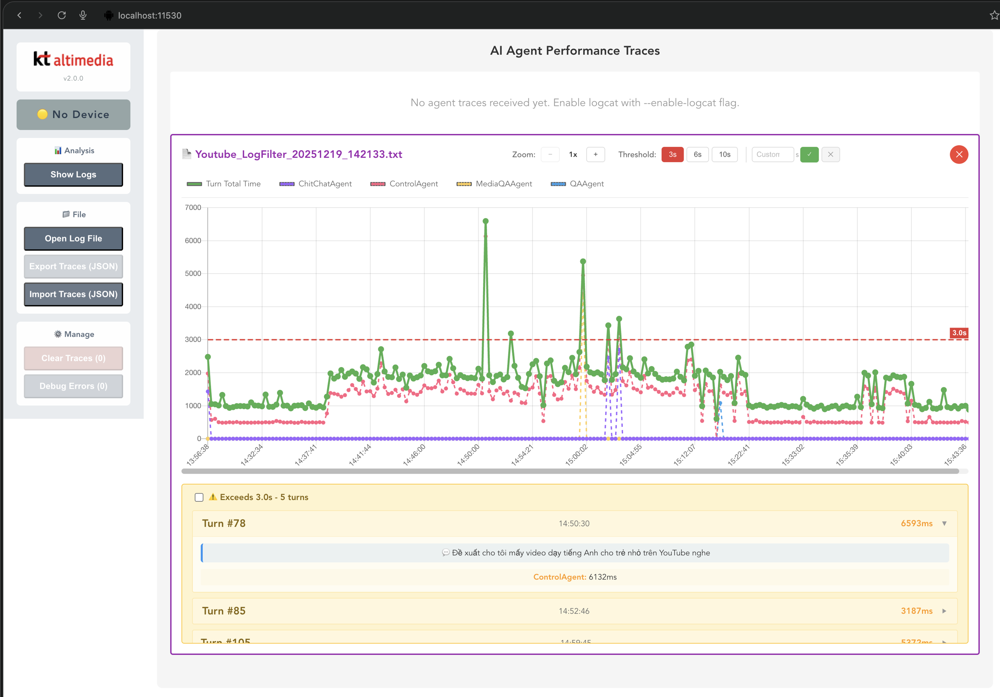

# Tammi Performance Chart (Trace Tool)

🌐 **Language**: [한국어](./README.md) | [English](./README_EN.md)

> AI Agent Performance Monitoring and Visualization Tool v2.0.0


---

## Overview

**Tammi Performance Chart** is a desktop tool for real-time monitoring and visualization of AI Agent performance on Android devices. It collects device logs through ADB (Android Debug Bridge) and displays each Agent's response time in intuitive charts for QA testing and performance analysis.

This tool plays a crucial role in identifying performance bottlenecks and validating response time standards during the quality assurance (QA) process for AI services.

---

## Key Features

### Real-time Performance Monitoring
- **Turn-by-Turn Processing Time Tracking**: Monitor total HTTP request/response time and individual Agent processing times in real-time
- **Timeline Chart**: Visualize performance data chronologically for easy trend identification

### Log File Analysis
- Load and analyze existing log files (`.txt`, `.log`)
- Compare with real-time monitoring simultaneously

### QA Testing Support
- **Y-axis Threshold Setting**: Preset values (3s, 6s, 10s) or custom values
- **Instant Threshold Violation Display**: Automatically list turns exceeding the threshold
- Automate performance validation against QA test criteria

### Data Management
- **Export/Import Traces**: Export/import real-time data in JSON format
- Share and reproduce test data

### User Experience
- **Chart Zoom In/Out**: 1x~3x zoom with horizontal scrolling
- **Chart Legend Toggle**: Click to show/hide specific Agent graphs
- **Modern UI Theme**: Light background with unified button colors
- **English UI**: Interface designed for global team collaboration

---

## Tech Stack

| Category | Technology |
|----------|------------|
| **Frontend** | HTML5, CSS3, JavaScript, Chart.js |
| **Backend** | Node.js |
| **Desktop App** | Electron (Cross-platform) |
| **Device Integration** | ADB (Android Debug Bridge) |
| **Data Format** | JSON |

---

## Architecture

```
┌─────────────────────────────────────────────────────────┐
│                    Desktop Application                   │
│  ┌─────────────────────────────────────────────────┐    │
│  │              Web UI (Browser View)               │    │
│  │  ┌─────────────┐  ┌─────────────────────────┐   │    │
│  │  │   Menu Bar  │  │     Chart Container     │   │    │
│  │  │  - Open Log │  │  ┌─────────────────────┐│   │    │
│  │  │  - Export   │  │  │  Timeline Chart     ││   │    │
│  │  │  - Import   │  │  │  (Chart.js)         ││   │    │
│  │  │  - Clear    │  │  └─────────────────────┘│   │    │
│  │  └─────────────┘  │  ┌─────────────────────┐│   │    │
│  │                   │  │  Threshold Controls ││   │    │
│  │                   │  └─────────────────────┘│   │    │
│  │                   └─────────────────────────────┘│   │
│  └─────────────────────────────────────────────────┘    │
│                           │                              │
│  ┌─────────────────────────────────────────────────┐    │
│  │              Node.js Backend Server              │    │
│  │  ┌─────────────┐  ┌─────────────┐  ┌─────────┐  │    │
│  │  │ ADB Handler │  │ Log Parser  │  │WebSocket│  │    │
│  │  └─────────────┘  └─────────────┘  └─────────┘  │    │
│  └─────────────────────────────────────────────────┘    │
└─────────────────────────────────────────────────────────┘
                           │
                           ▼
              ┌─────────────────────────┐
              │    Android Device       │
              │  (AI Agent Running)     │
              │    via ADB logcat       │
              └─────────────────────────┘
```

---

## Screenshots

### Initial Screen
*Waiting for ADB device connection*



### Log Graph
*Visualization of AI Agent's turn-by-turn processing time*



### Device Information
*Connected Android device information*



### Turn Details
*Utterance content and per-Agent processing time for each turn*



### Threshold Settings
*Threshold configuration and violation display for QA testing*



---

## Supported Platforms

| Platform | Filename |
|----------|----------|
| Windows 10/11 (64-bit) | `tammi-chart-v2.0.0-win.exe` |
| macOS (Intel) | `tammi-chart-v2.0.0-macos-intel` |
| macOS (Apple Silicon M1/M2/M3) | `tammi-chart-v2.0.0-macos-apple-silicon` |

---

## Challenges and Solutions

### 1. Real-time Log Streaming
**Challenge**: Stable parsing and UI updates were needed while handling high-volume log streaming from ADB logcat.

**Solution**: Optimized performance through log buffering and batch processing, implementing efficient real-time data transmission via WebSocket.

### 2. Cross-Platform Compatibility
**Challenge**: Application deployment was required for both Windows and macOS (Intel/Apple Silicon).

**Solution**: Utilized Electron to support three platforms with a single codebase and built platform-specific build pipelines.

### 3. Multi-Agent Visualization
**Challenge**: Multiple Agents' processing times needed to be clearly distinguished on a single chart.

**Solution**: Implemented Chart.js multi-dataset functionality with legend toggle, allowing users to selectively view specific Agents.

---

## Role & Contributions

- Overall application architecture design and implementation
- ADB integration and log parsing logic development
- Chart.js-based real-time visualization implementation
- Threshold settings and QA support feature development
- Cross-platform (Windows, macOS) build and deployment

---

## Version History

| Version | Date | Changes |
|---------|------|---------|
| v2.0.0 | 2025.12.20 | English UI, modern theme, legend toggle |
| v1.8.0 | - | Chart zoom in/out, legend separation |
| v1.7.0 | - | Menu UI grouping, version display improvement |
| v1.6.0 | - | Export/Import Traces feature |
| v1.5.0 | - | Clear Traces UI improvement, Show Logs tab UI |
| v1.4.0 | - | Y-axis Threshold feature, violation display |

---

## Related Links

- **Repository**: [Bitbucket - ais-vtt-qa-trace-chart](https://bitbucket.org/altimedia/ais-vtt-qa-trace-chart/src/main/)

---

*This project was developed as part of the KT Viettel AI Media Service project.*
