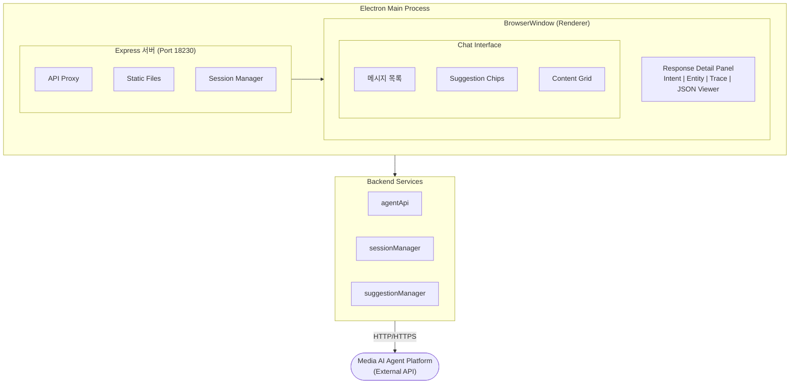

# VTT Media AI Agent Chat

🌐 **Language**: [한국어](./README.md) | [English](./README_EN.md)

> AI 에이전트 플랫폼 연동 테스트를 위한 Electron 기반 채팅 애플리케이션


---

## 개요

**VTT Media AI Agent Chat**은 STB(Set-Top Box) 단말의 Agent Client와 미디어 AI Agent Platform 간의 연동을 테스트하기 위한 Electron 기반 데스크톱 애플리케이션입니다.

멀티턴/싱글턴 대화 관리, 추천어 시스템, 콘텐츠 시각화 등 다양한 기능을 제공하며, 텔레그램 스타일의 직관적인 UI를 통해 AI 에이전트와의 상호작용을 테스트할 수 있습니다.

---

## 주요 기능

### API 연동
- **3가지 핵심 API 연동**: 선제언 조회, Agent 호출, 대화 종료
- **자동 턴 타입 판별**: 멀티턴/싱글턴 자동 인식 및 처리
- **Transaction ID 관리**: 세션 기반 ID 자동 생성 및 유지

### 대화 관리
- **멀티턴 대화**: 동일 Transaction ID 유지하며 연속 대화
- **싱글턴 대화**: 응답 후 자동 대화 종료 API 호출
- **응답 시간 측정**: API 요청-응답 밀리초 단위 측정

### 추천어 시스템
- **선제언(Pre-Suggestions)**: 프로그램 시작 시 추천어 로드
- **동적 업데이트**: AI 응답에 따른 추천어 자동 갱신
- **다국어 지원**: 한국어/베트남어/영어 실시간 전환

### 콘텐츠 시각화
- **포스터 그리드**: 2행 4열 레이아웃으로 콘텐츠 표시
- **콘텐츠 배지**: 등급(T16, P), 타입(FILM, VOD) 표시
- **상세 팝업**: Glassmorphism 효과의 콘텐츠 상세 모달
- **통계 정보**: 조회수, 좋아요, 재생시간 표시

### 상세 정보 표시
- **Intent 정보**: Main/Sub Intent 표시
- **Entity/Content List**: 추출된 엔티티 및 콘텐츠 목록
- **Trace 정보**: 모듈별 처리 시간 및 흐름
- **JSON 전문 보기**: Pretty Format JSON 뷰어 및 복사 기능

### Electron 데스크톱 앱
- **단독 실행**: Node.js 설치 없이 실행 가능
- **통합 패키징**: 서버와 클라이언트 일체형
- **크로스 플랫폼**: macOS Universal Binary, Windows Portable 지원
- **Code Signing**: macOS Notarization 지원

---

## 스크린샷

> 스크린샷 추가 예정

<!--
### 메인 채팅 화면


### 콘텐츠 상세 팝업

-->

---

## 기술 스택

| 분류 | 기술 |
|------|------|
| **Runtime** | Node.js |
| **Desktop Framework** | Electron |
| **Server** | Express.js |
| **Frontend** | Vanilla JavaScript (No Framework) |
| **Build Tool** | electron-builder |
| **Protocol** | HTTP/HTTPS (RESTful API) |

---

## 아키텍처



---

## 프로젝트 구조

```
vtt-assistant-chat/
├── electron.js              # Electron 메인 프로세스
├── preload.js               # Electron preload 스크립트
├── server.js                # Express 서버
├── package.json             # 프로젝트 설정
├── src/
│   ├── api/
│   │   └── agentApi.js      # API 호출 함수
│   ├── managers/
│   │   ├── sessionManager.js    # 세션/턴 관리
│   │   └── suggestionManager.js # 추천어 관리
│   └── utils/
│       └── helpers.js       # 유틸리티 함수
├── public/
│   ├── index.html           # 메인 HTML
│   ├── css/
│   │   └── style.css        # 텔레그램 스타일시트
│   └── js/
│       ├── app.js           # 메인 애플리케이션 로직
│       ├── api.js           # 프론트엔드 API 클라이언트
│       ├── ui.js            # UI 렌더링
│       └── turnManager.js   # 턴 타입 판별
└── resources/
    └── icons/               # 앱 아이콘 및 아바타
```

---

## 멀티턴/싱글턴 대화 정책

### Single-turn (싱글턴)
응답 후 자동으로 대화 종료 API 호출

| Agent Type | Intent | 설명 |
|------------|--------|------|
| ControlAgent | Youtube | YouTube 앱 제어 |
| ControlAgent | Spotify | Spotify 앱 제어 |
| ControlAgent | MediaControl | 미디어 제어 |
| ControlAgent | DeviceControl | 디바이스 제어 |

### Multi-turn (멀티턴)
동일 Transaction ID 유지하며 연속 대화

| Agent Type | Intent | 설명 |
|------------|--------|------|
| MediaQAAgent | MediaRecommendation | 콘텐츠 추천 |
| ChitChatAgent | Chat | 일반 대화 |
| QAAgent | QA | 시간/날짜/번역 |
| DailyInfoAgent | Weather | 날씨 정보 |

---

## 개발 과정에서의 도전과 해결

### 1. Electron stdio 문제
**도전**: `spawn('node', ...)` 사용 시 Finder에서 더블클릭 실행이 불가능했습니다.

**해결**: Electron 프로세스 내에서 `require`로 Express 서버를 직접 로드하는 방식으로 변경하여 stdio 문제를 해결했습니다.

### 2. 서버 준비 상태 확인
**도전**: BrowserWindow가 서버 시작 전에 로드를 시도하여 빈 화면이 표시되었습니다.

**해결**: `net.createConnection`을 사용하여 서버 포트 연결 가능 여부를 확인한 후 BrowserWindow를 로드하도록 구현했습니다.

### 3. 패키징 시 모듈 누락
**도전**: 빌드 후 `Cannot find module 'express'` 에러가 발생했습니다.

**해결**: package.json의 `files` 배열에서 `!node_modules/**/*` 제외 규칙을 제거하여 node_modules가 패키징에 포함되도록 수정했습니다.

### 4. 정적 파일 경로 문제
**도전**: 패키징 후 CSS 파일 로드가 실패했습니다.

**해결**: `express.static('public')`을 `express.static(path.join(__dirname, 'public'))`로 변경하여 절대 경로를 사용하도록 수정했습니다.

---

## 역할 및 기여

- Electron 데스크톱 앱 아키텍처 설계 및 구현
- Express 서버 내장형 Electron 앱 개발
- 멀티턴/싱글턴 대화 관리 시스템 구현
- 텔레그램 스타일 UI/UX 디자인 및 개발
- 콘텐츠 시각화 컴포넌트 (그리드, 모달) 개발
- 크로스 플랫폼 빌드 및 배포 시스템 구축

---

## 시스템 요구사항

| 항목 | 요구사항 |
|------|----------|
| **macOS** | macOS 10.13 이상 (Intel + Apple Silicon) |
| **Windows** | Windows 10 이상 |
| **개발 환경** | Node.js 16+ |

---

## 디자인 테마

### 텔레그램 스타일 색상 팔레트
| 용도 | 색상 코드 |
|------|-----------|
| Primary Blue | `#0088cc` |
| Light Blue | `#64b5f6` |
| Dark Blue | `#0066a0` |
| Background | `#f4f4f5` |

---

*이 프로젝트는 STB 단말 AI 에이전트 연동 테스트를 위한 사내 개발 도구입니다.*
