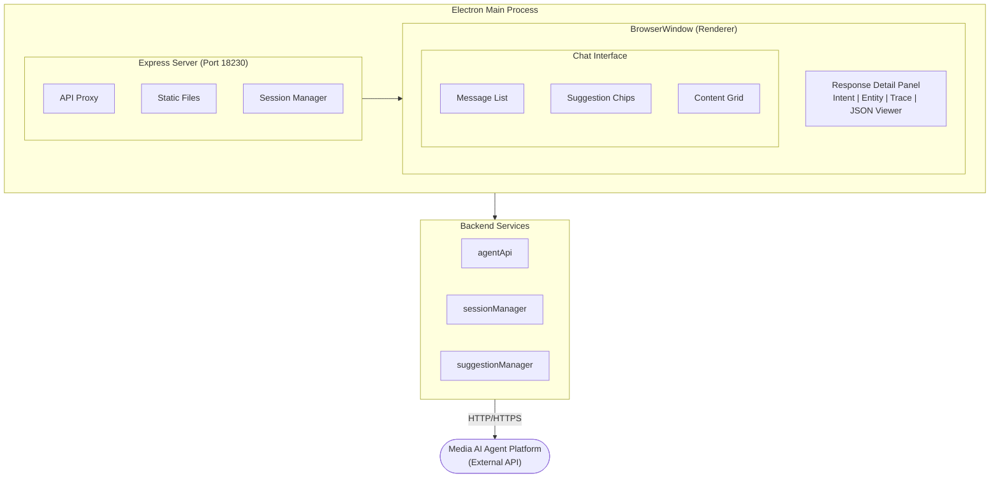

# VTT Media AI Agent Chat

🌐 **Language**: [한국어](./README.md) | [English](./README_EN.md)

> Electron-based Chat Application for AI Agent Platform Integration Testing


---

## Overview

**VTT Media AI Agent Chat** is an Electron-based desktop application for testing the integration between STB (Set-Top Box) terminal Agent Client and Media AI Agent Platform.

It provides various features including multi-turn/single-turn conversation management, recommendation system, and content visualization, allowing you to test interactions with AI agents through an intuitive Telegram-style UI.

---

## Key Features

### API Integration
- **3 Core API Integrations**: Pre-suggestions query, Agent call, Conversation end
- **Automatic Turn Type Detection**: Auto-recognition and handling of multi-turn/single-turn
- **Transaction ID Management**: Session-based ID auto-generation and maintenance

### Conversation Management
- **Multi-turn Conversation**: Continuous conversation maintaining same Transaction ID
- **Single-turn Conversation**: Auto conversation end API call after response
- **Response Time Measurement**: API request-response millisecond measurement

### Recommendation System
- **Pre-Suggestions**: Load recommendations at program start
- **Dynamic Updates**: Auto-refresh recommendations based on AI response
- **Multi-language Support**: Real-time switching between Korean/Vietnamese/English

### Content Visualization
- **Poster Grid**: 2x4 layout for content display
- **Content Badges**: Rating (T16, P), Type (FILM, VOD) display
- **Detail Popup**: Glassmorphism effect content detail modal
- **Statistics Info**: Views, likes, play duration display

### Detailed Information Display
- **Intent Info**: Main/Sub Intent display
- **Entity/Content List**: Extracted entities and content lists
- **Trace Info**: Module-wise processing time and flow
- **JSON Full View**: Pretty Format JSON viewer with copy function

### Electron Desktop App
- **Standalone Execution**: Runs without Node.js installation
- **Integrated Packaging**: Server and client all-in-one
- **Cross Platform**: macOS Universal Binary, Windows Portable support
- **Code Signing**: macOS Notarization support

---

## Screenshots

> Screenshots coming soon

<!--
### Main Chat Screen


### Content Detail Popup

-->

---

## Tech Stack

| Category | Technology |
|----------|------------|
| **Runtime** | Node.js |
| **Desktop Framework** | Electron |
| **Server** | Express.js |
| **Frontend** | Vanilla JavaScript (No Framework) |
| **Build Tool** | electron-builder |
| **Protocol** | HTTP/HTTPS (RESTful API) |

---

## Architecture



---

## Project Structure

```
vtt-assistant-chat/
├── electron.js              # Electron main process
├── preload.js               # Electron preload script
├── server.js                # Express server
├── package.json             # Project configuration
├── src/
│   ├── api/
│   │   └── agentApi.js      # API call functions
│   ├── managers/
│   │   ├── sessionManager.js    # Session/turn management
│   │   └── suggestionManager.js # Recommendation management
│   └── utils/
│       └── helpers.js       # Utility functions
├── public/
│   ├── index.html           # Main HTML
│   ├── css/
│   │   └── style.css        # Telegram stylesheet
│   └── js/
│       ├── app.js           # Main application logic
│       ├── api.js           # Frontend API client
│       ├── ui.js            # UI rendering
│       └── turnManager.js   # Turn type detection
└── resources/
    └── icons/               # App icons and avatars
```

---

## Multi-turn/Single-turn Conversation Policy

### Single-turn
Auto conversation end API call after response

| Agent Type | Intent | Description |
|------------|--------|-------------|
| ControlAgent | Youtube | YouTube app control |
| ControlAgent | Spotify | Spotify app control |
| ControlAgent | MediaControl | Media control |
| ControlAgent | DeviceControl | Device control |

### Multi-turn
Continuous conversation maintaining same Transaction ID

| Agent Type | Intent | Description |
|------------|--------|-------------|
| MediaQAAgent | MediaRecommendation | Content recommendation |
| ChitChatAgent | Chat | General conversation |
| QAAgent | QA | Time/Date/Translation |
| DailyInfoAgent | Weather | Weather information |

---

## Challenges and Solutions

### 1. Electron stdio Issue
**Challenge**: Using `spawn('node', ...)` made double-click execution from Finder impossible.

**Solution**: Changed to loading Express server directly with `require` within the Electron process, resolving the stdio issue.

### 2. Server Ready State Check
**Challenge**: BrowserWindow attempted to load before server started, showing blank screen.

**Solution**: Implemented checking for server port connection availability using `net.createConnection` before loading BrowserWindow.

### 3. Missing Modules During Packaging
**Challenge**: `Cannot find module 'express'` error occurred after build.

**Solution**: Removed `!node_modules/**/*` exclusion rule from package.json's `files` array to include node_modules in packaging.

### 4. Static File Path Issue
**Challenge**: CSS file loading failed after packaging.

**Solution**: Changed `express.static('public')` to `express.static(path.join(__dirname, 'public'))` to use absolute paths.

---

## Role & Contributions

- Electron desktop app architecture design and implementation
- Express server embedded Electron app development
- Multi-turn/Single-turn conversation management system implementation
- Telegram-style UI/UX design and development
- Content visualization components (grid, modal) development
- Cross-platform build and deployment system setup

---

## System Requirements

| Item | Requirement |
|------|-------------|
| **macOS** | macOS 10.13 or later (Intel + Apple Silicon) |
| **Windows** | Windows 10 or later |
| **Development** | Node.js 16+ |

---

## Design Theme

### Telegram Style Color Palette
| Purpose | Color Code |
|---------|------------|
| Primary Blue | `#0088cc` |
| Light Blue | `#64b5f6` |
| Dark Blue | `#0066a0` |
| Background | `#f4f4f5` |

---

*This project is an internal development tool for STB terminal AI agent integration testing.*
