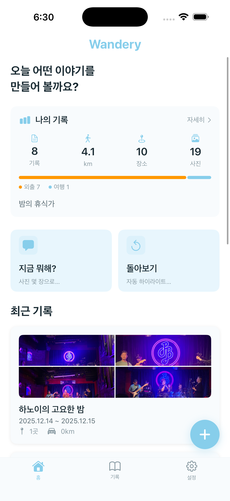
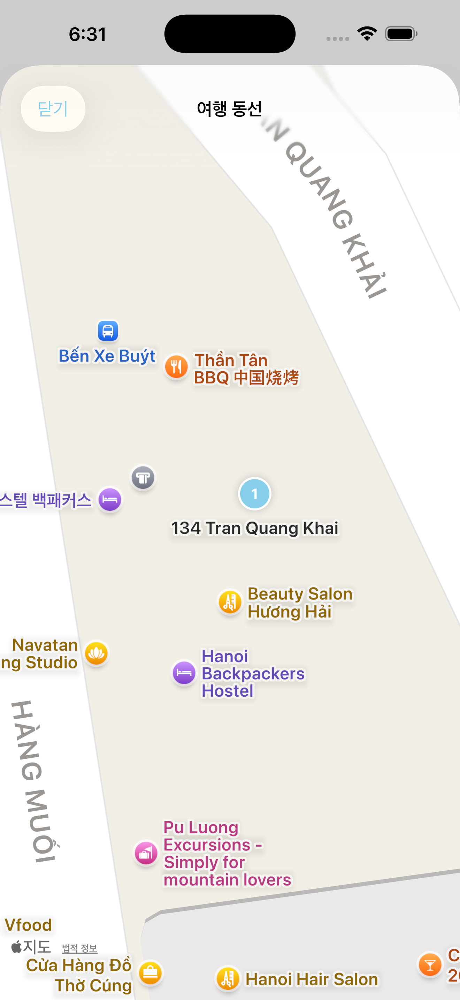
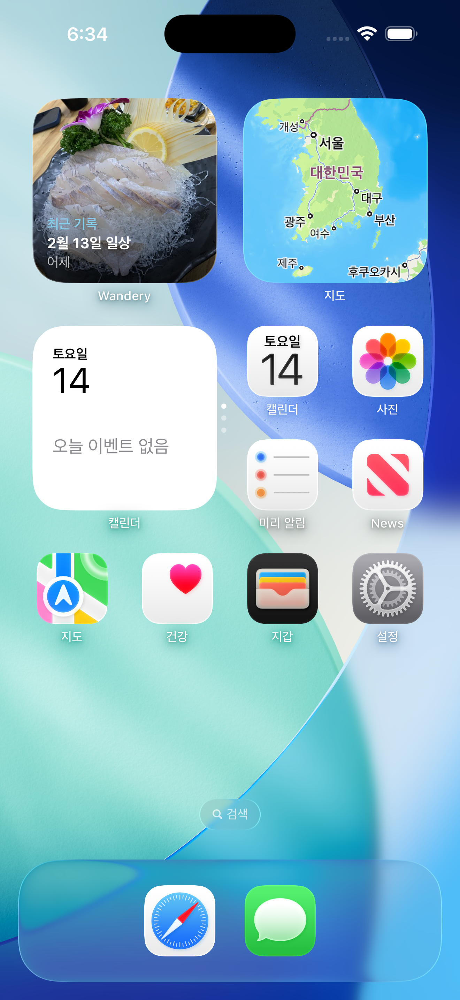

# Wandery

🌐 **Language**: [한국어](./README.md) | [English](./README_EN.md)

> Travel photos to timeline, AI to story


---

## Overview

**Wandery** is an iOS app that analyzes GPS and time information from travel photos to automatically generate timelines, with AI writing your travel stories. It runs 100% on-device without any server, and can be used immediately without login.

---

## Key Features

### Automatic Timeline Generation
Select photos and the app analyzes GPS coordinates and capture times to automatically identify visited places and travel routes. Uses DBSCAN density-based clustering and H3 hexagon grid for accurate place classification.

### Wander Intelligence (Smart Analysis)
On-device AI analyzes photos from multiple angles:
- **Vision Scene Classification** - Scene recognition based on Apple Vision Framework
- **Travel DNA** - Personal traveler profile analysis
- **Context Classification** - Automatic daily / outing / travel distinction
- **Insight Discovery** - 3-Layer architecture (single analysis → record comparison → AI expansion)
- **Auto Place Learning** - Automatic detection of frequent places (home/work/school)
- **Revisit Detection** - Revisit alerts via H3 neighborhood-level matching

### AI Polish
Built-in Google Gemini AI naturally polishes rule-based smart analysis results. Completes titles, stories, insights, and Travel DNA descriptions all at once.

### Map Visualization
Display visited places on a map and view travel routes at a glance.

### Share & Export
Create glassmorphism-style share cards or share travel records directly with other users via P2P (CloudKit). Markdown/image export is also supported.

### Home Screen Widgets
- **Today's Memory** - Records from this day N years ago
- **Recent Record** - Most recent trip
- **Travel Stats** - Cumulative record summary

Supports Small / Medium / Lock Screen widgets.

---

## Screenshots

<p align="center">
  
  
  
</p>
<p align="center">
  
  
  
</p>

---

## Highlights

| | |
|---|---|
| **100% On-device** | All analysis processed on device without any server |
| **No Login Required** | Use immediately without sign-up or login |
| **Free** | AI polish 3 times/day free, additional uses via rewarded ads |
| **Privacy** | Photos never leave your device |
| **iPhone Only** | UI/UX optimized for iPhone |

---

## Additional Features

- **What are you doing?** - Quick analysis with recent 24h photos + camera capture
- **Weekly Highlights** - Automatic summary of this week's photos
- **Look Back** - H3 place grouping + swipe drag selection
- **Statistics Dashboard** - Records/distance/places aggregation, DNA distribution, monthly charts
- **Security Lock** - App protection with PIN or Face ID
- **Category Classification** - Organize records by travel, daily, business trip, etc.
- **Frequent Places** - Custom place registration and management

---

## Tech Stack

| Category | Technology |
|----------|------------|
| **Language** | Swift 5.9 |
| **UI Framework** | SwiftUI |
| **Data** | SwiftData |
| **Architecture** | MVVM |
| **Clustering** | DBSCAN |
| **Spatial Indexing** | SwiftyH3 (Uber H3) |
| **AI** | Google Gemini |
| **Minimum OS** | iOS 17+ |
| **Device** | iPhone |
| **Frameworks** | PhotoKit, CoreLocation, MapKit, Vision, CloudKit |

---

## Architecture

```
┌─────────────────────────────────────────────────────────┐
│                     Wandery App                          │
│                                                          │
│  ┌───────────────┐  ┌───────────────┐  ┌─────────────┐ │
│  │   Photo Pick   │  │  Quick Snap   │  │   Widget    │ │
│  │  (PhotoKit)    │  │  (Camera)     │  │ (WidgetKit) │ │
│  └───────┬───────┘  └───────┬───────┘  └─────────────┘ │
│          │                  │                            │
│          ▼                  ▼                            │
│  ┌──────────────────────────────────────────────────┐   │
│  │              Analysis Pipeline                    │   │
│  │  ┌──────────┐ ┌──────────┐ ┌──────────────────┐ │   │
│  │  │  EXIF    │ │  DBSCAN  │ │  H3 Hexagon     │ │   │
│  │  │  Parser  │ │ Cluster  │ │  Grid Indexing  │ │   │
│  │  └────┬─────┘ └────┬─────┘ └────────┬─────────┘ │   │
│  │       └─────────────┼───────────────┘            │   │
│  │                     ▼                             │   │
│  │  ┌──────────────────────────────────────────┐    │   │
│  │  │         Wander Intelligence              │    │   │
│  │  │  Vision Scene · Travel DNA · Context     │    │   │
│  │  │  Insights · Place Learning · Revisit     │    │   │
│  │  └──────────────────┬───────────────────────┘    │   │
│  └─────────────────────┼────────────────────────────┘   │
│                        ▼                                 │
│  ┌──────────────────────────────────────────────────┐   │
│  │              AI Polish (Gemini)                   │   │
│  │  Title · Story · Insights · Travel DNA            │   │
│  └──────────────────────────────────────────────────┘   │
│                        │                                 │
│          ┌─────────────┼─────────────┐                  │
│          ▼             ▼             ▼                  │
│  ┌────────────┐ ┌────────────┐ ┌──────────────┐        │
│  │  Timeline  │ │  Map View  │ │  Share Card  │        │
│  │  (SwiftUI) │ │  (MapKit)  │ │  (CloudKit)  │        │
│  └────────────┘ └────────────┘ └──────────────┘        │
│                                                          │
│  ┌──────────────────────────────────────────────────┐   │
│  │              SwiftData Storage                    │   │
│  └──────────────────────────────────────────────────┘   │
└─────────────────────────────────────────────────────────┘
```

---

## Challenges and Solutions

### 1. GPS-based Place Clustering
**Challenge**: Automatically classifying meaningful places from large amounts of photo GPS data.

**Solution**: Combined DBSCAN density-based clustering with Uber H3 hexagon grid to implement noise-resistant and accurate place classification.

### 2. On-device AI Analysis
**Challenge**: Processing photo analysis and story generation entirely on-device without a server.

**Solution**: Designed a pipeline that performs scene classification with Apple Vision Framework, generates step-by-step insights through a 3-Layer architecture (single analysis → record comparison → AI expansion), then naturally polishes with Gemini AI.

### 3. Revisit Detection
**Challenge**: Efficiently detecting revisited places by comparing with previous travel records.

**Solution**: Implemented a system using H3 neighborhood-level matching to detect same-area revisits without exact coordinate matching.

### 4. P2P Sharing
**Challenge**: Travel record sharing between users was needed without a server.

**Solution**: Leveraged CloudKit's P2P capabilities to enable secure travel record sharing in a serverless environment.

---

## Role & Contributions

- Full iOS app architecture design and development
- DBSCAN + H3 based place clustering engine implementation
- Wander Intelligence on-device analysis system design
- Google Gemini AI integration and story generation pipeline
- MapKit-based map visualization and route display
- Glassmorphism share card UI design and implementation
- WidgetKit-based home screen widget development
- SwiftData data model design

---

## Related Links

- **App Store**: [Wandery](https://apps.apple.com/kr/app/wandery/id6759185541)
- **GitHub**: [leonardo204/Wander](https://github.com/leonardo204/Wander)

---

*This project is an iOS app developed to make travel recording easier and more meaningful.*
