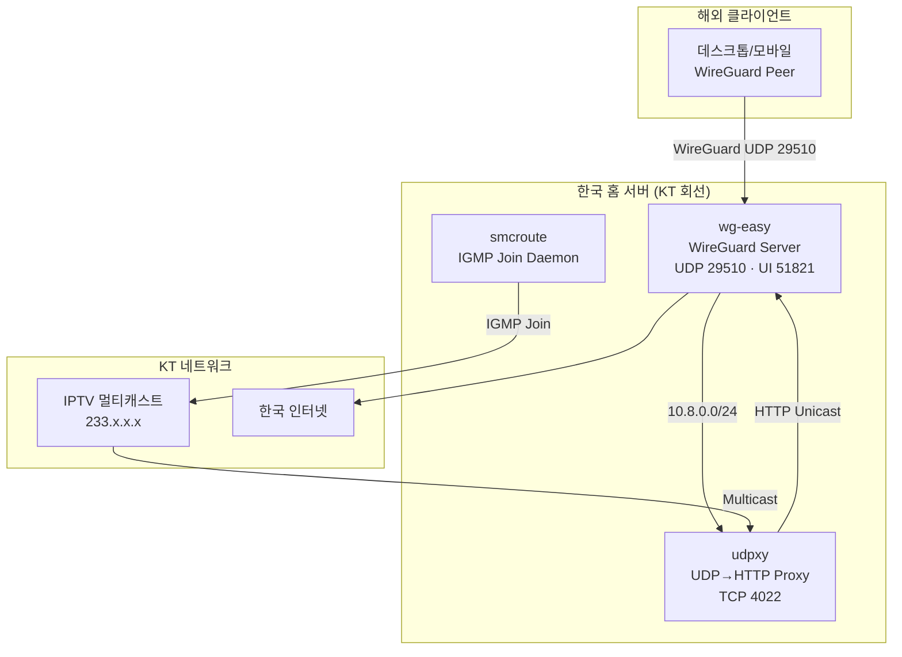

# zerolive-vpn

🌐 **Language**: [한국어](./README.md) | [English](./README_EN.md)

> WireGuard 기반 개인 VPN — 해외에서 한국 IP로 접속하고 KT IPTV 채널을 스트리밍하기 위한 셀프호스팅 VPN 게이트웨이

---

## 개요

**zerolive-vpn**은 한국 KT 인터넷 회선에 연결된 홈 서버에서 동작하는 셀프호스팅 WireGuard VPN입니다. 해외에서 한국 IP가 필요한 상황이나, VPN 터널을 통해 KT IPTV 멀티캐스트 채널을 시청해야 하는 상황을 해결하기 위해 만들었습니다. `wg-easy`로 피어 관리를 웹 UI에서 처리하고, `udpxy`와 `smcroute`로 멀티캐스트 기반 IPTV를 HTTP 유니캐스트로 변환하여 VPN 위에서도 채널을 시청할 수 있도록 구성되어 있습니다.

---

## 주요 기능

### WireGuard VPN 게이트웨이

- **wg-easy 기반 피어 관리**: 웹 UI(TCP 51821)에서 QR 코드 및 설정 파일을 생성하여 모바일/데스크톱 피어 추가
- **한국 IP 라우팅**: 모든 클라이언트 트래픽을 한국 KT 회선을 통해 송출, 해외에서도 국내 서비스 접속 가능
- **UDP 29510 리스닝**: 10.8.0.0/24 서브넷 할당으로 피어 간 격리

### KT IPTV 멀티캐스트 중계

- **udpxy 멀티캐스트 → HTTP 변환**: 233.x.x.x 대역 멀티캐스트 채널을 HTTP 유니캐스트(TCP 4022)로 변환
- **smcroute IGMP 조인**: 커스텀 컨테이너에서 smcroute 데몬을 실행하여 필요한 채널만 선별적으로 조인
- **VPN 위 IPTV 시청**: L3 포인트투포인트 WireGuard의 멀티캐스트 미지원 한계를 HTTP 변환으로 우회

### 셀프호스팅 운영

- **Docker Compose 단일 명령 배포**: 3개 서비스(wg-easy, smcroute, udpxy)를 호스트 네트워크 모드로 구성
- **쉘 스크립트 자동화**: 설정/기동/백업 스크립트로 운영 부담 최소화

---

## 기술 스택

| 계층 | 기술 |
|------|------|
| **VPN** | WireGuard, wg-easy |
| **멀티캐스트 처리** | udpxy (UDP→HTTP 프록시), smcroute (IGMP 라우팅) |
| **컨테이너** | Docker, Docker Compose (호스트 네트워크 모드) |
| **스크립팅** | Shell, JavaScript, Dockerfile |
| **네트워크** | UDP 29510 (WireGuard), TCP 51821 (UI), TCP 4022 (udpxy), 10.8.0.0/24 |
| **도메인** | vpn.zerolive.co.kr |

---

## 아키텍처

---

## 개발 과정에서의 도전과 해결

### 1. WireGuard L3 터널의 멀티캐스트 미지원

**도전**: KT IPTV는 233.x.x.x 대역의 멀티캐스트로 채널을 송출하지만, WireGuard는 L3 포인트투포인트 터널이라 멀티캐스트 패킷을 피어에 전달할 수 없었습니다. 해외 클라이언트에서 IPTV를 바로 수신하는 것은 구조적으로 불가능했습니다.

**해결**: 홈 서버에 `udpxy`를 두어 멀티캐스트 스트림을 HTTP 유니캐스트(TCP 4022)로 변환하고, 클라이언트는 VPN 위에서 `http://<gateway>:4022/udp/233.x.x.x:port` 형식으로 채널을 요청하도록 구성했습니다. VPN 터널을 유니캐스트 트래픽만 지나가게 만들어 L3 한계를 우회했습니다.

### 2. 선별적 IGMP 조인 및 대역폭 관리

**도전**: 모든 IPTV 채널을 조인하면 홈 서버의 업링크 대역폭이 불필요하게 소모되는 문제가 있었습니다. 또한 udpxy 단독으로는 필요한 채널만 선택적으로 IGMP 조인하기가 까다로웠습니다.

**해결**: 별도의 `smcroute` 컨테이너를 Dockerfile로 빌드하여 IGMP 조인 데몬으로 운영하고, 필요한 채널 목록만 설정 파일로 관리했습니다. udpxy와 역할을 분리하여 멀티캐스트 수신은 smcroute, 유니캐스트 변환은 udpxy가 담당하도록 구성했습니다.

### 3. 호스트 네트워크 모드 구성

**도전**: Docker 브리지 네트워크에서는 멀티캐스트와 IGMP 패킷이 호스트 NIC까지 정상적으로 전달되지 않았습니다.

**해결**: 3개 컨테이너(wg-easy, smcroute, udpxy)를 모두 `network_mode: host`로 설정하여 호스트 네트워크 스택을 공유하도록 했습니다. Docker Compose 단일 파일로 전체 스택을 기동할 수 있도록 통합했습니다.

---

## 역할 및 기여

- 전체 시스템 설계 및 구현 (단독 개발)
- WireGuard + wg-easy 셀프호스팅 구성
- udpxy / smcroute를 활용한 IPTV 멀티캐스트 → HTTP 변환 파이프라인 설계
- smcroute 커스텀 Dockerfile 작성 및 IGMP 조인 데몬화
- Docker Compose 기반 호스트 네트워크 모드 인프라 구성
- 운영 자동화 쉘 스크립트 작성

---

## 관련 링크

- **GitHub**: [leonardo204/zerolive-vpn](https://github.com/leonardo204/zerolive-vpn)
- **도메인**: vpn.zerolive.co.kr
- **Contact**: zerolive7@gmail.com

---

*이 프로젝트는 해외에서 한국 IP가 필요한 개인적인 니즈와 KT IPTV 시청을 위해 만든 셀프호스팅 VPN 게이트웨이입니다.*
