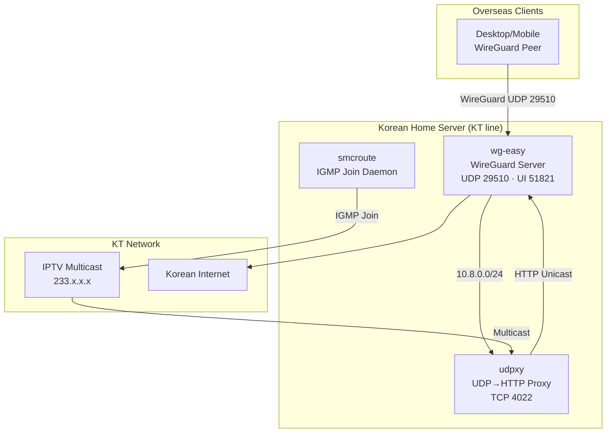

# zerolive-vpn

🌐 **Language**: [한국어](./README.md) | [English](./README_EN.md)

> Self-hosted WireGuard VPN — A Korean IP gateway for overseas access and KT IPTV channel streaming

---

## Overview

**zerolive-vpn** is a self-hosted WireGuard VPN running on a home server connected to a Korean KT broadband line. It was built to solve two personal needs: browsing with a Korean IP from abroad, and watching KT IPTV multicast channels over the VPN tunnel. The stack uses `wg-easy` for web-based peer management, with `udpxy` and `smcroute` converting KT's multicast IPTV streams into HTTP unicast so they remain watchable over WireGuard's L3 point-to-point tunnel.

---

## Key Features

### WireGuard VPN Gateway

- **wg-easy peer management**: Generate QR codes and config files from a web UI (TCP 51821) for mobile/desktop peers
- **Korean IP routing**: Route all client traffic through the Korean KT line, enabling access to Korea-only services from overseas
- **UDP 29510 listener**: Peer isolation on a 10.8.0.0/24 subnet

### KT IPTV Multicast Relay

- **udpxy multicast → HTTP conversion**: Transform 233.x.x.x multicast channels into HTTP unicast (TCP 4022)
- **smcroute IGMP joining**: Run smcroute as a dedicated daemon container to selectively join only the required channels
- **IPTV over VPN**: Work around WireGuard's L3 point-to-point multicast limitation via HTTP conversion

### Self-hosted Operations

- **Single-command Docker Compose deploy**: Three services (wg-easy, smcroute, udpxy) in host network mode
- **Shell automation**: Setup, launch, and backup scripts to minimize operational burden

---

## Tech Stack

| Layer | Technology |
|-------|------------|
| **VPN** | WireGuard, wg-easy |
| **Multicast Handling** | udpxy (UDP→HTTP proxy), smcroute (IGMP routing) |
| **Containers** | Docker, Docker Compose (host network mode) |
| **Scripting** | Shell, JavaScript, Dockerfile |
| **Network** | UDP 29510 (WireGuard), TCP 51821 (UI), TCP 4022 (udpxy), 10.8.0.0/24 |
| **Domain** | vpn.zerolive.co.kr |

---

## Architecture

---

## Challenges & Solutions

### 1. WireGuard's L3 Tunnel Lacks Multicast Support

**Challenge**: KT IPTV delivers channels via 233.x.x.x multicast, but WireGuard is an L3 point-to-point tunnel that cannot forward multicast packets to peers. Receiving IPTV directly on overseas clients was structurally impossible.

**Solution**: Deploy `udpxy` on the home server to convert multicast streams into HTTP unicast (TCP 4022). Clients request channels over the VPN as `http://<gateway>:4022/udp/233.x.x.x:port`. Only unicast traffic traverses the tunnel, sidestepping the L3 limitation.

### 2. Selective IGMP Join & Bandwidth Management

**Challenge**: Joining every IPTV channel would waste uplink bandwidth unnecessarily. udpxy alone made selective channel joining cumbersome.

**Solution**: Build a dedicated `smcroute` container via a custom Dockerfile to run as an IGMP join daemon, managing the required channel list via a config file. Responsibilities are split cleanly — smcroute handles multicast reception while udpxy handles unicast conversion.

### 3. Host Network Mode Requirement

**Challenge**: Multicast and IGMP packets did not propagate correctly from Docker's bridge network to the host NIC.

**Solution**: Run all three containers (wg-easy, smcroute, udpxy) with `network_mode: host` so they share the host's network stack. The entire stack boots from a single Docker Compose file.

---

## Role & Contributions

- Full system design and implementation (solo project)
- WireGuard + wg-easy self-hosted setup
- IPTV multicast → HTTP conversion pipeline via udpxy / smcroute
- Custom smcroute Dockerfile and IGMP join daemonization
- Docker Compose infrastructure with host network mode
- Shell-based operational automation scripts

---

## Links

- **GitHub**: [leonardo204/zerolive-vpn](https://github.com/leonardo204/zerolive-vpn)
- **Domain**: vpn.zerolive.co.kr
- **Contact**: zerolive7@gmail.com

---

*This project is a self-hosted VPN gateway built to address personal needs for a Korean IP from overseas and for watching KT IPTV over VPN.*
